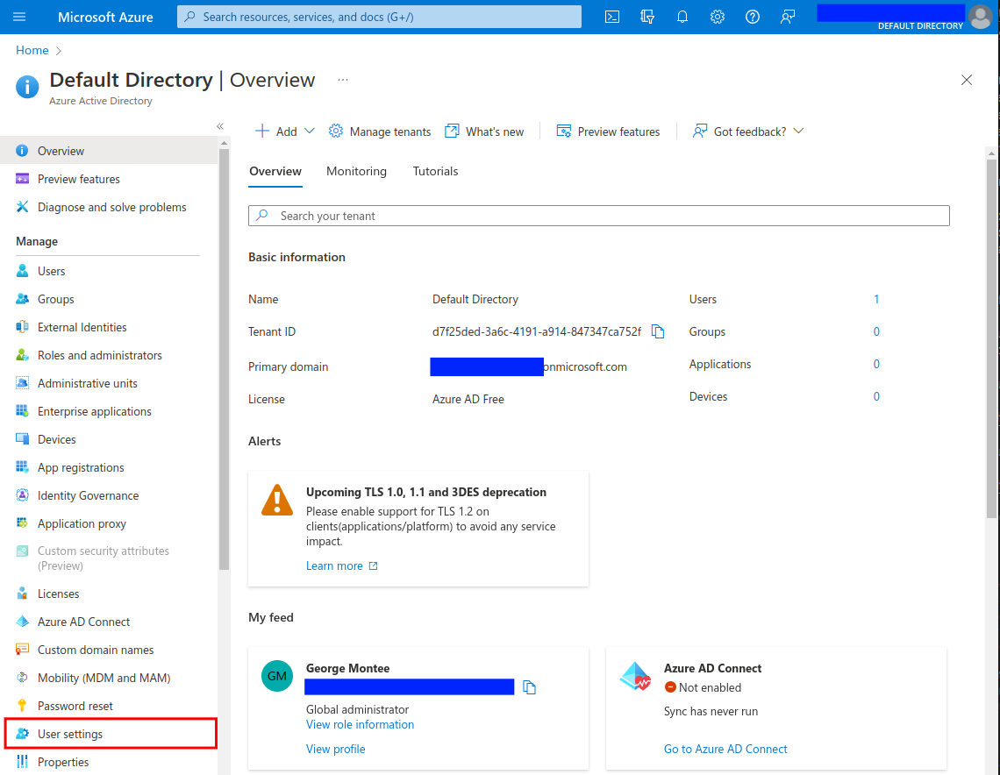
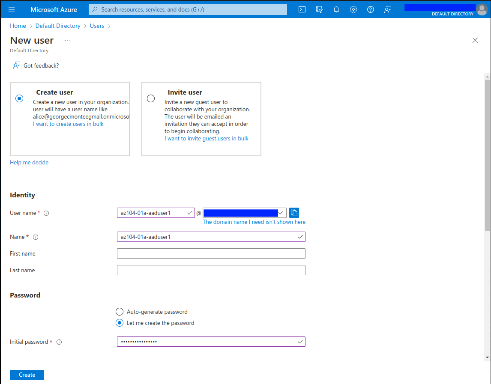
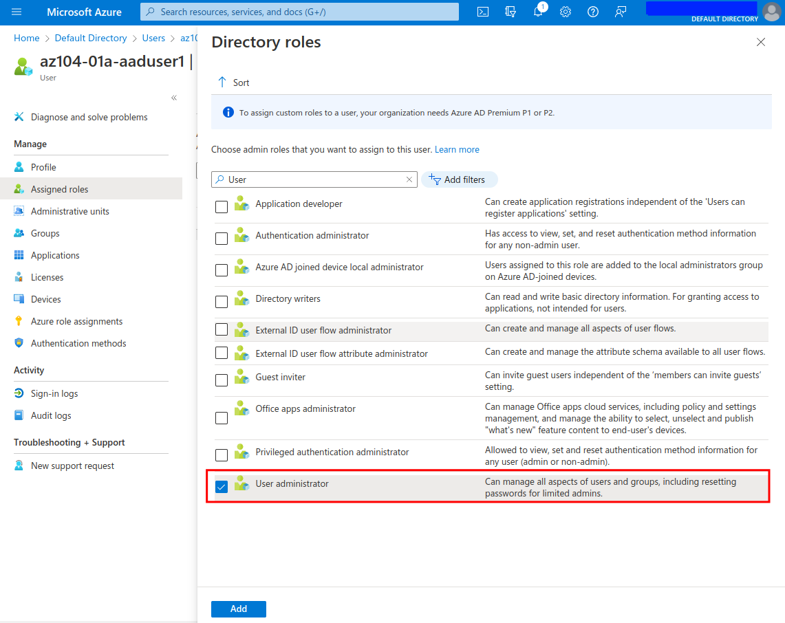
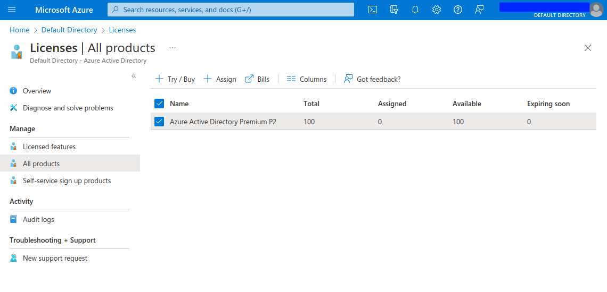
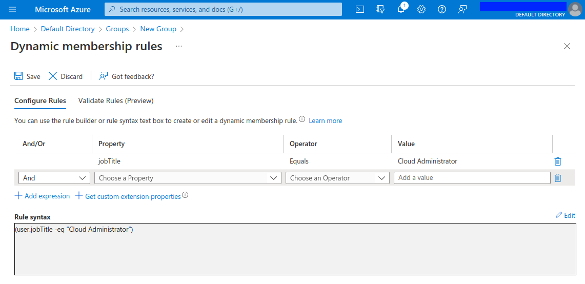
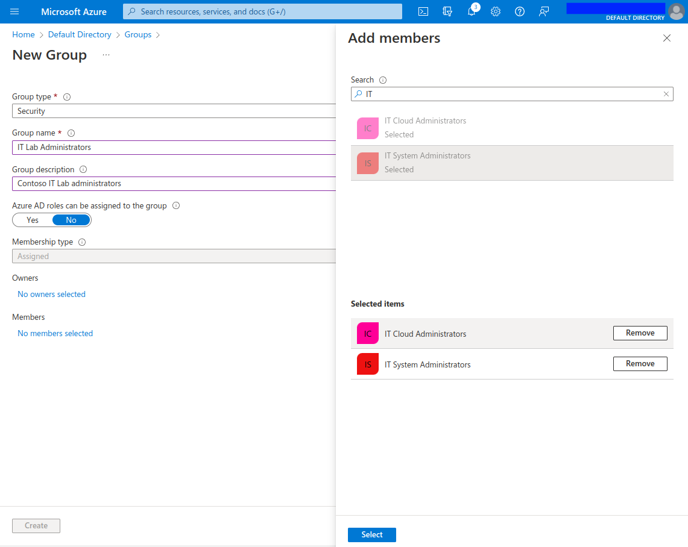
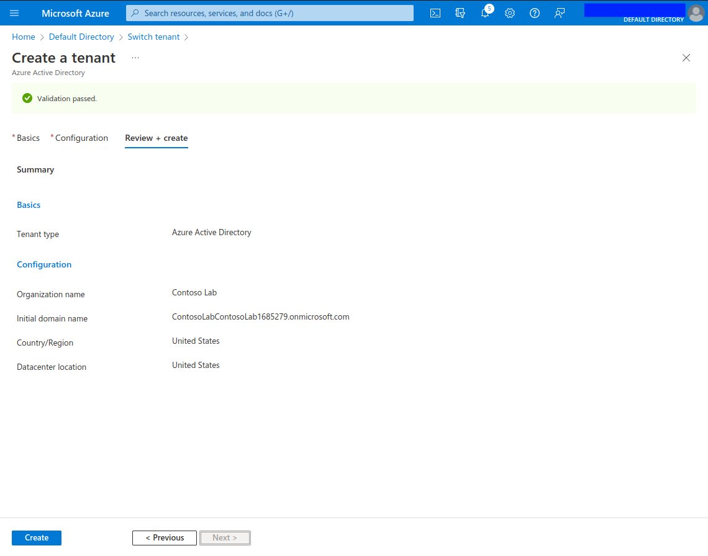
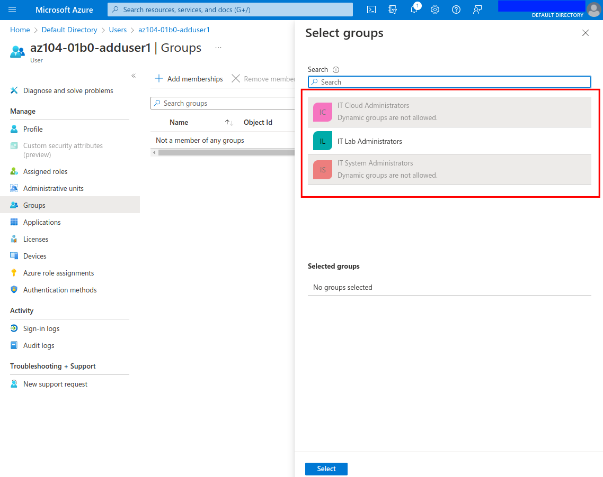

# Day 2 - Azure AZ-104 Manage Azure Active Directory Identities Lab

## Introduction

✍️ I mentioned yesterday I completed [A Cloud Guru's AZ-104 Microsoft Azure Administrator certification prep course](https://acloudguru.com/course/az-104-microsoft-azure-administrator-certification-prep). Although, they provide hands-on labs, I still want to do [Microsoft Learn AZ-104 Lab Exercises](https://microsoftlearning.github.io/AZ-104-MicrosoftAzureAdministrator/). Today, I will be doing Lab 1 Manage Azure Active Directory Identities.

## Prerequisite

✍️ In this demonstration of Azure Active Directory, we'll go over creating users, and groups utilizing dynamic memberships, and ones with manually assigned users and groups. Additionally, we'll create a tenant, another word for organization. Within the tenant we'll create a user, and then invite that user to the primary tenant.

## Use Case

- ✍️ This architecture diagram is taken from the lab page, showing the four steps:
  - Task 1: Create and configure Azure AD users
  - Task 2: Create Azure AD groups with assigned and dynamic membership
  - Task 3: Create an Azure Active Directory (AD) tenant
  - Task 4: Manage Azure AD guest users

## Cloud Research

- ✍️ For the dynamic membership groups, you create a query that will be executed to populate that group. A common issue I ran into was good ole user error. For the 'IT System Administrators' I mistakenly added a 's', 'Systems' versus 'System', in the query. When it didn't populate, I double-checked, found my error, and was able to update the query.

## Try yourself

### Step 1 — Create and Configure Azure AD users

Task 1 - Step 3 they ask you to check 'User Settings'. Initially, I couldn't find it, I was click 'Users', then trying to find 'Settings'

Creating a user was straight-forward

After creating a user, select 'Assigned Roles' in the Blade, then I find filtering help narrow the list down.

### Step 2 — Create Azure AD groups with assigned and dynamic membership

In order to use Dynamic membership groups we need an Azure Active Directory Premium P2 license assigned to the relevant users

Here we use the Rule Builder for creating the dynamic expression

Manually assigning, in this case, other groups to the 'IT Lab Administrators' group

### Step 3 — Create an Azure Active Directory (AD) tenant

Creating our Lab Tenant

### Step 4 — Manage Azure AD guest users

Following the lab, we invited the Lab Tenant user as a guest account. Then assigning them to the 'IT Lab Administrators' group. Notice the Dynamic groups are greyed out; you can't manually assign a user or group to such groups

## ☁️ Cloud Outcome

✍️ (Result) I got comfortable working through the process of adding users, configuring dynamic groups, and creating a tenant organization. I was reminded to be consistent in my naming conventions, e.g., System vs Systems.

## Next Steps

✍️ Tomorrow, I'm going to do the first lab, Manage Subscriptions and RBAC, from the Governance and Compliance module.

## Social Proof

✍️ Show that you shared your process on LinkedIn

[Linkedin Post](link)
