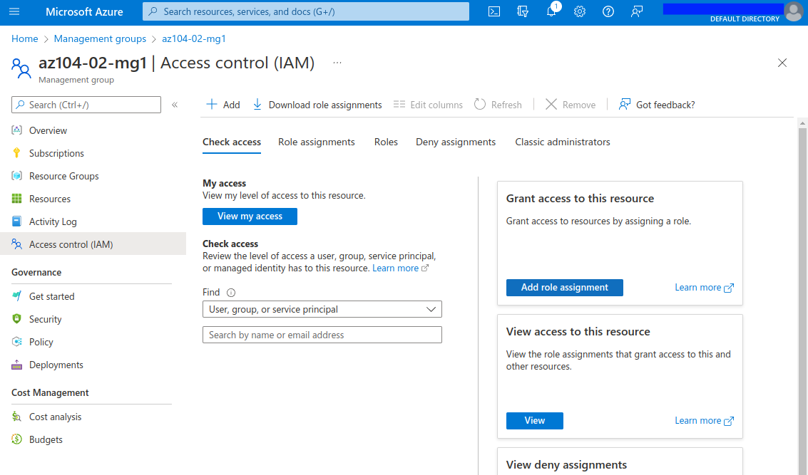

  

# Day 3 - Azure AZ-104 Manage Subscriptions and RBAC Lab

## Introduction

✍️ Yesterday, I walked through Lab 1, Manage Azure Active Directory Identities, from [Microsoft Learn AZ-104 Lab Exercises](https://microsoftlearning.github.io/AZ-104-MicrosoftAzureAdministrator/). Today, I'm doing Lab 2a, Manage Subscriptions and RBAC Lab.

## Prerequisite

✍️ In Azure, [Subscriptions](https://docs.microsoft.com/en-us/azure/cloud-adoption-framework/ready/azure-best-practices/organize-subscriptions) are a logical container for billing purposes. Since resources are billed as a group in a subscription, one potential use you'll see for subscriptions is for different departments within a company to manage expenses. You'll see the term 'Management Groups' used in concert with Subscriptions, since they were specifically created to manage resources and subscriptions.

✍️ Another function for managing resources is [Azure Role-Based Access Controls](https://docs.microsoft.com/en-us/azure/role-based-access-control/overview) (RBAC). By assigning roles, you can allow and/or deny access to certain resources. For instance, you can have teams manage only their specific resources, or for someone in an auditing role to review resources but not be able to modify them.

## Use Case

  

- ✍️ This architecture diagram is taken from the lab page, showing the three tasks:
  - Task 1: Implement Management Groups
  - Task 2: Create custom RBAC roles
  - Task 3: Assign RBAC roles

## Cloud Research

- ✍️ Document your trial and errors. Share what you tried to learn and understand about the cloud topic or while completing micro-project.
- 🖼️ Show as many screenshot as possible so others can experience in your cloud research.

## Try yourself

### Task 1 — Implement Management Groups

First, I had to update my permissions, in order to manage all subscriptions and management groups in my tenant.

For the purpose of this lab, they have us move our current subscription, rather going through the hassle of creating an another subscription. This part makes a little nervous.

### Task 2 — Create custom RBAC roles

The lab files are located [here](https://github.com/MicrosoftLearning/AZ-104-MicrosoftAzureAdministrator/archive/master.zip). I modified the json file to reference my subscription.

They give a GUI option to upload and download files.

### Task 3 — Assign RBAC roles

Here I am assigning the custom rule to our new user. There's a built-in role named 'Support Request Contributor', so be sure to select the one with '(Custom)' attached to the name.

The custom RBAC role allows two actions. For the first one, the user can see (read) available resource groups.

For the second action, the user can create support requests.

## ☁️ Cloud Outcome

✍️ I was a bit uneasy about moving subscription down to a another management group level. If you follow along, be sure to follow the clean-up instructions, where they have you move the subscription back to the root management group.

✍️ I hadn't opened Cloud Shell on this account before, so I had to create a storage account, and file share to store the cloud shell settings. Storage accounts have some naming convention limitations, so I couldn't use more than 24 characters, or use hyphens. Annoying, but I'm sure it's for compatibility purposes.

✍️ Flipping between Bash and Powershell terminal options hurts my brain. In this lab we used PowerShell, but when I went to list directory contents (after uploading the json file), I used 'll' instead of 'dir' and got an error. Took my brain a second to process, "Oh!, right, using PowerShell".

I don't know if it was a glitch, but when I was initially creating the user I got a generic "Unable to create a user" message. No other elaboration was provided on what the issue was. Frustrating. A quick google search, and I went the auto-generate password that others had suggested. I had to click to reveal the generated password.

## Next Steps

✍️ Tomorrow, I'm going to do the third lab, 2b Manage Governance via Azure Policy, from the Governance and Compliance module.

## Social Proof

✍️ Show that you shared your process on LinkedIn

[Linkedin Post]()
