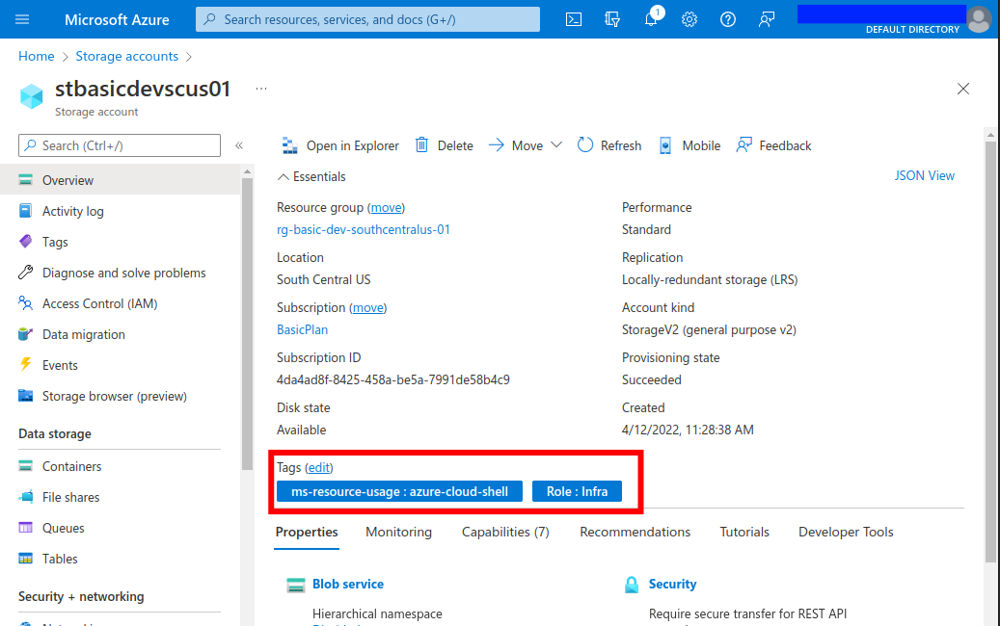
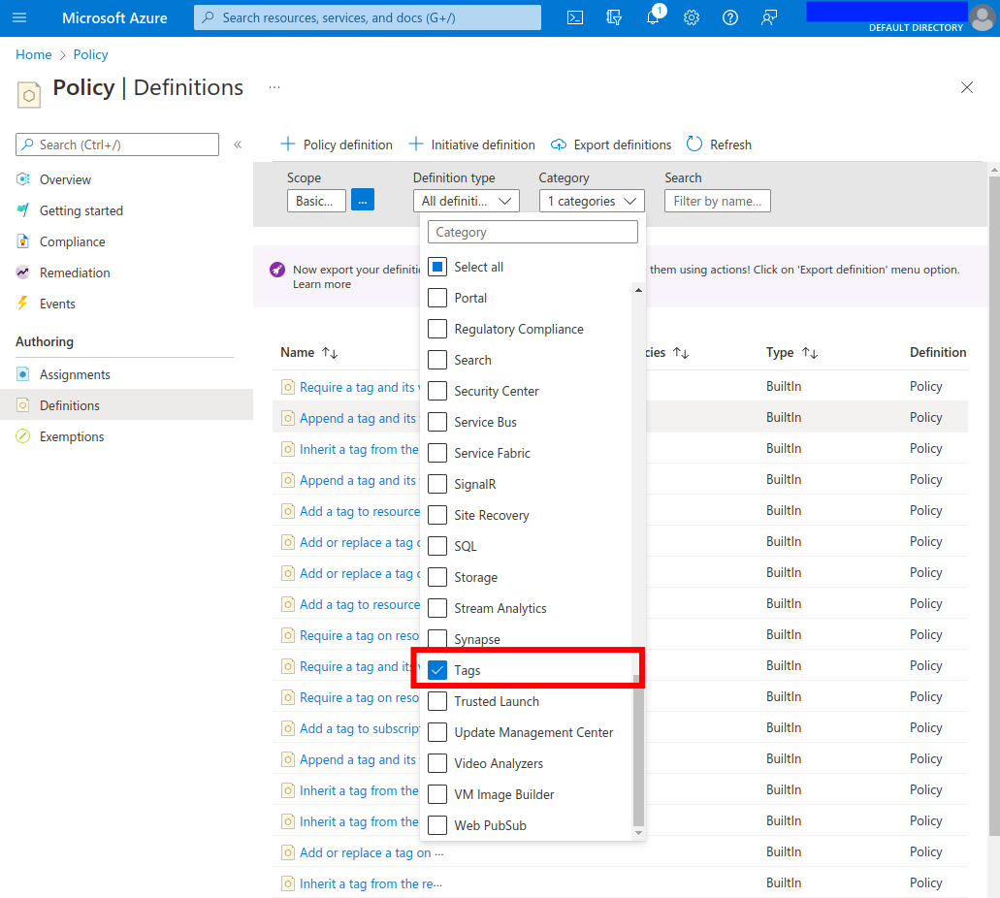
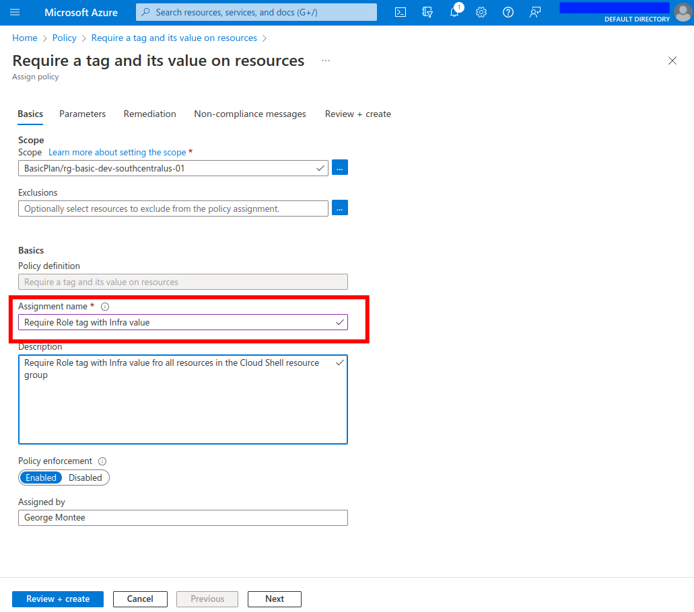
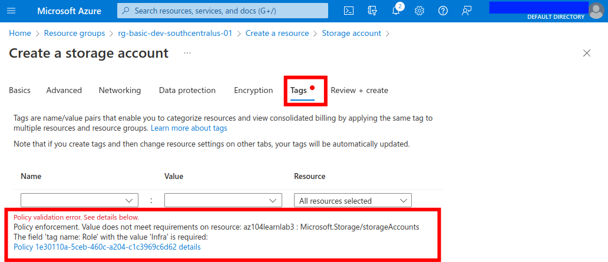
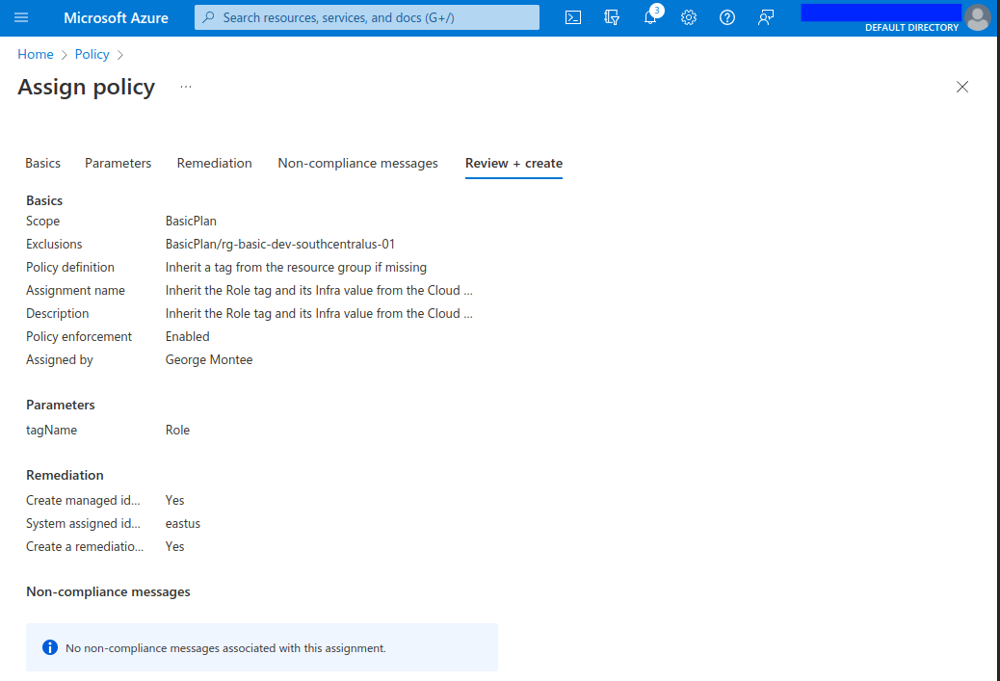

  

# Day 4 - Azure AZ-104 Manage Governance via Azure Policy Lab

## Introduction

✍️ Yesterday, I walked through Lab 2a, Manage Subscriptions and RBAC, from [Microsoft Learn AZ-104 Lab Exercises](https://microsoftlearning.github.io/AZ-104-MicrosoftAzureAdministrator/). Today, I'm doing Lab 2b, Manage Governance via Azure Policy Lab.

## Prerequisite

✍️ [Azure Policies](https://docs.microsoft.com/en-us/azure/governance/policy/overview) are used to enforce business rules on resources. It could be ensuring naming conventions are followed, only certain virtual machine SKUs resources are created in a particular region, restrict access to an Azure service, requiring tagging, etc.

## Use Case

  

- ✍️ This architecture diagram is taken from the lab page, showing the three tasks:
  - Task 1: Create and assign tags via the Azure portal
  - Task 2: Enforce tagging via an Azure policy
  - Task 3: Apply tagging via an Azure policy

## Try yourself

### Step 1 — Create and assign tags via the Azure portal

Here's I'm showing the tag Role:Infra is in place

### Step 2 — Enforce tagging via an Azure policy

Filtering to policy definitions related to tags.

Creating the policy

Here the attempt to deploy a new storage account without the necessary tag fails validation
<!--  -->

### Step 3 — Apply tagging via an Azure policy

Creating the policy for resources to inherit a certain tag from the resource group

## ☁️ Cloud Outcome

✍️ Yesterday, working with RBAC, that was for controlling user actions at different scopes. Policy, however, maintains compliance with resources.

✍️ Applying and removing policies isn't instant, so you might have to wait 5-15 minutes.

✍️ Previously, I had used the Portal, Azure CLI, and PowerShell to apply, to modify, and remove tags. Applying tags via Policy sounds extremely useful.

✍️ I'm not sure why, yet, but sometimes the Azure Portal will attempt to create resources in a different region. It's kind of annoying for consistency

## Next Steps

✍️ Tomorrow, I'm going to do the fourth lab, 3a Manage Azure resources by Using the Azure Portal, from the Azure Administration module.

## Social Proof

✍️ Show that you shared your process on LinkedIn

[Linkedin Post]()
