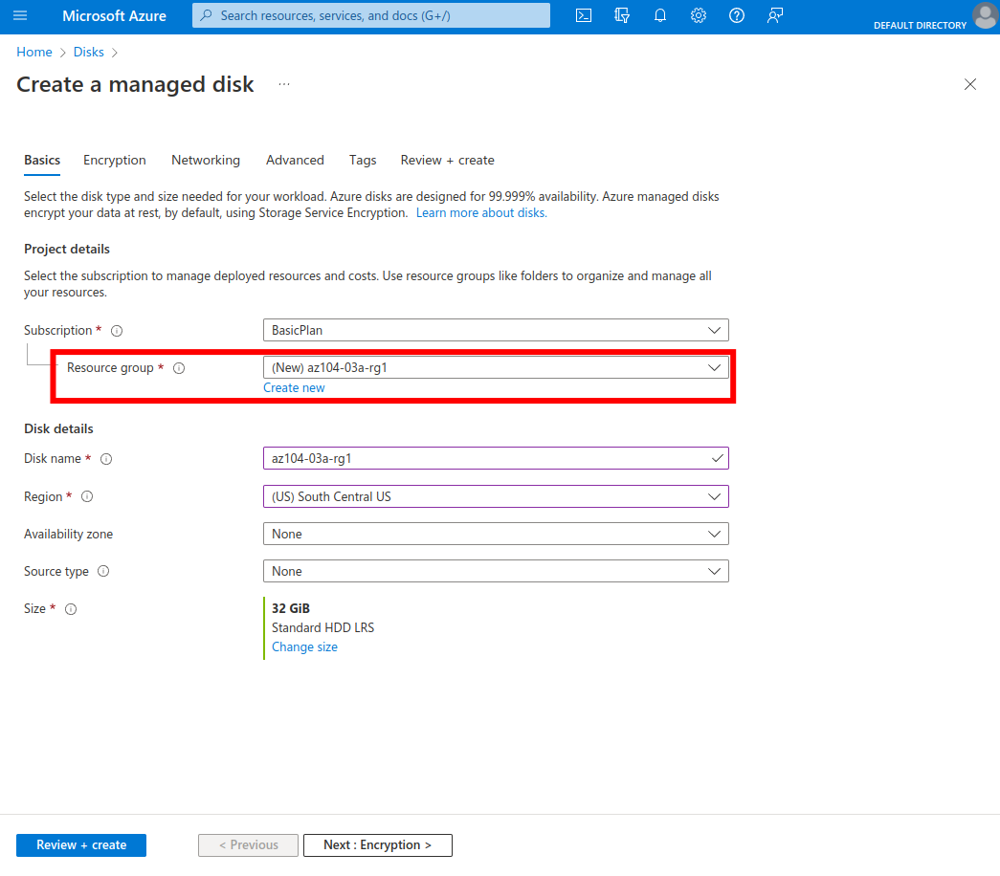
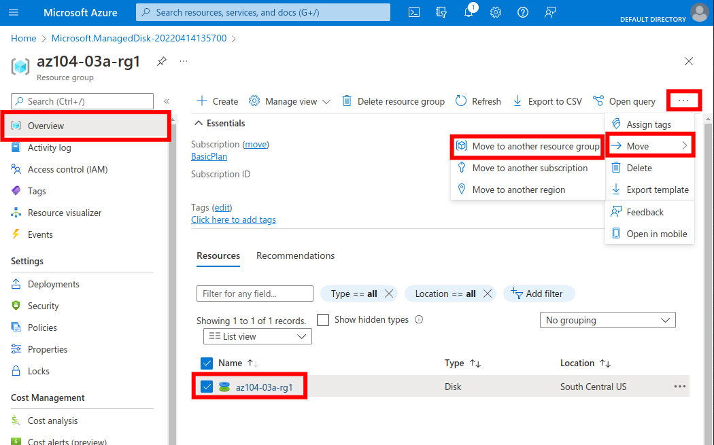
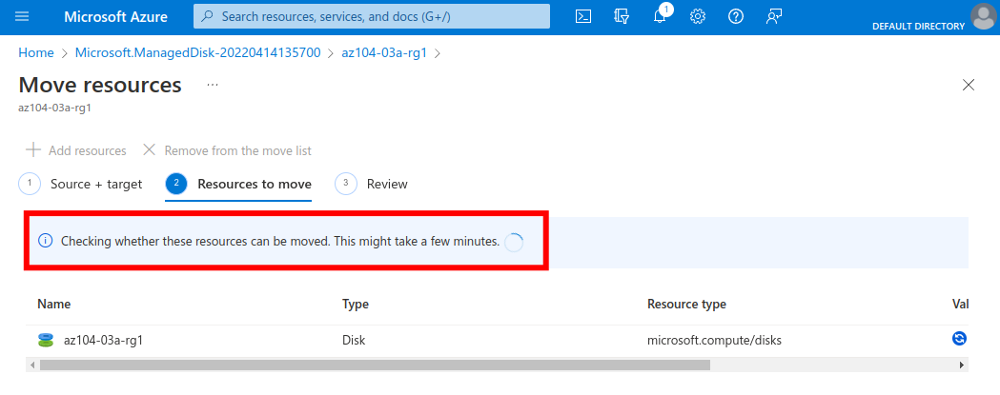
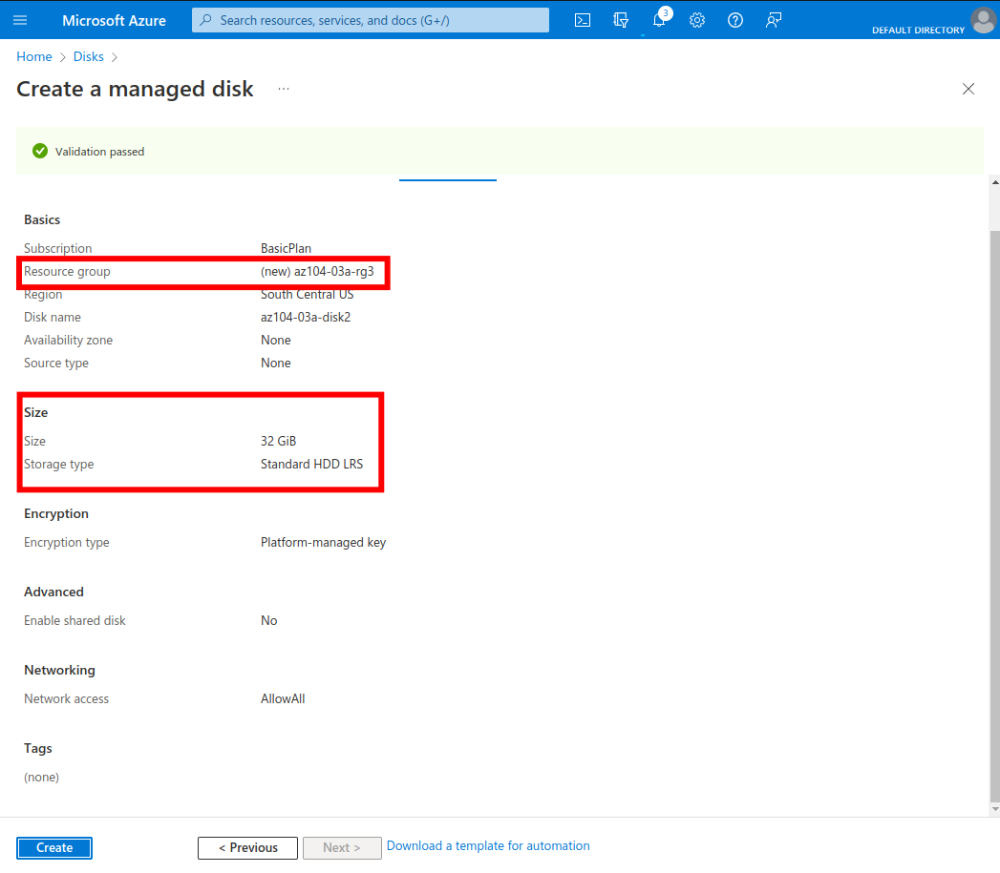
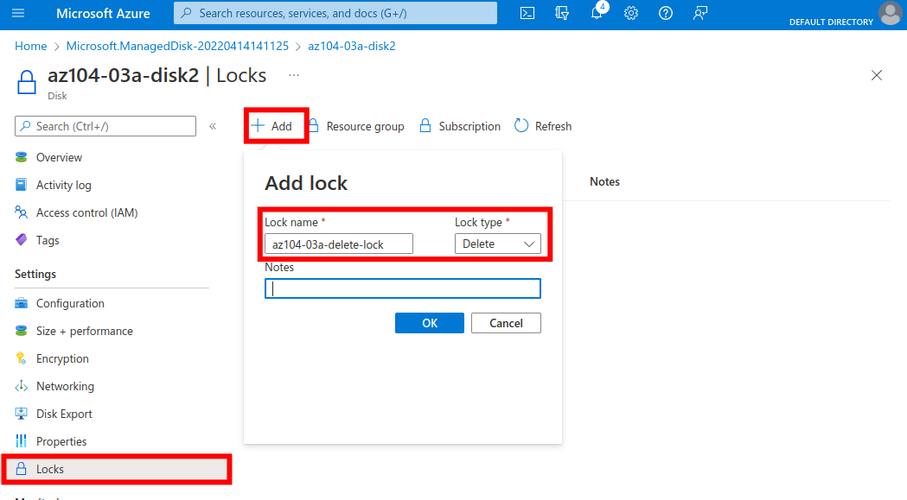
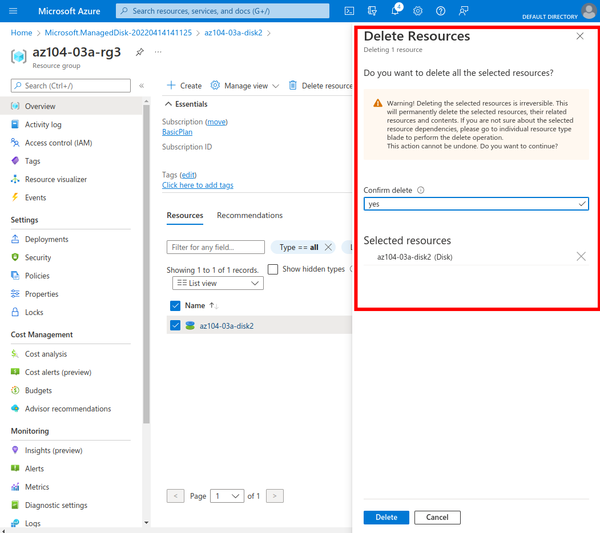
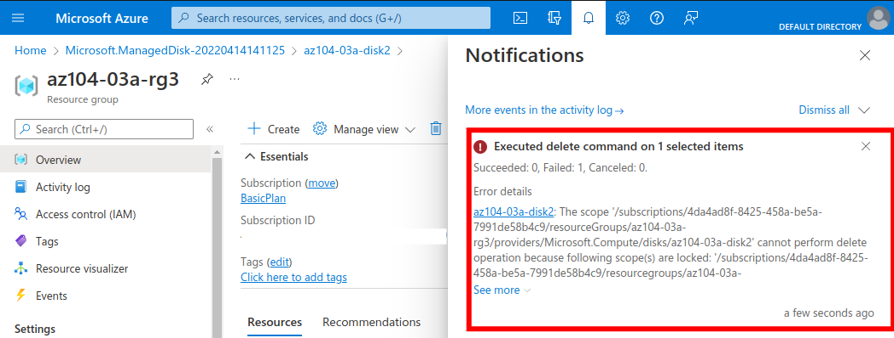
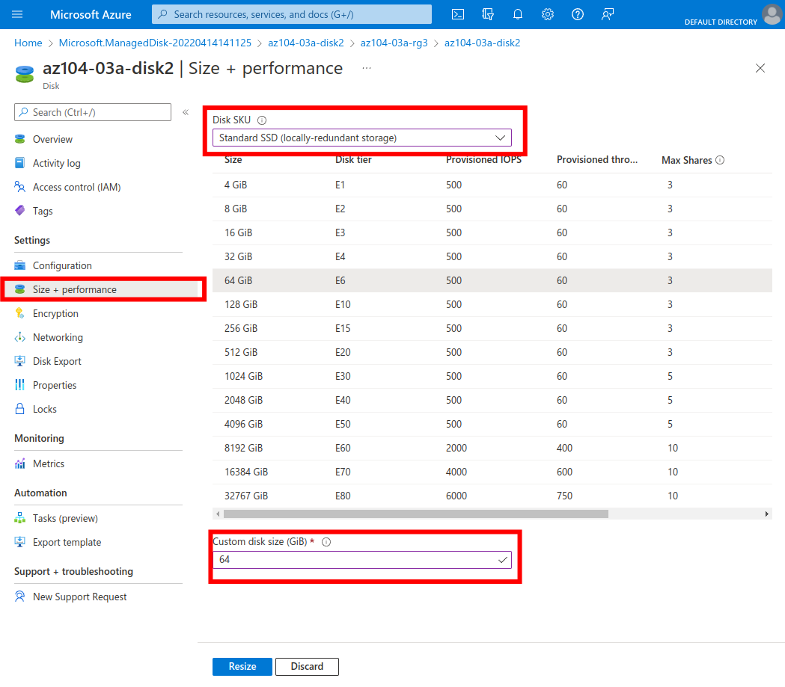

  

# Day 5 - Azure AZ-104 Manage Azure resources by Using the Azure Portal Lab

## Introduction

✍️ Yesterday, I walked through Lab 2b, Manage Governance via Azure Policy, from [Microsoft Learn AZ-104 Lab Exercises](https://microsoftlearning.github.io/AZ-104-MicrosoftAzureAdministrator/). Today, I'm doing Lab 3a, Manage Azure resources by Using the Azure Portal Lab.

## Prerequisite

✍️ This lab and the next three show four different ways of managing resources. In Azure, the term 'resources' means any manageable item available through Azure. So, we're talking virtual machines, storage accounts, web apps, databases, virtual networks, and so on.

✍️ Managing resources has three avenues:

- Graphical User Interface: the Azure Portal, which allows a point-and-click method to interact with resources. This method is good for users new to creating resources, and don't know all the options. Often, there is tooltips over items, explaining what they do, or the expected entry. The downside to using a GUI is it can be slow, and prone to user error when repeating a process, particularly when creating a sizable number of resources.
- Command Line: This provides entry of commands and specifying parameters to manage resources. There are two flavors: PowerShell, a Microsoft scripting language, and Azure CLI, which is very similar to Bash, a UNIX shell and command language Linux users would be familiar with.
- Infrastructure-as-Code: Azure Resource Manager utilizes declarative, JSON-based templates. This allows deployments to be automated, consistent, and repeatable.

We're also going to utilize a [resource lock](https://docs.microsoft.com/en-us/azure/azure-resource-manager/management/lock-resources?tabs=json).

## Use Case

  

- ✍️ This architecture diagram is taken from the lab page, showing the three tasks:
  - Task 1: Create resource groups and deploy resources to resource groups
  - Task 2: Move resources between resource groups
  - Task 3: Implement and test resource locks

## My Experience

### Task 1: Create resource groups and deploy resources to resource groups

In the process of creating the new disk, I used the "Create new" link to create a new resource group.

### Task 2: Move resources between resource groups

Going through the interface to move the disk to another resource group.

A little annoying having to wait a few minutes for the "Next" button to be enabled while the check was going on.

### Task 3: Implement and test resource locks

Same process as creating the first disk, also creating a new resource group.

I clicked on the resource, the disk, the section 'Locks' under 'Settings', and then 'Add'.

Here I'm attempting the delete. The warning provides a good tip, to double-check the resources selected for deletion.

Sorry, I didn't expand the event, but here I get the notification the delete failed due to the scope, in this case the disk itself, being locked. We can also apply delete locks to resource groups and subscriptions.

Here's I'm able to [resize the disk](https://docs.microsoft.com/en-us/azure/virtual-machines/windows/expand-os-disk). If I wanted to restrict this function as well, I would need to apply a 'Read-Only' lock.

## ☁️ Cloud Outcome

✍️ (Result) Describe your personal outcome, and lessons learned.

I noticed when creating disks Azure defaults to a Premium SDD 1024 GiB. Isn't that nice of Microsoft, wanting the best for me? :)

CAUTION: When removing the resource lock on the disk, I wasn't prompted. It just did. Something to keep in mind for folks, like me, who like to click things.

In cleaning up, I deleted the three new resource groups I created. The second one resource group had the first disk I created. When I was deleting that resource group, it prompted me to type the name of it, and it also displayed all the associated resources with that group, which I felt was helpful.

## Next Steps

✍️ Tomorrow, I'm going to do the fifth lab, 3b Manage Azure resources by Using the ARM Templates, from the Azure Administration module.

## Social Proof

[✍️ Show that you shared your process on LinkedIn

[Linkedin Post]()
