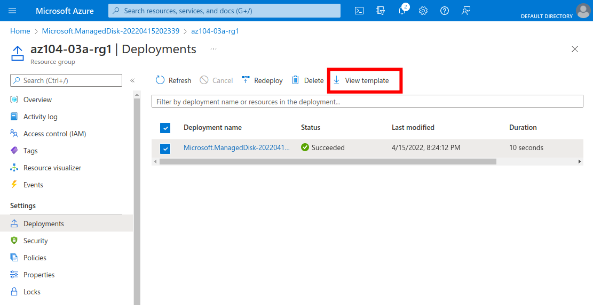
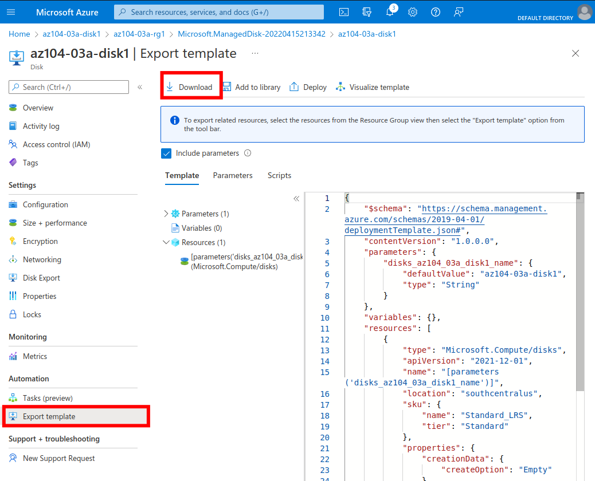
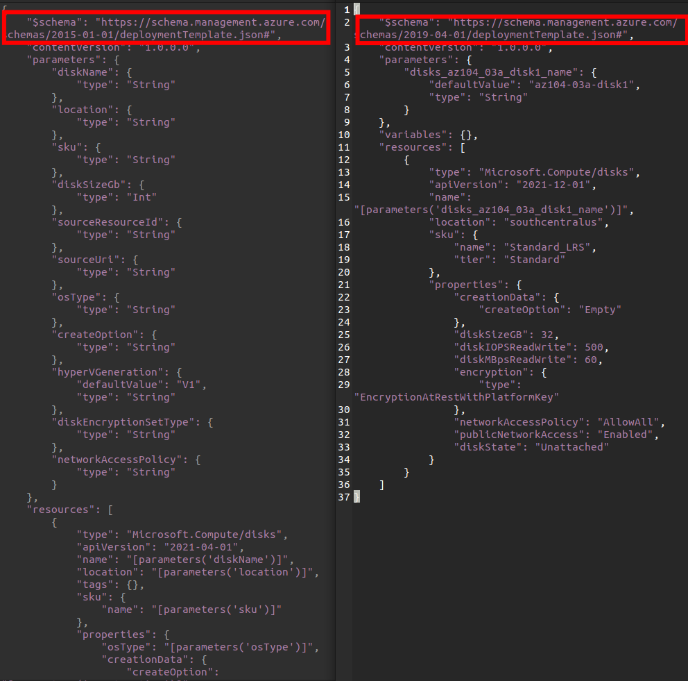
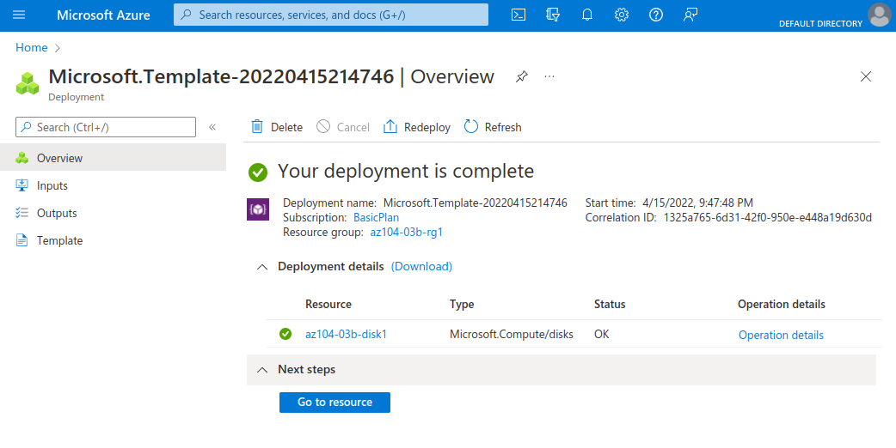

  

# Day 6 - Azure AZ-104 Manage Azure resources by Using ARM Templates

## Introduction

✍️ Yesterday, I walked through Lab 3a Manage Azure resources by Using the Azure Portal lab, from [Microsoft Learn AZ-104 Lab Exercises](https://microsoftlearning.github.io/AZ-104-MicrosoftAzureAdministrator/). Today, I'm doing Lab 3B, Manage Azure resources by Using ARM Templates Lab.

## Prerequisite

✍️ (What) Explain in one or two sentences the base knowledge a reader would need before describing the the details of the cloud service or topic.

## Use Case

  

- ✍️ This architecture diagram is taken from the lab page, showing the three tasks:
  - Task 1: Review an ARM template for deployment of an Azure managed disk
  - Task 2: Create an Azure managed disk by using an ARM template
  - Task 3: Review the ARM template-based deployment of the managed disk

## Cloud Research

- ✍️ Document your trial and errors. Share what you tried to learn and understand about the cloud topic or while completing micro-project.
- 🖼️ Show as many screenshot as possible so others can experience in your cloud research.

## My Experience

### Step 1 — Review an ARM template for deployment of an Azure managed disk

In the 'az104-03a-rg1' resource group, I look at past deployment of resources, in this case the disk from the previous lab.

Looking at the template, there's the option to download it. "My preciouss" - Gollum (probably)

At this point I'm frustrated, so walking through the portal I noticed that via the disk blade you can view it's template, versus the using 'deployments' on the resource group blade.

Critically, I noticed the templates had two different schemas, one marked 2015, and one 2019.

### Step 3 — Review the ARM template-based deployment of the managed disk

Utilizing the 2019 template I had gotten directly from the previous disk, this deployment went smoothly, as it should since I didn't change anything.

## ☁️ Cloud Outcome

✍️ Unlike the previous labs, up to this point, this was quite bumpy. I'm going to need to do more research on utilizing ARM templates. I noticed when comparing the two different schemas, the older one had 2021-04-01 for the API version, while the more recent schema had 2021-12-01. I found this [page for Microsoft.Compute/disks](https://docs.microsoft.com/en-us/azure/templates/microsoft.compute/disks?tabs=bicep), where it allows you to view previous API versions.

## Next Steps

✍️ Tomorrow, I'm going to do the fifth lab, 3c Manage Azure resources by Using Azure PowerShell, from the Azure Administration module.

## Social Proof

✍️ Show that you shared your process on LinkedIn

[Linkedin Post]()
