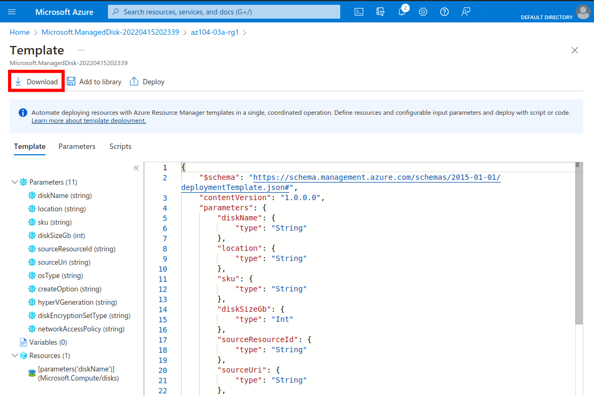
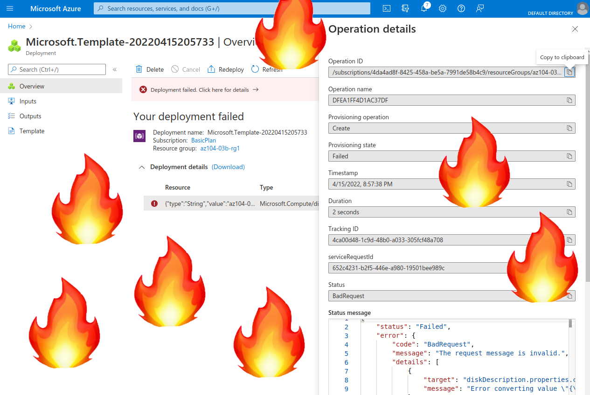

  

# Day 6 - Azure AZ-104 Manage Azure resources by Using ARM Templates

## Introduction

Yesterday, I walked through Lab 3a Manage Azure resources by Using the Azure Portal lab, from [Microsoft Learn AZ-104 Lab Exercises](https://microsoftlearning.github.io/AZ-104-MicrosoftAzureAdministrator/). Today, I'm doing Lab 3B, Manage Azure resources by Using ARM Templates Lab.

## Prerequisite

☁️ Today's concept is **Infrastructure-as-Code (IaC)**.

☁️ Anybody that has had to manage the configuration and maintenance of servers, networks, firewalls, load balancers, etc has experienced **'environment drift'**. Just by the nature of IT, even duplicate servers, with the same exact Operating System, configurations, application code, and so on will have differing configurations as time progresses. A update crashes on one machine, and although you overcome the issue, the machine is never the same as a it's sibling. As time progresses, these differences start to accumulate.

☁️ IaC provides a way to manage infrastructure via code, enabling automation, consistent deployments, and removes much of the previous manual work.

☁️ Azure Resource Manager is a native Azure IaC tool that utilizes declarative JSON-based or Bicep templates.

**Sidenote**: Bicep is a recent addition; a domain specific language for deploying Azure resources. It was created to provide simpler syntax compared to JSON-templates. Although, it's still 0.5 version at the time of this writing, it's already being recommended by Microsoft to learn and utilize it. For the sake of this lab I will be using the JSON-template, but expect Bicep in future posts.

## Use Case

  

- This architecture diagram is taken from the lab page, showing the three tasks:
  - Task 1: Review an ARM template for deployment of an Azure managed disk
  - Task 2: Create an Azure managed disk by using an ARM template
  - Task 3: Review the ARM template-based deployment of the managed disk

## My Experience

### Step 1 — Review an ARM template for deployment of an Azure managed disk

In the 'az104-03a-rg1' resource group, I look at past deployment of resources, in this case the disk from the previous lab.

  

Looking at the template, there's the option to download it. "My preciouss" - Gollum (probably)

  

### Step 2 — Create an Azure managed disk by using an ARM template

Apparently, there's a service called "Deploy a custom template". I guess that's straight forward.

  

The template loads, and goto Edit Parameters. No problem.

  

Bunch of warnings and an error. Something about Strings when expecting objects.

  

I tried editing various fields, re-loading the template, then the parameters, and even when I passed 'validation', the deployment would fail.

  

At this point I'm frustrated, so walking through the portal I noticed that via the disk blade you can view it's template, versus the using 'deployments' on the resource group blade.

  

Critically, I noticed the templates had two different schemas, one marked 2015, and one 2019.

  

### Step 3 — Review the ARM template-based deployment of the managed disk

Utilizing the 2019 template I had gotten directly from the previous disk, this deployment went smoothly, as it should since I didn't change anything.

  

## ☁️ Cloud Outcome

Unlike the previous labs, up to this point, this was quite bumpy. I'm going to need to do more research on utilizing ARM templates. I noticed when comparing the two different schemas, the older one had 2021-04-01 for the API version, while the more recent schema had 2021-12-01. I found this [page for Microsoft.Compute/disks](https://docs.microsoft.com/en-us/azure/templates/microsoft.compute/disks?tabs=bicep), where it allows you to view previous API versions.

## Next Steps

Tomorrow, I'm going to do the sixth lab, [3c Manage Azure resources by Using Azure PowerShell](../007/Readme.md), from the Azure Administration module.

## Social Proof

Show that you shared your process on LinkedIn

[Linkedin Post]()
