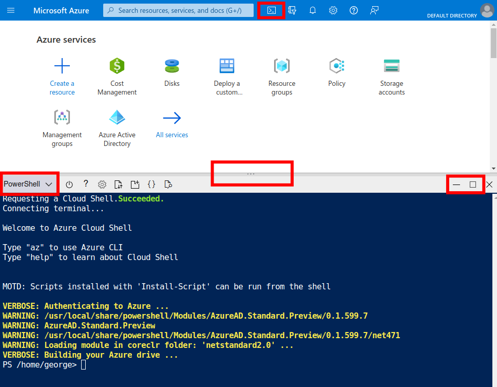
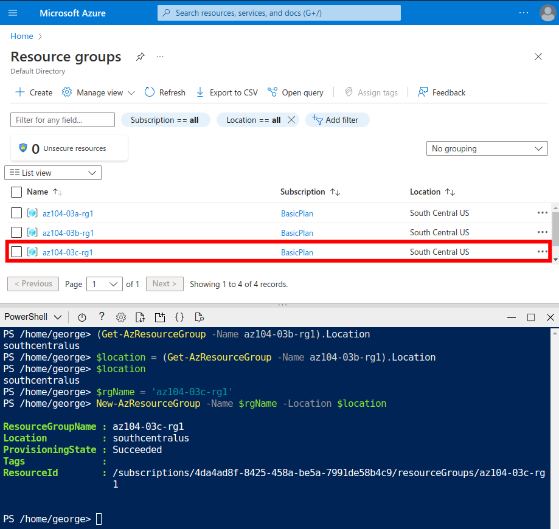
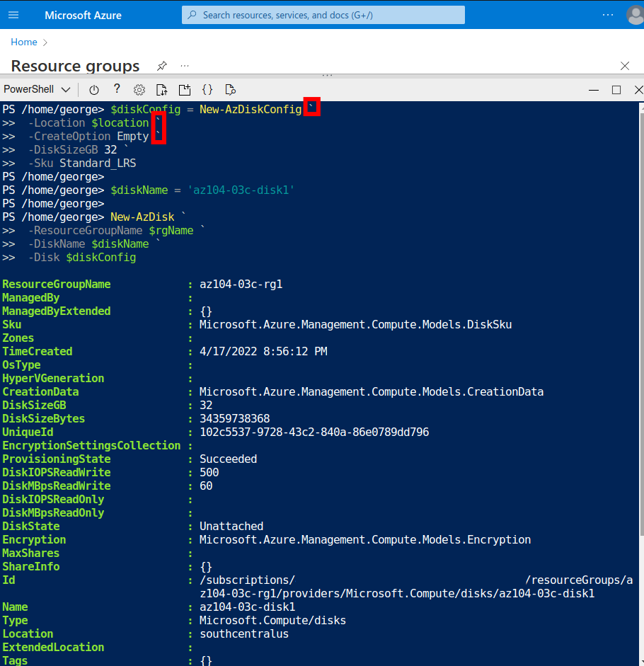
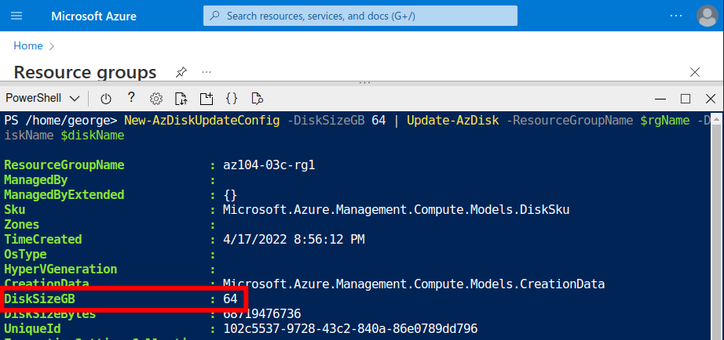

  

# Day 7 - Azure AZ-104 Manage Azure resources by Using Azure PowerShell

## Introduction

☁️ Yesterday, I walked through Lab 3b Manage Azure resources by Using ARM Templates lab, from [Microsoft Learn AZ-104 Lab Exercises](https://microsoftlearning.github.io/AZ-104-MicrosoftAzureAdministrator/). Today, I'm doing Lab 3c, Manage Azure resources by Using Azure PowerShell Lab.

## Prerequisite

☁️ PowerShell is a task automation and configuration management program, consisting of a command-line shell, and scripting language.

☁️ If you haven't used the Cloud Shell before, Azure will ask you to create storage so that configuration files will persist across sessions.

## Use Case

  

- This architecture diagram is taken from the lab page, showing the three tasks:
  - Task 1: Start a PowerShell session in Azure Cloud Shell
  - Task 2: Create a resource group and an Azure managed disk by using Azure PowerShell
  - Task 3: Configure the managed disk by using Azure PowerShell

## Cloud Research

☁️ Azure Cloud Shell comes in two flavors, PowerShell and CLI (aka Bash-like). Generally, if you're coming from a Microsoft environment, PowerShell will be the natural choice, and if you can come from a Linux environment, then Azure CLI will be the choice. The two options do have _some_ differences when it comes to capabilities, but a number of those are user preference.

## My Experience

### Task 1 — Start a PowerShell session in Azure Cloud Shell

Since I have you used Cloud Shell before, I wasn't prompted for creating a storage account and file share.
To open Cloud Shell, it's the icon to the right of the search bar showing the greater than sign followed by an underscore.
You can adjust the window size using the middle divider, if you still wish to see part of the Portal, or maximize it like a typical window.
On the left side of the Cloud Shell toolbar, you can select PowerShell, or Azure CLI. Even with PowerShell selected, you can still use Azure CLI commands.

### Task 2 — Create a resource group and an Azure managed disk by using Azure PowerShell

In PowerShell you create variables using '$', the dollar sign. If you're doing work within the same resource group, using the same Azure Region, and so on, it makes sense to assign those items to variables. This allows consistency (just make sure you didn't mistype it the first time), and easier to type and read commands.

When entering long commands, you can use, '`' the backtick (usually above your tab key) followed by enter to continue to the next line for easier reading.
Here, I create two additional variables for the disk configuration, and disk name.

### Task 3 — Configure the managed disk by using Azure PowerShell

Here I use increase the disk size, originally 32, to 64 GB. The change is nearly instant.

With a simple command, I change the SKU from standard to premium. This Microsoft Doc covers the [difference between the Disk SKU's](https://docs.microsoft.com/en-us/azure/virtual-machines/disks-types).

## ☁️ Cloud Outcome

☁️ Smooth sailing on this one. I think for one off or non-routine work this is GREAT!

## Next Steps

☁️ Tomorrow, I'm going to do the seventh lab, 3d Manage Azure resources by Using Azure CLI, from the Azure Administration module.

## Social Proof

Show that you shared your process on LinkedIn

[Linkedin Post](https://www.linkedin.com/posts/georgemontee_github-gmontee100daysofcloud-activity-6922269697316966401-5nB-?utm_source=linkedin_share&utm_medium=member_desktop_web)
