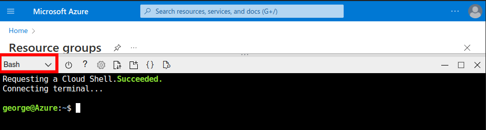
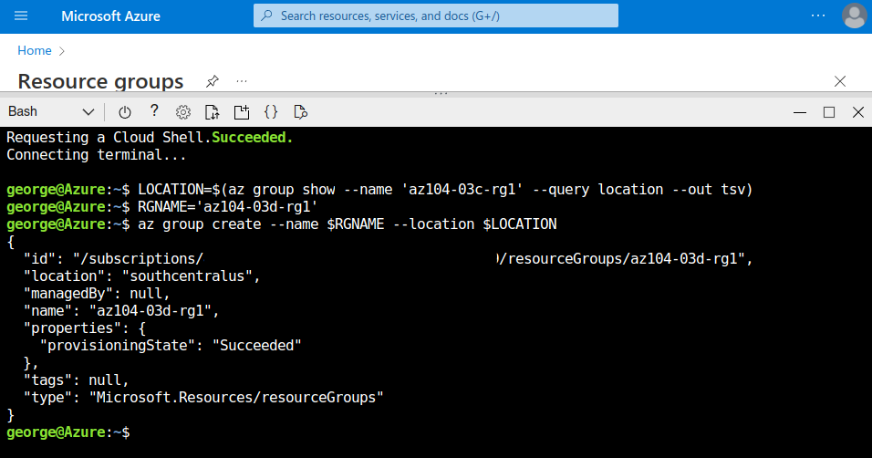
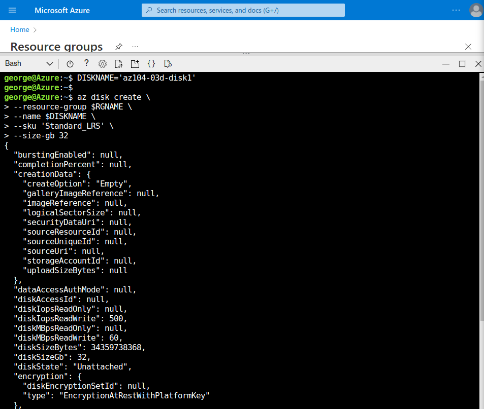
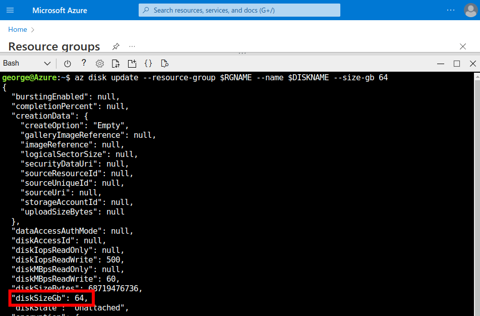
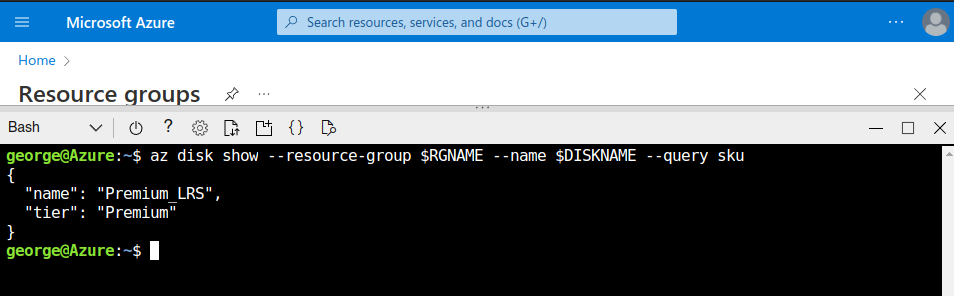

  

# Day 8 - Azure AZ-104 Manage Azure resources by Using Azure CLI

## Introduction

☁️ Yesterday, I walked through Lab 3b Manage Azure resources by Using Azure PowerShell lab, from [Microsoft Learn AZ-104 Lab Exercises](https://microsoftlearning.github.io/AZ-104-MicrosoftAzureAdministrator/). Today, I'm doing Lab 3c, Manage Azure resources by Using Azure CLI Lab.

## Prerequisite

☁️ Azure CLI is a Bash-like command line interface.

☁️ If you haven't used the Cloud Shell before, Azure will ask you to create storage so that configuration files will persist across sessions.

## Use Case

  

- This architecture diagram is taken from the lab page, showing the three tasks:
  - Task 1: Start a Bash session in Azure Cloud Shell
  - Task 2: Create a resource group and an Azure managed disk by using Azure CLI
  - Task 3: Configure the managed disk by using Azure CLI

## My Experience

### Task 1 — Start a Bash session in Azure Cloud Shell

Just like yesterday, opening Cloud Shell, and this time selecting 'Bash' from the drop-down.

### Task 2 — Create a resource group and an Azure managed disk by using Azure CLI

Some differences from PowerShell yesterday. You'll notice when declaring and assigning variables, the dollar sign isn't used. But when referencing the variable, the dollar sign is used.
Additionally, the backspace '/', is used for line continuation.

Creating the disk.

### Task 3 — Configure the managed disk by using Azure CLI

You'll notice a pattern with commands. Starting with 'az', then the command group, the command itself, and then parameters (distinguished by the --), and then the value.

Easy Peasy.

## ☁️ Cloud Outcome

☁️ Another straight forward lab. I have used PowerShell, yesterday's lab, on and off in the past. The beginning of last year I finally jumped into the Linux world full steam, and starting learning Bash. For me, the Bash commands are less verbose.

## Next Steps

☁️ Tomorrow, I'm going to take the AZ-104 Azure Administrator exam.

## Social Proof

☁️ Show that you shared your process on LinkedIn

[Linkedin Post]()
