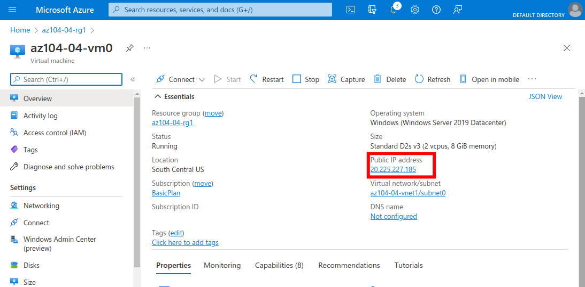

  

# Day 10 - Azure AZ-104 Implement Virtual Networking

## Introduction

☁️ Today, I'm going to create a virtual network in Azure, some virtual machines to reside within different subnets, and implement a DNS name resolution for those VMs.

## Prerequisite

- ☁️ In [Azure Virtual Networks](https://docs.microsoft.com/en-us/azure/virtual-network/virtual-networks-overview) (VNets) are a fundamental building block, allowing an IP address range to specified, subnets, associating network security groups, and configuring route tables. VNets can have public and private subnets (and technically a gateway subnet).

## Use Case

  

- This architecture diagram is taken from the lab page, showing the six tasks:
  - Task 1: Create and configure a virtual network
  - Task 2: Deploy virtual machines into the virtual network
  - Task 3: Configure private and public IP addresses of Azure VMs
  - Task 4: Configure network security groups
  - Task 5: Configure Azure DNS for internal name resolution
  - Task 6: Configure Azure DNS for external name resolution

## Cloud Research

- ☁️ I've heard the [Domain Name System](https://docs.microsoft.com/en-us/azure/dns/dns-overview) (DNS) compared to a phone book. It enables domain names to be associated with an Internet Protocol (IP) address. So instead of entering 74.125.21.101, I can instead enter the much easier to remember, www.google.com.

- ☁️ When virtual machines are deployed within a VNet, they are automatically assigned a [private IP address](https://docs.microsoft.com/en-us/azure/virtual-network/ip-services/private-ip-addresses) based on that VNet's Classless Inter-Domain Routing (CIDR) range. A [public IP address](https://docs.microsoft.com/en-us/azure/virtual-network/ip-services/public-ip-addresses), common shorthand is 'pip', can be assigned to allow Azure resources to communicate with the Internet; some possible resources that can have a pip are vm network interfaces, public load balancers, application gateways, firewalls, and bastion hosts.

- ☁️ [Network Security Groups](https://docs.microsoft.com/en-us/azure/virtual-network/network-security-groups-overview) enable network traffic traveling to and from resources within a VNet to be filtered. A key point about NSGs is they're 'stateful'; meaning if a rule opens an incoming port, the outgoing port will automatically be opened to allow traffic. NSG rules are processed in order, from lowest to highest assigned numbers.

- ☁️ Azure allows the use of [public and private DNS zones](https://docs.microsoft.com/en-us/azure/dns/dns-zones-records). Utilizing a private DNS zone in Azure removes the need for a custom DNS solution, provides automatic hostname record management, hostname resolution between virtual networks, and so on.

## My Experience

### Step 1 — Create and configure a virtual network

Here I'm creating the VNet with an address space of 4,096 possible IP addresses, and the subnet, with a /24 CIDR range, claiming 256 addresses out of the VNet's total.

  

Don't forget, [Azure reserves 5 IP addresses](https://docs.microsoft.com/en-us/azure/virtual-network/virtual-networks-faq) for multicast, broadcast, loopback, link-local, and internal DNS. Thus, the available IP addresses for each subnet is 251, instead of 256.

  

### Step 2 — Deploy virtual machines into the virtual network

Utilizing the template and parameters json files provided by the lab, a vm is created in each subnet.

  

### Step 3 — Configure private and public IP addresses of Azure VMs

I created a public IP address for each Network Interface Card (NIC), which are attached to the VM's.

  

Here, you can see the VM now has a public IP address associated with it.

  

### Step 4 — Configure network security groups

Before creating the NSG, I had to stop the VM's, else it could take up to 30 minutes for the new NSG to be associated.

When I created the NSG, Azure created 3 default rules. Here I'm adding the rule to allow Remote Desktop connections. The warning symbol is letting me know I'm exposing resources to the internet, and it's not recommended for production workloads.

  

Here I'm able to associate the NSG with both NICs.

  

Finally, with the NSG and the RDP allow rule in place, I'm able to remote into the vm.

  

### Step 5 — Configure Azure DNS for internal name resolution

I created a private DNS zone, and a virtual network link.

  

Because 'Auto Registration' was enabled, a few minutes after creation, links are created for the two VMs.

  

RDPing into a vm again, because of the new private DNS zone, I'm able to look up information about the VMs just based on their hostname. Neat!

  

### Step 6 — Configure Azure DNS for external name resolution

I searched for a domain name that wasn't in use, and thankfully, az104lab4task6.net was available. I created a public DNS entry to use that domain name.

  

Here I'm able to successfully resolve the domain name for the first vm! The second parameter in the nslookup is an available Azure Name Server.

  

## ☁️ Cloud Outcome

☁️ I was a bit apprehensive considering what this lab entailed, but it went smoothly. Having done Sysadmin work in the past, I can see a private dns zone being highly useful for doing manual and automated work.

## Next Steps

☁️ Tomorrow, I'm going to journey into the world of Intersite Connectivity.

## Social Proof

[Linkedin Post](https://www.linkedin.com/posts/georgemontee_github-gmontee100daysofcloud-activity-6926900722869403648-Wt_A?utm_source=linkedin_share&utm_medium=member_desktop_web)
