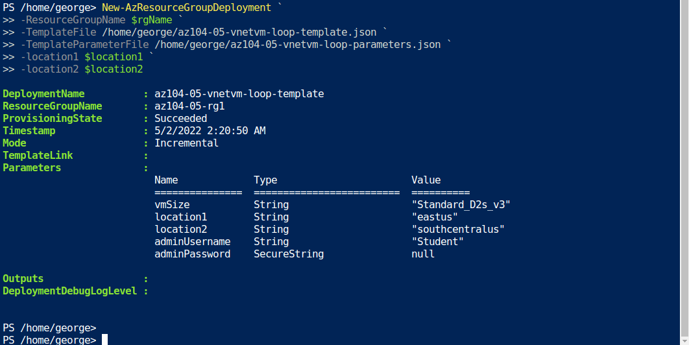

  

# Day 11 - Azure AZ-104 Implement Intersite Connectivity

## Introduction

☁️ Today I'm going to replicate 3 datacenters, two in the same region, and the third in another region. The goal is to have them connected via a mesh wide-area network links, utilizing [Network Peering](https://docs.microsoft.com/en-us/azure/virtual-network/virtual-network-peering-overview).

## Prerequisite

☁️ To connect two or more VNets in Azure, we can use Virtual Network Peering, for networks within the same region, and **Global** Virtual Network Peering, for connecting networks in different regions.

## Use Case

  

- This architecture diagram is taken from the lab page, showing the three tasks:
  - Task 1: Provision the lab environment
  - Task 2: Configure local and global virtual network peering
  - Task 3: Test intersite connectivity

## Cloud Research

- ☁️ The neat thing about virtual network peering is it uses the Microsoft backbone infrastructure, making the network traffic private. No hops out to the public Internet.

- ☁️ Virtual networks can use gateways to connect to an on-premises network.

## My Experience

### Task 1 — Provision the lab environment

Here I'm assigning values for Locations 1 & 2, which will be used in the template and parameters ARM files. If you need a list of available regions, in a Cloud Shell PowerShell session run '(Get-AzLocation).Location'

  

Executing the ARM templates via PowerShell. This creates the three networks, two in East US, and one in South Central US. Each network contains a VM, an attached disk, a NIC, a Public IP address, and a Network Security Group

  

### Task 2 — Configure local and global virtual network peering

VNets 0 and 1 are in the same region, so I created a virtual network peering.

  

Here I'm connecting VNets 0 and 2, from different regions, with a global virtual network peering. The process is identical. I later do the same connection VNets 1 and 2.

  

### Task 3 — Test intersite connectivity

Utilizing RDP, I remote into VM0. Using PowerShell and the Test-NetConnection commandlet, I'm able to verify I can connect via TCP Port 3389 to VM1, in a different VNet, and VM2 in a different region.

  

## ☁️ Cloud Outcome

☁️ I was able to connect 3 different sites, represented by the VNets, utilizing peering.

## Next Steps

☁️ Tomorrow, I'm going to manage network traffic.

## Social Proof

[Linkedin Post]()
