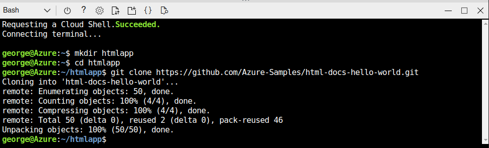
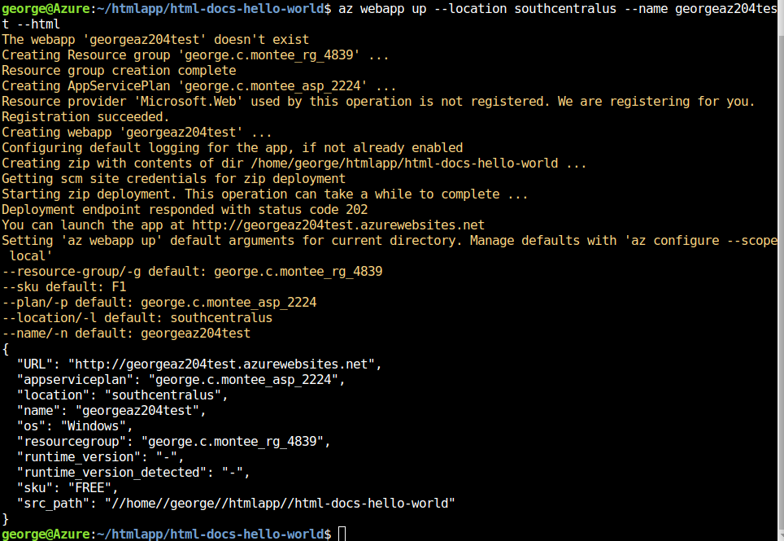
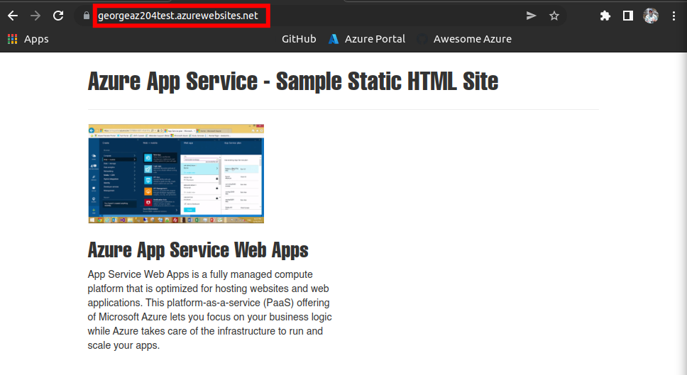
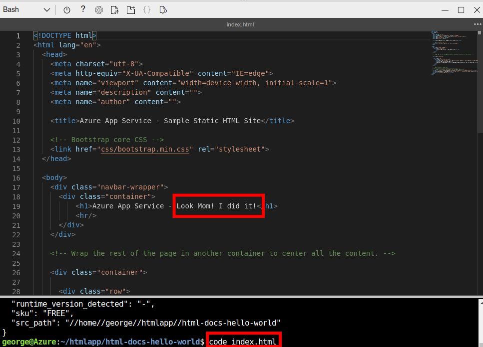
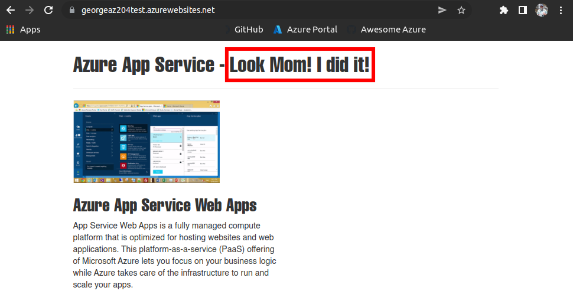

  

# Day 13 - AZ-204 Creating a static HTML web app by using Azure Cloud Shell

## Introduction

☁️ Today I'm going to [deploy a simple web app](https://docs.microsoft.com/en-us/learn/modules/introduction-to-azure-app-service/7-create-html-web-app) using the App Service.

## Prerequisite

☁️ Need Cloud Shell set up. Sample program is found [here](https://github.com/Azure-Samples/html-docs-hello-world.git).

## Use Case

  

- This architecture diagram is taken from the lab page, showing the three tasks:
  - Task 1: Download the Sample App
  - Task 2: Create the Web App
  - Task 3: Update and Redeploy the App

## My Experience

### Task 1 — Download the Sample App

I opened Cloud Shell, switched to Bash, and entered the commands shown in the screenshot.

  

### Task 2 — Create the Web App

Creating the app via Azure CLI. The name has to be globally unique.

  

Success

  

### Task 3 — Update and Redeploy the App

I use the built-in code editor to make a simple change.

  

A quick refresh, and the page shows the update.

  

## ☁️ Cloud Outcome

☁️ That was painless. This was the equivalent of "hello world!", since I merely deployed it, but didn't do anything with settings.

## Next Steps

☁️ Tomorrow, I'm going to dig deeper into Azure App Service by looking at application settings, installing SSL/TLS certificates to secure web traffic, enable diagnostic logging, creating virtual app to directory mappings, and managing app features.

## Social Proof

[Linkedin Post](https://www.linkedin.com/posts/georgemontee_github-gmontee100daysofcloud-activity-6927972370028650496-6nCp?utm_source=linkedin_share&utm_medium=member_desktop_web)
