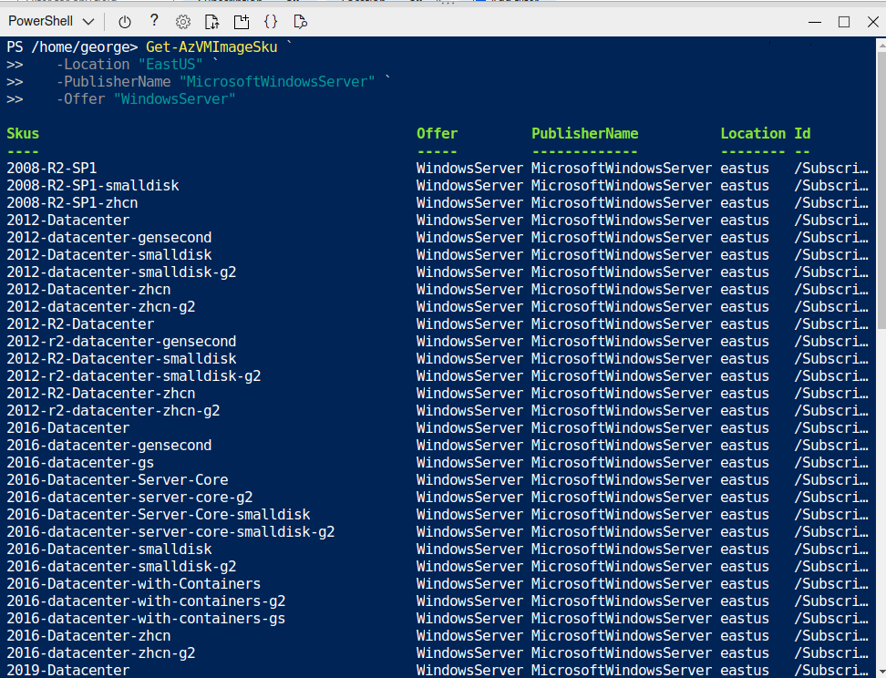

  

# Day 16 - Azure AZ-204 Implement IaaS Solutions: VMs

## Introduction

☁️ Alright! Having passed the AZ-900 and AZ-104 exams, I'm aggressively studying for the AZ-204. Through a Cloud Skills Challenge sponsored by the [The Nashville Microsoft Azure Users Group](https://www.meetup.com/The-Nashville-Microsoft-Azure-Users-Group/?_cookie-check=lL9KkAOOCGsqsLMA) I received an exam voucher! The catch is I have to schedule and complete the exam by the end of this month!

## Prerequisite

Here are some quick, high-level concepts we're looking at today:

☁️ Virtual Machine - on-demand, scalable computer resource, i.e., like an on-premise server but way more awesome

☁️ ARM Template - a declarative template that defines infrastructure and configuration, targets the Azure Resource Manager API, to deploy Azure resources

## Use Case

  

- Implement Infrastructure-as-a-Service Solutions:
  - **Provision Virtual Machines (VMs)**
  - **Configure, validate, and deploy ARM templates**
  - Configure container images for solutions
  - Publish an image to the Azure Container Registry
  - Run containers by using the Azure Container Instance

## Cloud Research with Virtual Machines

Scalable and flexible, but more responsibility lies with the consumer than with Microsoft; see [Shared responsibility in the cloud](https://docs.microsoft.com/en-us/azure/security/fundamentals/shared-responsibility).

- secure and maintain your machines once they're provisioned
- make sure you systems are meeting any resiliency standards you may have, e.g., RPO/RTO
- ensure your system's data is secure

VM offerings range from small, test-optimized servers to massive, GPU-bearing machine learning systems.

You can use Windows or Linux based servers, deploy pre-configured servers for things like databases, or even bring your own image.

Deployment Methods:

- Azure Portal Console
- Scripted Deploy via Azure CLI or Powershell
- Azure Resource Manager (ARM) Templates
- Third-party tools such as Terraform or Ansible

Maintaining VMs

- patching (Microsoft provides options that can streamline it)
- keep programs & services up to date
- scale automatically or manually

Securing VMs

- hardening network defenses
- identifying anyone or anything that wants to connect
- encrypt data

System Availability

- Virtual Machine Scale Sets
- Backups
- Build with expectation of failure
  - Azure provides 3 '9s', 99.9% uptime, which means potentially 44 minutes of downtime expected per month

## My Experience with Virtual Machines

New- for deploying new systems or scale sets from scratch
Get- commands to gather information and even plug returns into variables
Start-AzVM and Stop-AzVM commands cna power up/down a VIM
Caution: Stop-AzVM does not deallocate the VM

### Task 1 — Create RG and VM

Creating the Resource Group for this exercise

  

Creating the Virtual Machine

  

### Task 2 — Connect to newly created VM

Finding the new public IP address of the VM

  

### Task 3 — Reviewing Marketplace Images

Bring a list of image publishers
Get-AzVMImagePublisher -Location "southcentralus"

Here I'm see what the Windows Server Publisher has available

  

Diving further down, I see what Windows Server SKUs are available

  

### Task 4 — VM Sizes

Here I check out VM sizes are available for my region. FYI, this list scrolls on or a bit.

  

Resizing myVM from Standard_D2s_v2 to Standard_DS3_v2

  

### Task 5 — VM Power States

Here I'm using PowerShell to check the power state of myVM, and the stopping it.

  

## ☁️ Cloud Outcome

☁️ Utilizing the backtick ` can be quite useful if there a number of parameters for the command. The only thing is, I'm always worried about hitting the 'Enter' key prematurely.

☁️ When provisioning a VM I get a status bar. However, doing actions like resizing, I don't get any response than the terminal sitting there. Even if it was just spinning slashes, would be nice so I know it's working on it.

☁️ Some of the Get results were quite long. Utilizing the More Function helps, e.g., Get-AzVMSize -ResourceGroupName "myResourceGroupVM" -VMName "myVM" | more

## Next Steps

☁️ Tomorrow, I move to the latter half of the Compute section, working with Containers in Azure

## Social Proof

[Linkedin Post](https://www.linkedin.com/posts/georgemontee_github-gmontee100daysofcloud-activity-6929798430261219329-jvm1?utm_source=linkedin_share&utm_medium=member_desktop_web)
