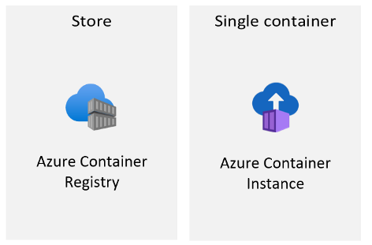
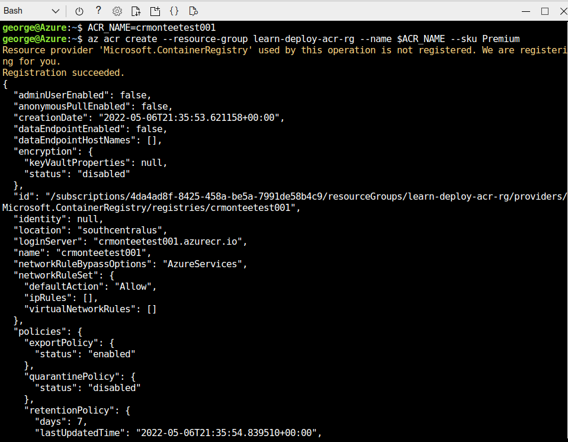
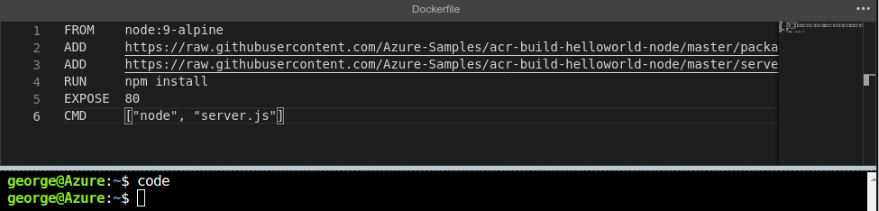
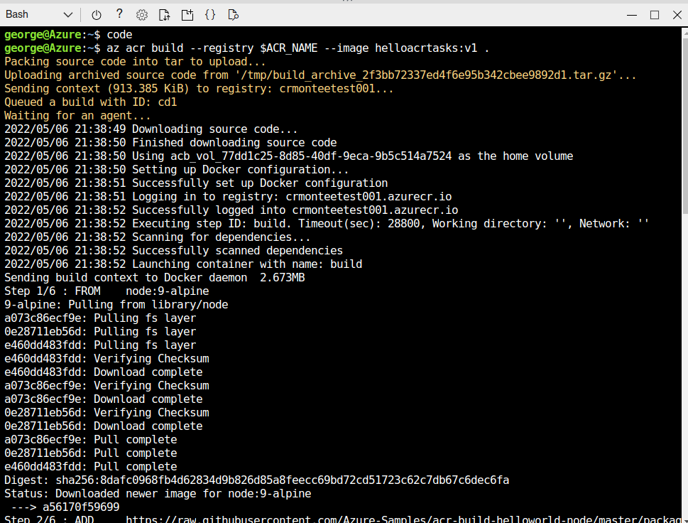
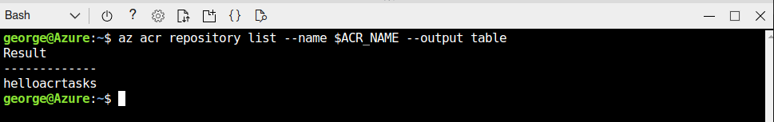
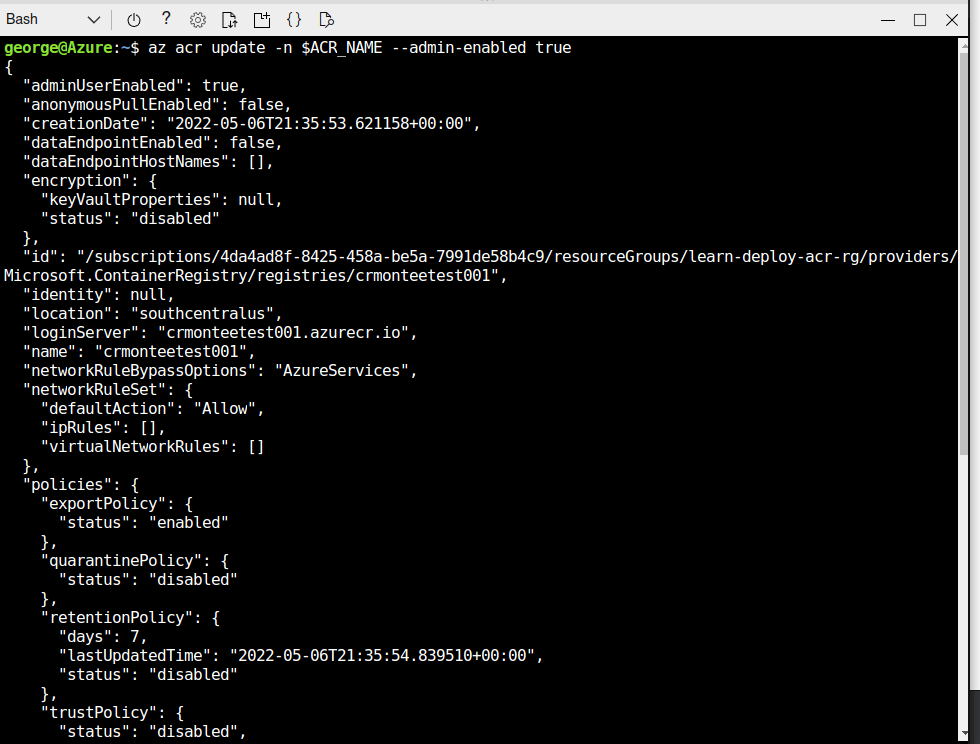
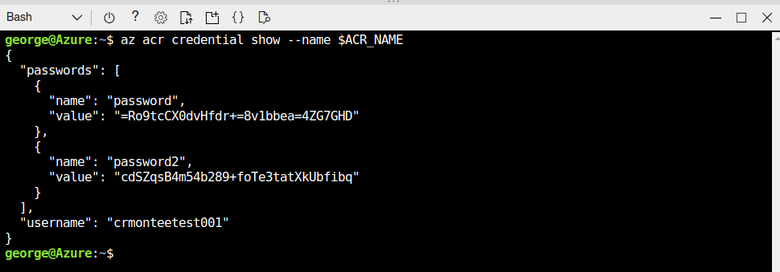
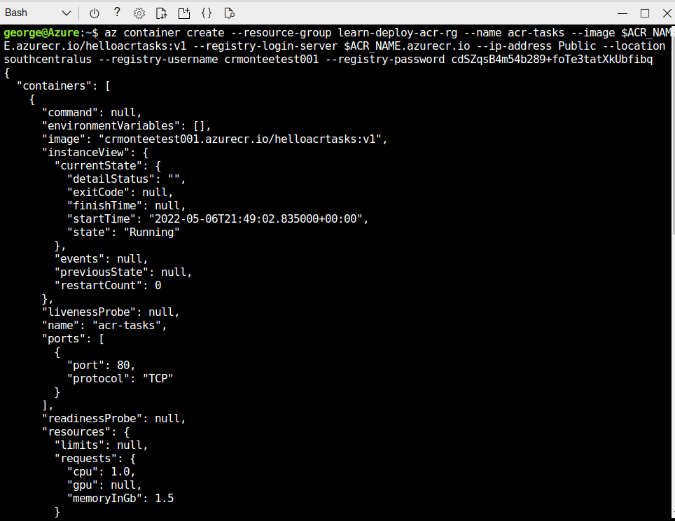
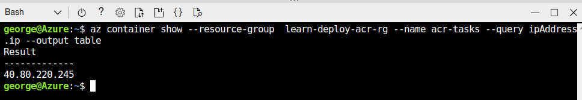
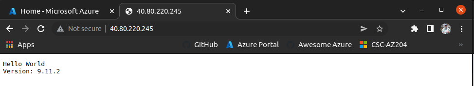

  

# Day 17 - Azure AZ-204 Implement IaaS Solutions: Containers in Azure

## Introduction

☁️ Containers are the next evolution that comes after virtualization. They're highly versatile, super portable, even more resource efficient, scalable, and they can be created/replicated/destroyed in seconds.

## Prerequisite

☁️ Container Images - a static file with execute that can create a container on a computing system

☁️ Azure Container Registry - private registry service for building, storing, and managing container images and related artifacts

☁️ Azure Container Instance a solution for any scenario that can operate in isolated containers, without orchestration

## Use Case

  

- Implement Infrastructure-as-a-Service Solutions:
  - Provision Virtual Machines (VMs)
  - Configure, validate, and deploy ARM templates
  - **Configure container images for solutions**
  - **Publish an image to the Azure Container Registry**
  - **Run containers by using the Azure Container Instance**

## Cloud Research

Container

- The Service
- Dependencies
- Libraries

Azure CLI
az container create command

- resource group
- name
- image path or url
- dns name label
- ports

PowerShell
new-AzContainerGroup command

- Resource Group
- Name
- Image path or url
- OS TYpe
- DNS name label
- (defaults to Port 80)

Container Groups

- a collection of containers that get scheduled on the same host machine
- containers share a lifecycle, resources, local network, and storage volumes
- similar in concept to a pod in Kubernetes

Container Operations

Azure Container Registry

- 3 Tiers:
  - Basic: cost-optimized, developer focused, lower throughput/storage
  - Standard: default for production loads, more throughput/storage
  - Premium: high-volume scenarios with concurrent operations; geo-replication, content trust, and compatibility with Private Link
- understand how to "lock" repos/images to avoid unauthorized or accidental updates/deletes
- restricting access and authorization

## My Experience with Containers in Azure

### Task 1 — Create the Registry

Creating my own container registry. I went through the lab found [here](https://docs.microsoft.com/en-us/learn/modules/build-and-store-container-images/1-intro-to-azure-container-registry).

  

### Task 2 — Build Container images with ACR

Creating the Dockerfile; this config adds a Node.js app that will serve the application on Port 80.

  

Building the container image. It might be hard to notice, but at the end of the command the period represents the current directory as the source directory for the Dockerfile. I could've specified the location of that file utilizing the --file parameter.

  

Verifying the image. Success!

  

### Task 3 — Deploy images from ACR

Azure Container Registry requires authenticated access; either via Azure AD, or an admin account. For this exercise, I don't want to mess with AAD. Admin accounts are disabled by default, so I need to enable it.

  

I need to get the credentials (don't worry I deleted this RG and all its resources after I was done).

  

Deploying the container!

  

Grabbing the IP address of the container's public site

  

There it is!

  

## ☁️ Cloud Outcome

Benefits of using Azure Container Registry

- Able to replicate container images to multiple Azure datacenters
- Pull container images using any Docker container-related technology
- Build container images without the need for locally installed Docker tools

Recommend Authentication method for ACR is utilizing an Azure service principal. That provides granular access, allowing read-only up to full access

Geo-replication enables ACR to function as a single registry (!), serving several regions with multi-master regional registries.

## Next Steps

☁️ Tomorrow, I learn about Azure Functions.

## Social Proof

[Linkedin Post]()
