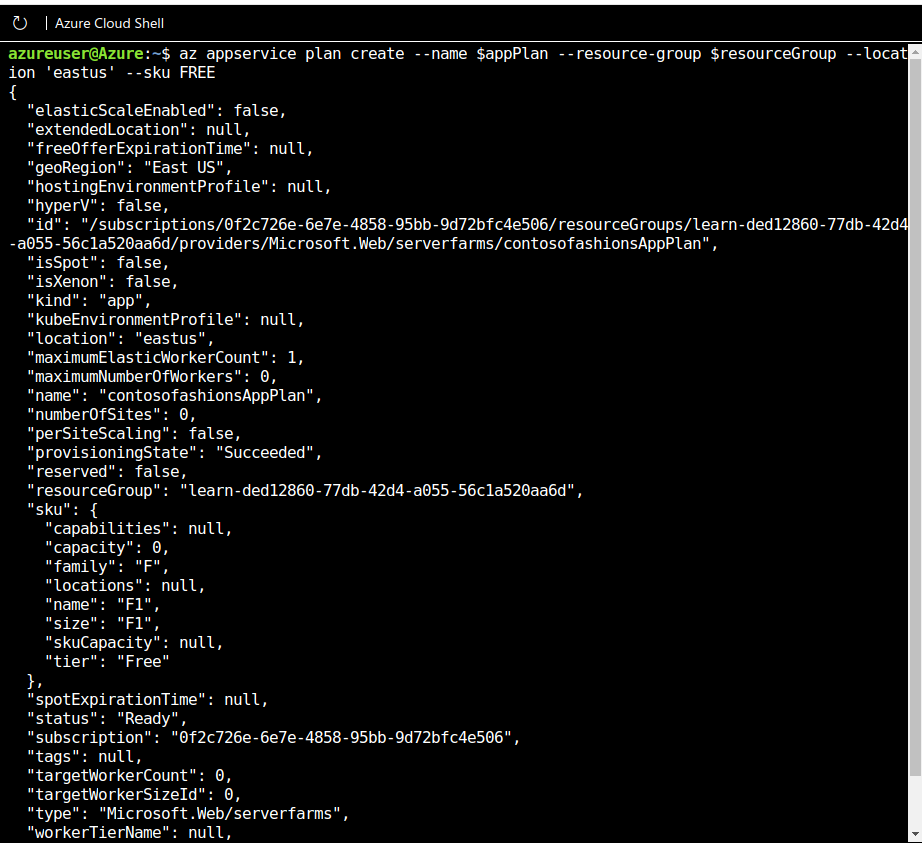

  

# Day 18 - Azure AZ-204 Azure App Service Web Apps: Diagnostic Logs

## Introduction

☁️ Logging can be incredibly important, vital, to troubleshooting issues

## Prerequisite

☁️ Azure App Service is an HTTP-based service for hosting web applications, REST APIs, and mobile back ends

☁️ App Logs are the output of runtime trace statements in app code

## Use Case

  

- Create Azure App Service Web App:
  - Create an Azure App Service Web App
  - **Enable Diagnostic Logging**
  - Deploy code to a web app
  - Configure Web App Settings including SSL, API settings, and connection strings
  - Implement autoscaling rules including scheduled autoscaling and autoscaling by operational or system metrics

## Cloud Research

☁️ App Logging is useful for Pre-Prod environments and investigating troublesome issues; excessive logs quickly consume storage and negatively affect performance

☁️ Scaling limitations due to logged output goes to files

- Types of Logging Available Examples
  - ASP.NET
    - Trace.TraceError("Message"); // Writes an error message
  - ASP.NET Core
    - logger.LogDebug("Message"); // Writes a debug message at log level 1
    - logger.LogError("Message"); // Writes an error message at log level 4
  - Node.js
    - console.error("Message") - writes a message to STDERR
    - console.log("Message") - writes a message to STDOUT

## My Experience with Azure Web App Diagnostic Logging

### Task 1 — Deploy ASP.NET Web App

Creating variables for easier cli command entry. I had to change to region eastus, since southcentralus didn't have any available slots for the Microsoft Learn sandbox

  

Creating the App Service Plan

  

Creating the Web App

  
  
  
  
  

Creating the Storage Account for storing logs

  
  
  

### Task 2 — Enable Logging via Azure Portal

Finding the web app address

  

Turning on logging options

- App Logging (Filesystem) - Error
- App Logging (Blob) - Verbose
- Storage Containers - container named asplogs
- Retention Problem - 5 days

  

### Task 3 — View Live Log stream via Azure CLI

Tailing a log will show live updates as they happen. Once logging service started, I navigated on the site, and the log showed the error messages.

  

### Task 4 — Retrieve files system logs via Azure CLI

Using Azure CLI I download the logs to a zip file

  

I extract the log text file from the zip, and open the file using the built-in code editor

  

## ☁️ Cloud Outcome

- An interesting tool for troubleshooting an app. Depending on what Framework, e.g., ASP.NET, Node.js, and the Operating System, e.g., Windows, Linux, affects whether you can use a Filesystem or Blob storage for storing logs.

## Next Steps

☁️ Tomorrow, I learn about Azure Functions.

## Social Proof

[Linkedin Post](https://www.linkedin.com/posts/georgemontee_github-gmontee100daysofcloud-activity-6930519973668741122-aKA4?utm_source=linkedin_share&utm_medium=member_desktop_web)
