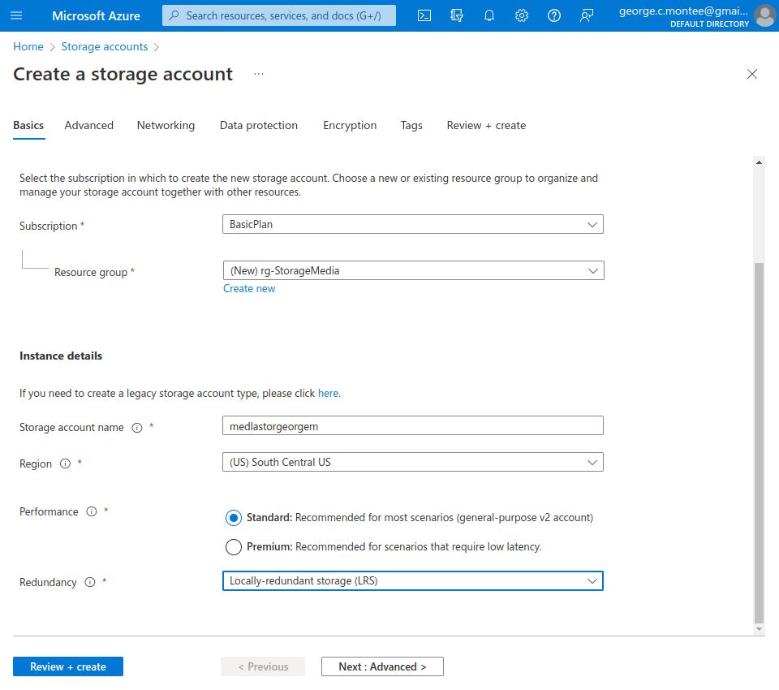
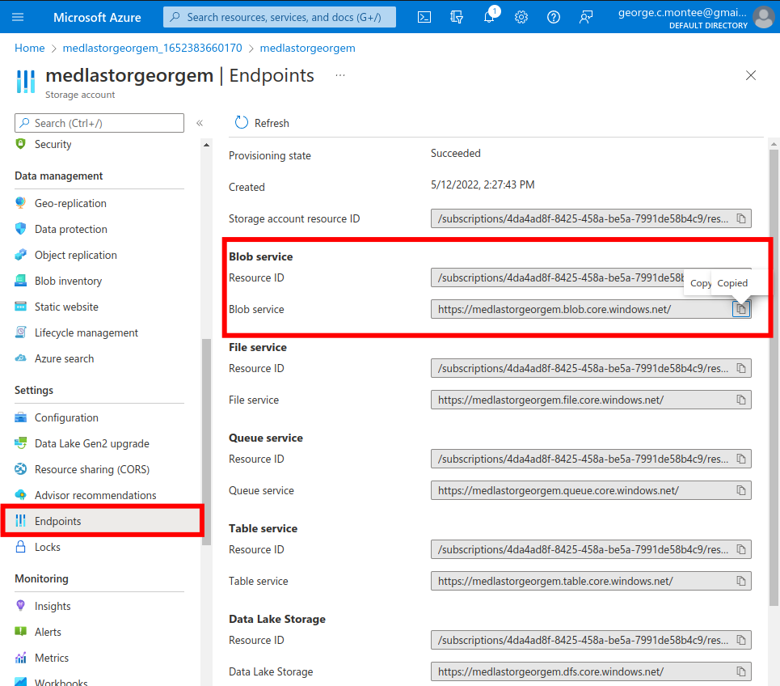
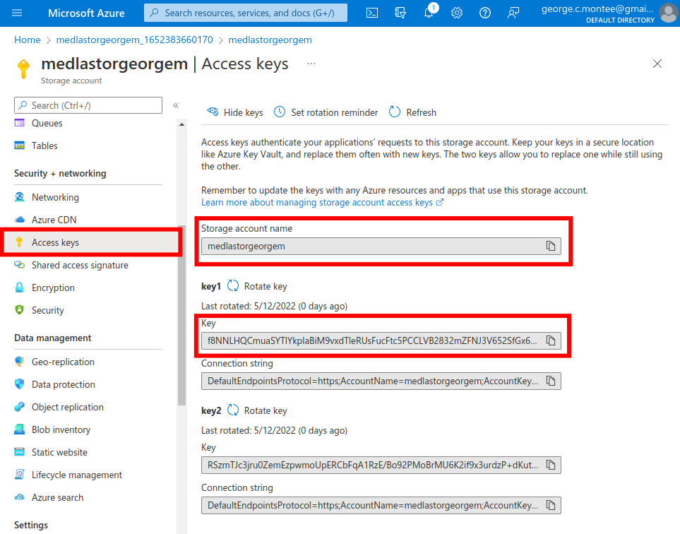
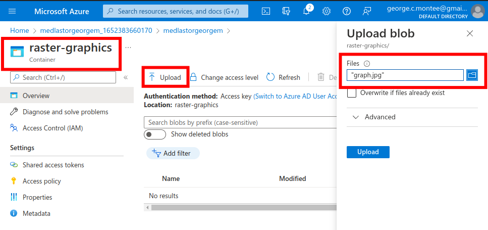
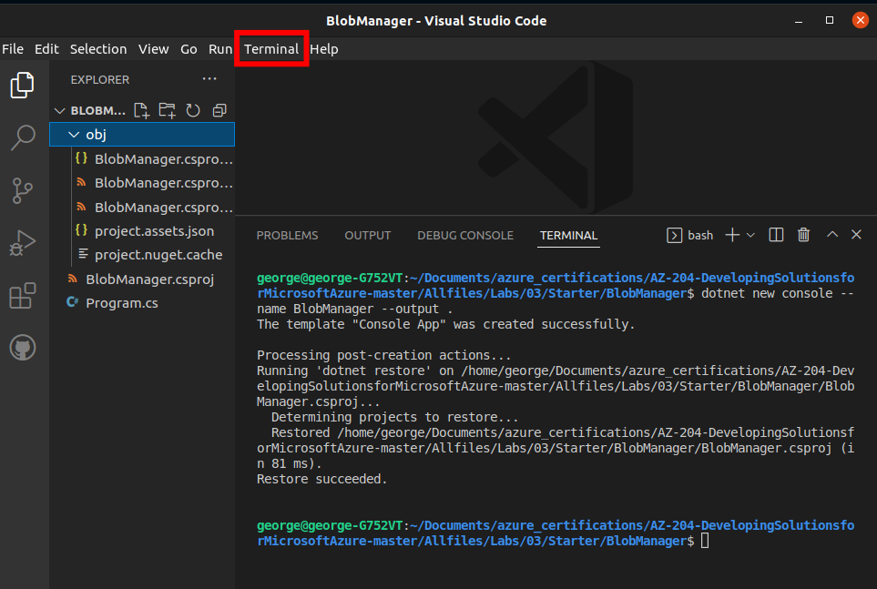
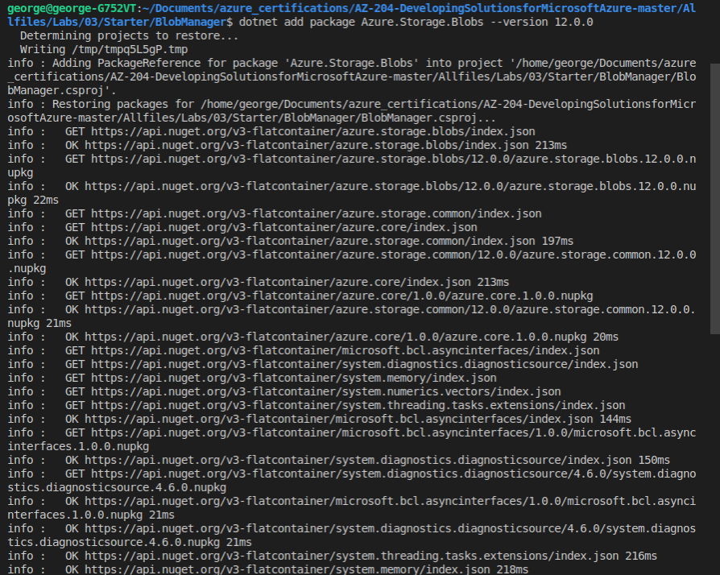
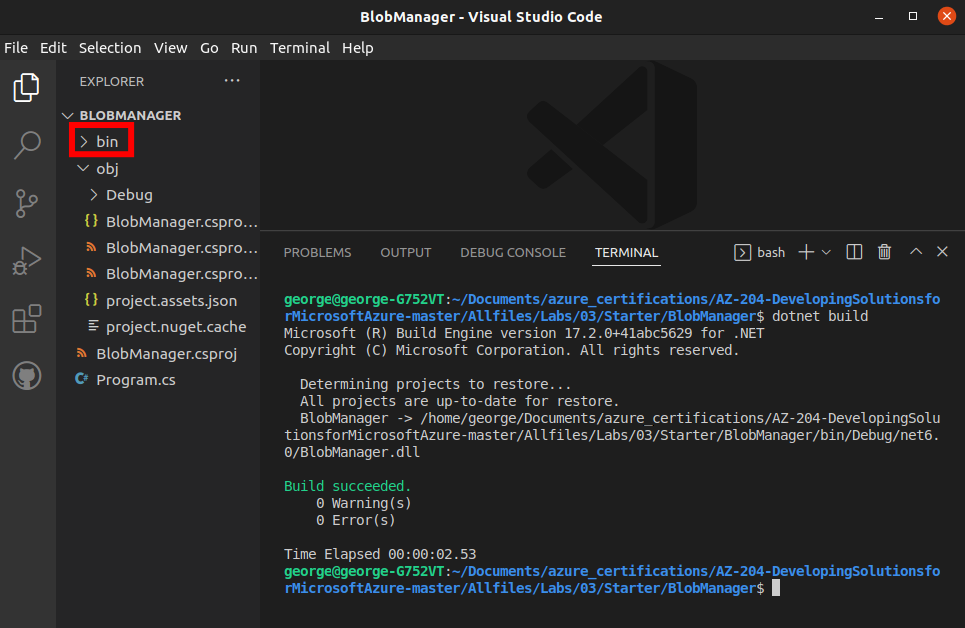
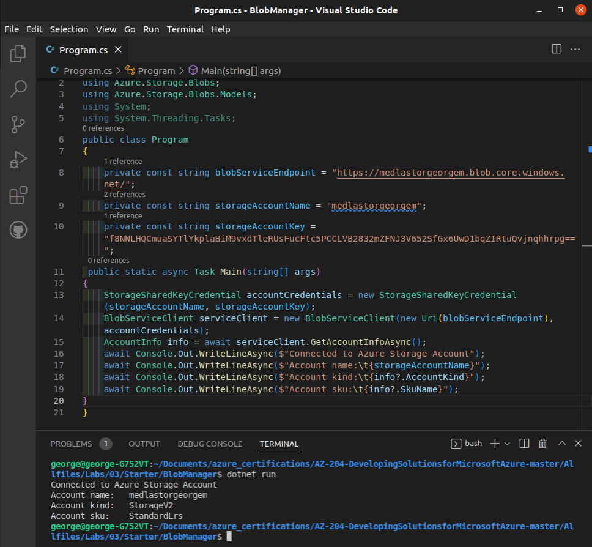
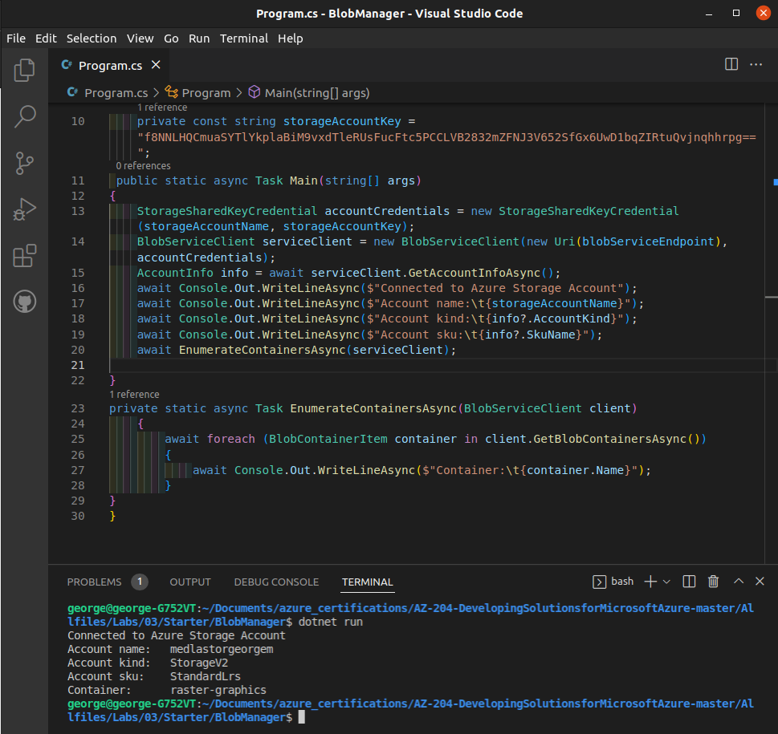

  

# Day 20 - Azure AZ-204 Retrieve Azure Storage via Azure Storage SDK for .NET

## Introduction

☁️ Today, I'm going to upload some files to a blob container in Azure. I will utilize the .NET SDK to access the container, and retrieve the blob URIs.

## Prerequisite

☁️ Blob storage is optimized for storing massive amounts of _unstructured_ data.

## Use Case

  

- Develop solutions that use Blob Storage
  - move items in Blob storage between storage accounts or containers
  - **set and retrieve properties and metadata**
  - **perform operations on data by using the appropriate SDK**
  - implement storage policies, and data archiving and retention

## Cloud Research

☁️ Blob storage is useful for a variety of applications: serving images or documents directly to the browser, streaming video and audio, writing to log files, storing data for backup and restore, storing analysis data.

☁️ Blob storage can be accessed via Azure CloudShell (Powershell or CLI), the Azure REST API, and an Azure Storage client library

☁️ Supported languages for the client library: .NET, Java, Node.js, Python, Go, PHP, Ruby

- Blob storage is made up of three resources

  - Storage account: provides unique namespace in Azure for data
  - Container: organizes a set of blobs, similar to a directory in a file system
  - Blob in the container
    - Block blobs: stores text and binary data, made up of blocks that can be individually managed
    - Append blobs: optimized for append operations
    - Page blobs: store random access files up to 8 TiB in size, can also store virtual hard drive files, and serve as disk for Azure VMs

- Access Tiers
  - Hot: lowest access cost, but highest storage cost
  - Cool: short-term backup data, and not often accessed data
  - Archive: lowest storage costs, takes time to "rehydrate" for access

☁️ Service Level Agreement is 99.9% availability

## My Experience with Azure Storage

### Task 0 — Create Prerequisite Resources

Need a storage account

  

Getting the Endpoint link for the Blob Storage

  

Getting an access key. CAUTION: Treat access keys like passwords, protect them, don't shared them, etc. I'm deleting the RG after this lab.

  

### Task 1 — Upload a blob into a container

Uploading a blob into the raster-graphics container

  

### Task 2 — Access containers via .NET SDK

Creating a .NET Project

  

Importing version 12.0.0 of Azure.Storage.Blobs package

  

Building the app; notice the creating of the bin folder, which contains the actual executable code

  

### Task 3 — Retrieve metadata via .NET SDK

Using the items we copied in Task 0, I assign them to variables. The Main method invokes the GetAccounInfoAsync method of the BlobServiceClient class to retrieve account metadata from the service.

  

Adding a method to check and print any containers found.

  

## ☁️ Cloud Outcome

A great capability to manage and interact with Azure resources programmatically. Here is a [list of resource APIs](https://docs.microsoft.com/en-us/dotnet/api/overview/azure/?view=azure-dotnet) you can interact with, not just Storage.

## Next Steps

Tomorrow, I'm going to work with CosmosDB.

## Social Proof

[Linkedin Post](https://www.linkedin.com/posts/georgemontee_github-gmontee100daysofcloud-activity-6931969049245474816-ASmA?utm_source=linkedin_share&utm_medium=member_desktop_web)
