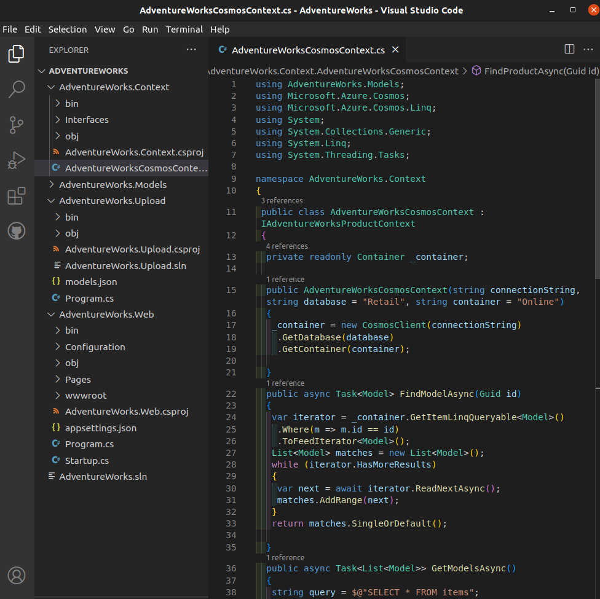

  

# Day 21 - Azure AZ-204 Construct a Polyglot Data Solution

## Introduction

☁️ Today, I'm going to create an app that will pull information from Cosmos DB, and images from a blob container, to populate my application.

## Prerequisite

☁️ Ployglot means knowing multiple languages. In the case of this lab, it means using two cloud services for our application; one from the Cosmos DB, and the other from blob storage.

## Use Case

  

- Develop solutions that use Cosmos DB storage
  - **select the appropriate API and SDK for a solution**
  - implement a partitioning scheme and partition keys
  - **perform operations on data and Cosmos DB containers**
  - set the appropriate consistency level for operations
  - manage change feed notifications

## Cloud Research

☁️ Since Cosmos DB is a Platform-as-a-Service item, upon creation it autogenerates endpoints, keys, and connection strings for easy interaction.

☁️ Similar to yesterday, instead of Storage, I added the Microsoft Azure Cosmos package so my .NET code could interact with that API.

## My Experience with Cosmos DB

### Task 0 — Create Prerequisite Resources

Creating the Cosmos DB

  

Getting the Cosmos DB URI, primary key, and primary connection string

  

Need a storage account

  

### Task 1 — Upload images to Azure Blob Storage

Creating a container for the images

  

Uploading the images

  

### Task 2 — Create a Cosmos DB database and collection, and perform a JSON data upload

Taking a look at the construction of the JSON data I'm working with

  

Adding the Azure Cosmos DB .NET client library to the AdventureWorks.Upload project

  

Some of the code for creating the Cosmos database and container

  

Creating...

  

### Task 3 — Validate JSON data upload

Going to Data Explorer within the Cosmos DB

  

Executing a select query

  

### Task 4 — Configure a .NET web application

Updating appsettings.json with primary connection string and blob url

  

Code to accessing the container and finding products

  

### Task 5 — Configure connectivity to Azure Cosmos DB

Running the app locally

  

### Task 6 — Validate that the .NET application successfully connects to data stores

Here I can see my app is reaching out to the Cosmos DB in Azure, to pull the information and images about the various products. Note: not all products had images for them

  

## ☁️ Cloud Outcome

Just incredible! I was able to populate a database with a schema json file, upload images to a container, and retrieve the info and images from the app.

## Next Steps

Tomorrow, I'm going to learn about implementing user authentication and authorization in Azure

## Social Proof

[Linkedin Post]()
