<div id="cover photo" align="center">
  
</div>

# Day 22 - Azure AZ-204 Authenticate by using OpenID Connect, MSAL, and .NET SDKs

## Introduction

☁️ Today, I'm going to have a ASP.NET Core web app utilizing the Microsoft Identity Platform to authenticate users to the app.

## Prerequisite

☁️ Identity Provider - creates, maintains, and manages identity information while providing authentication services to applications

## Use Case

<div id="use case" align="center">
  
</div>

- Implement User Authentication and Authorization
  - **authenticate and authorize users by using the Microsoft Identify platform**
  - **authenticate and authorize users by using Azure Active Directory**
  - create and implement shared access signatures
  - implement solutions with Microsoft Graph

## Cloud Research

☁️ Examples of Identity Providers: Azure Active Directory, Microsoft 365, Google, Facebook, Email one-time passcodes

☁️ OAuth 2.0 - an authorization framework that delegates user authentication to the service provider that hosts the user account, and authorizes third-party applications to access the user account

☁️ OpenID Connect is an open authentication protocol that profiles and extends OAuth 2.0 to add an identity layer

☁️ ID token is a security token that allows client to verify the identity of the user

OpenID = Authentication protocol
OAuth = Authorization framework

## My Experience

### Task 1 — Register an Application in Azure AD

Going to Azure Active Directory for App Registration

<div align="center">
  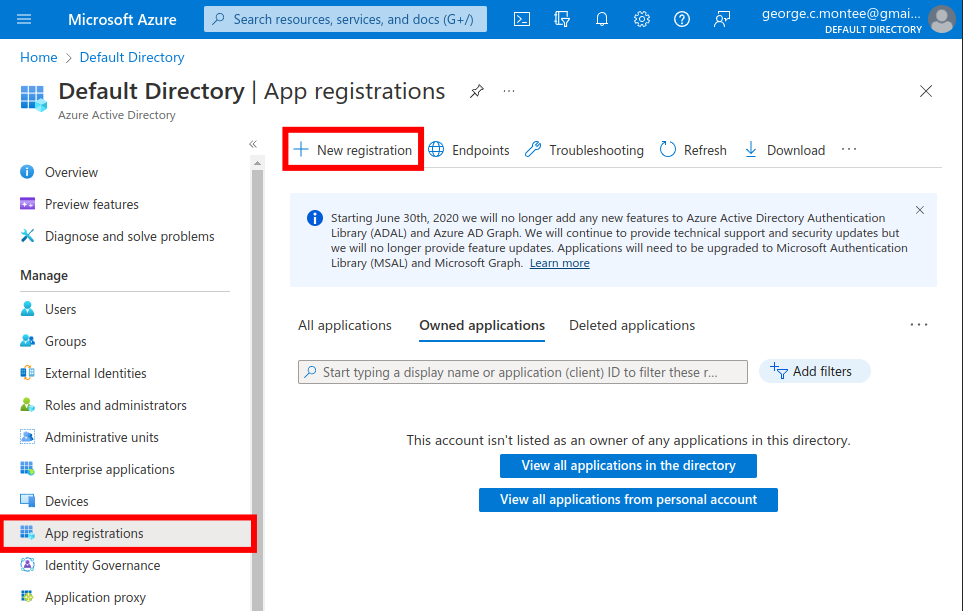
</div>

Registering the App

<div align="center">
  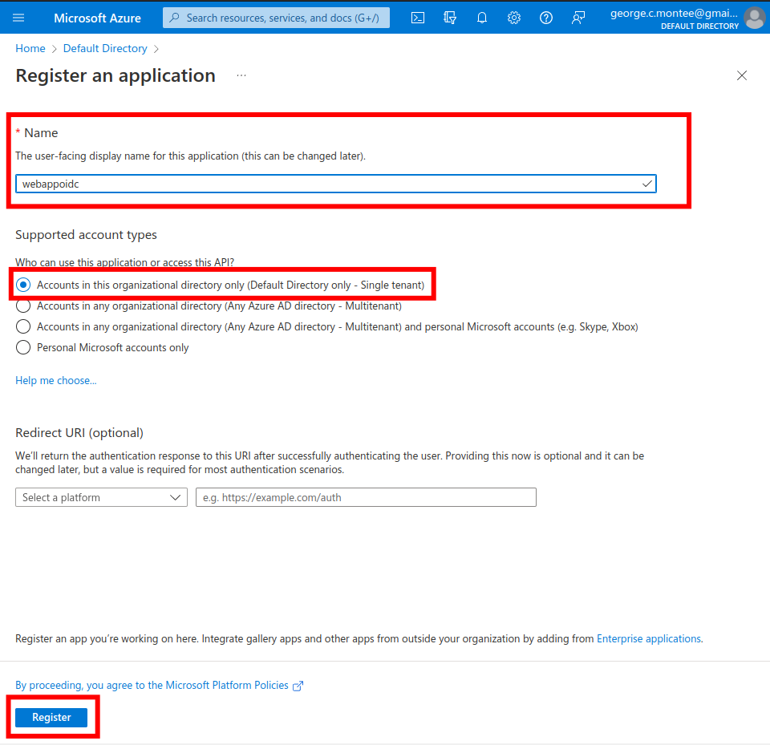
</div>

Recording Unique Identifiers

<div align="center">
  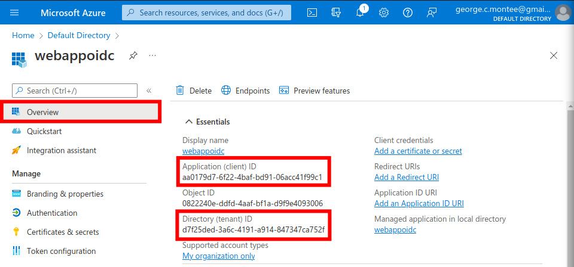
</div>

Configure the App Authentication Settings

<div align="center">
  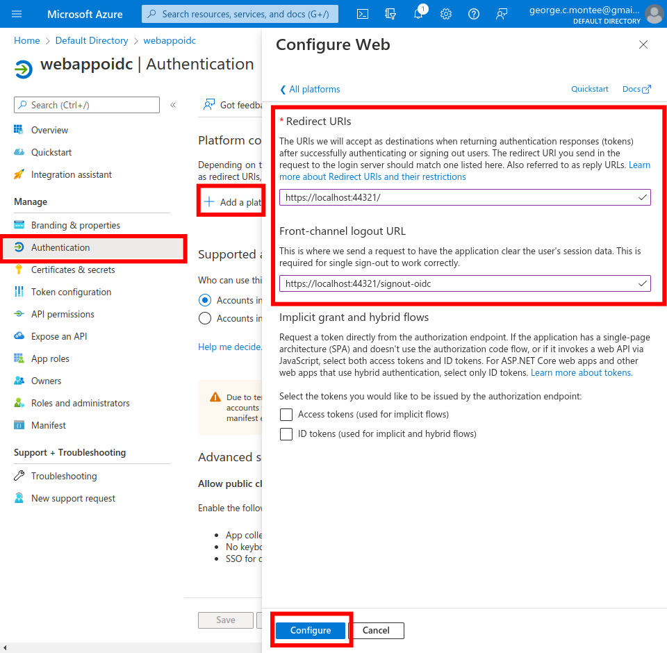
  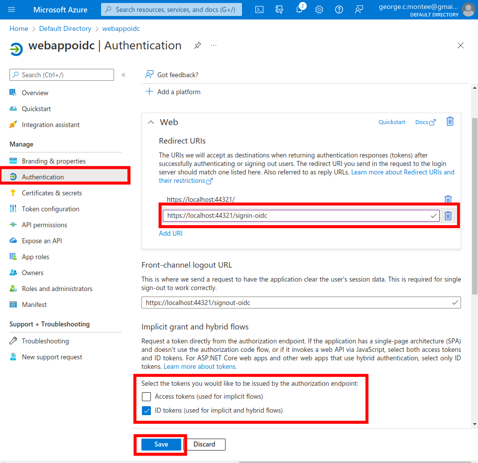
</div>

### Task 2 — Create an Azure AD user

Creating the user; for future use I need to record the DNS domain name, and the user principal name

<div align="center">
  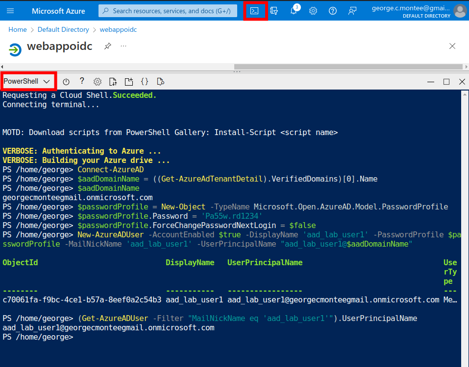
</div>

### Task 3 — Create an ASP.NET Core web app project

Creating the ASP.NET Core app; if it's not clear in the image, here's the command I ran:

```
dotnet new mvc --auth SingleOrg \\
--client-id aa0179d7-6f22-4baf-bd91-06acc41f99c1 \\
--tenant-id d7f25ded-3a6c-4191-a914-847347ca752f \\
--domain georgecmonteegmail.onmicrosoft.com
```

<div align="center">
  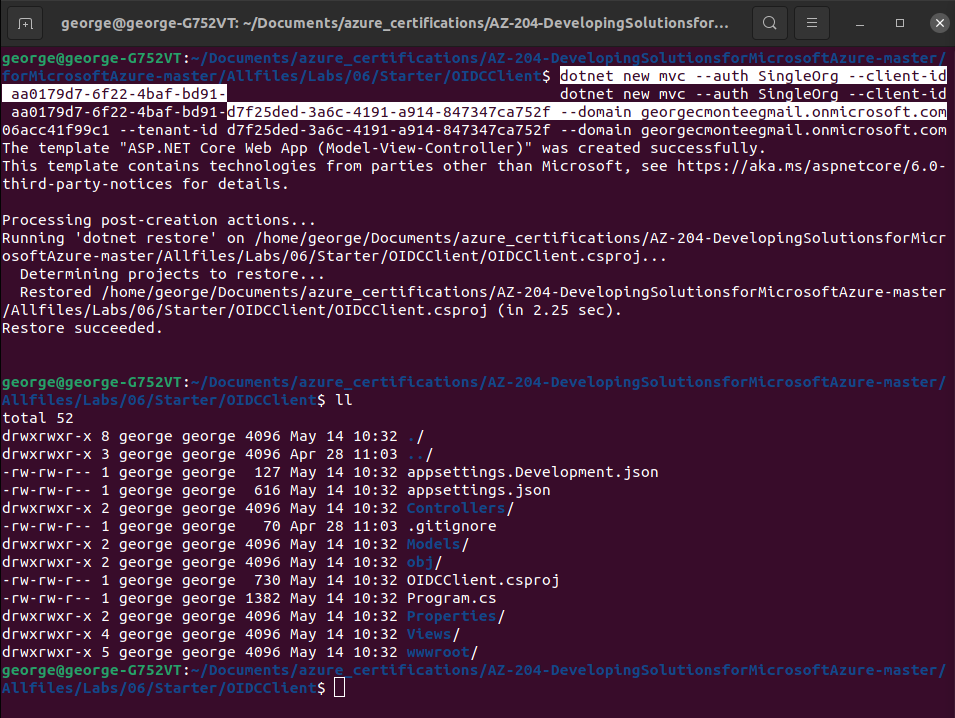
</div>

Updating the OpenID Connect project file

<div align="center">
  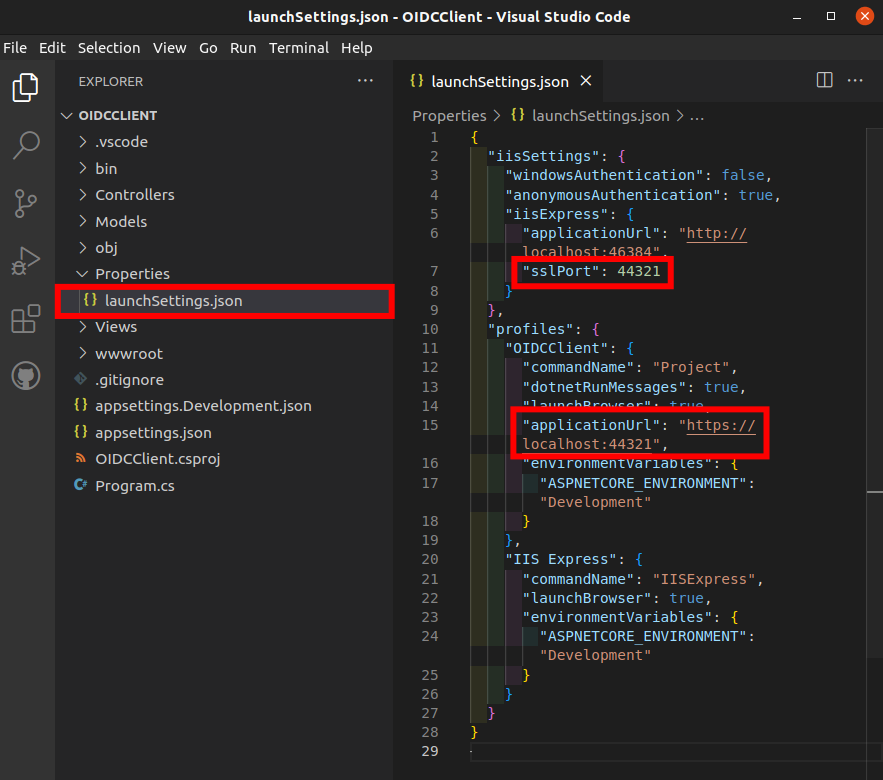
</div>

Updating the Startup code to refer to the ASP.NET Core packages

<div align="center">
  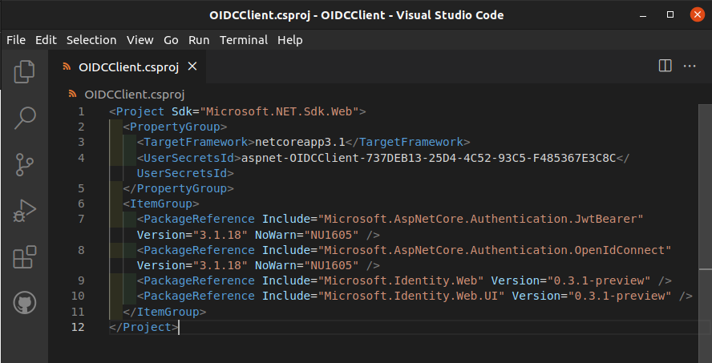
</div>

App Settings

<div align="center">
  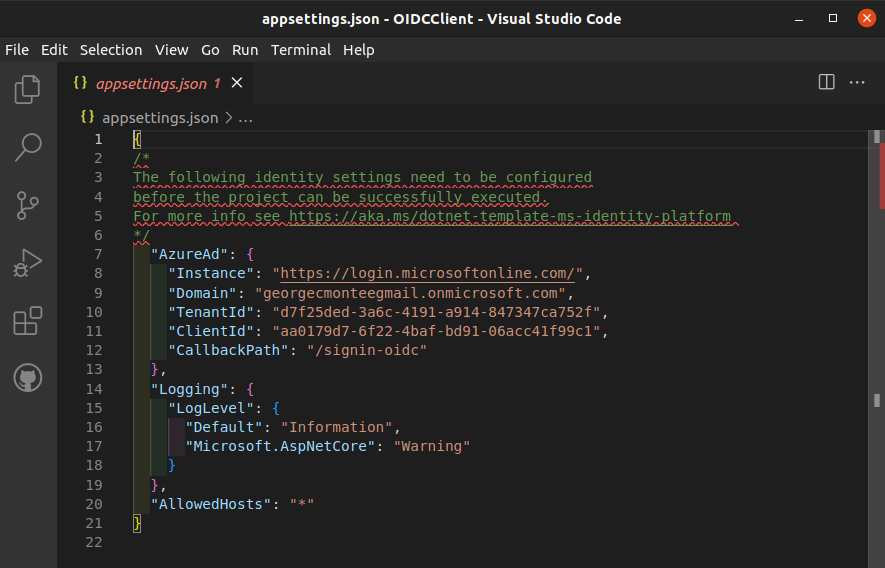
</div>

### Task 4 — Test the single-tenant web app in a single-tenant scenario

I'm embarrassed to say it, but I got stuck. I started playing whack-a-mole chasing build errors.

Initially, I ran into a file-scoped namespace is not available in C$ 8.0; perhaps foolishly I specified the language in the project file.

<div align="center">
  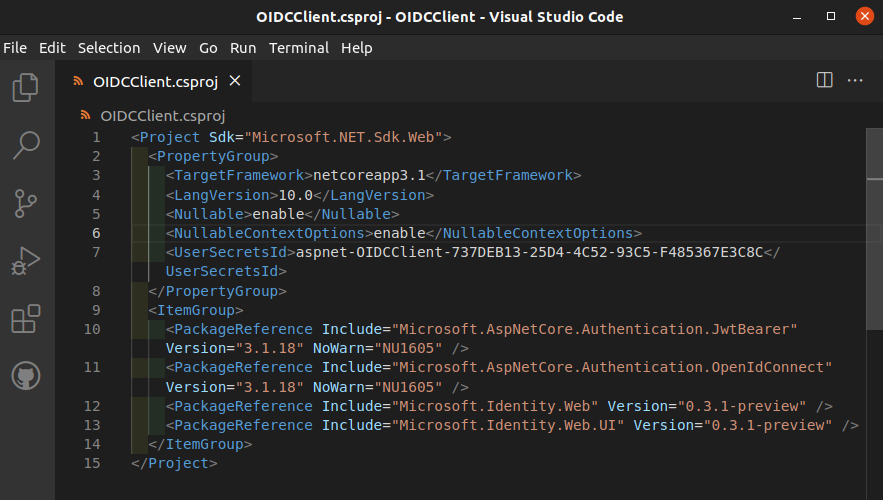
</div>

Next mole, was complaining about ILogger<>; easy fix with Microsoft.Extensions.Logging library

<div align="center">
  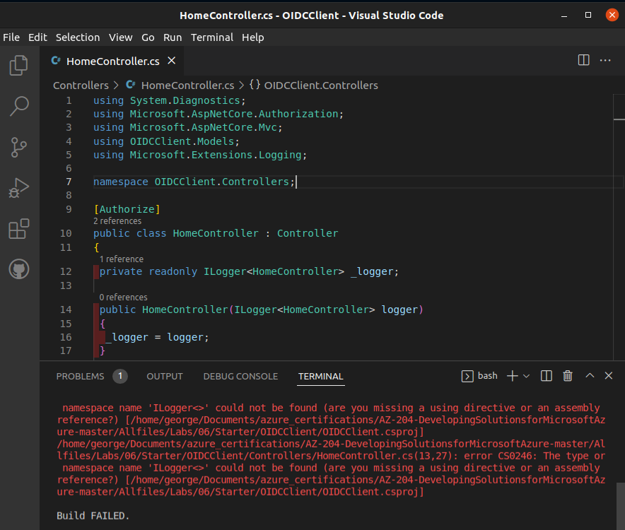
</div>

After that, it was complaining about the WebApplication reference in the program file wasn't in the current context. Looking at possibly rebuilding the entire file, I just don't have time to fool with it. I'm under the gun for an end of the month deadline.

<!--
Generating self-signed certificates

<div align="center">
  
</div>

Running the app

<div align="center">
  
</div>

Navigating to the web app in browser

<div align="center">
  
</div>

-->

## ☁️ Cloud Outcome

Well, defeat happens sometimes. It doesn't feel like great, but I can at least appreciate what I've learned so far today.

## Next Steps

Tomorrow, I'm going to learn about accessing resource secrets more securely across services.

## Social Proof

[Linkedin Post]()
