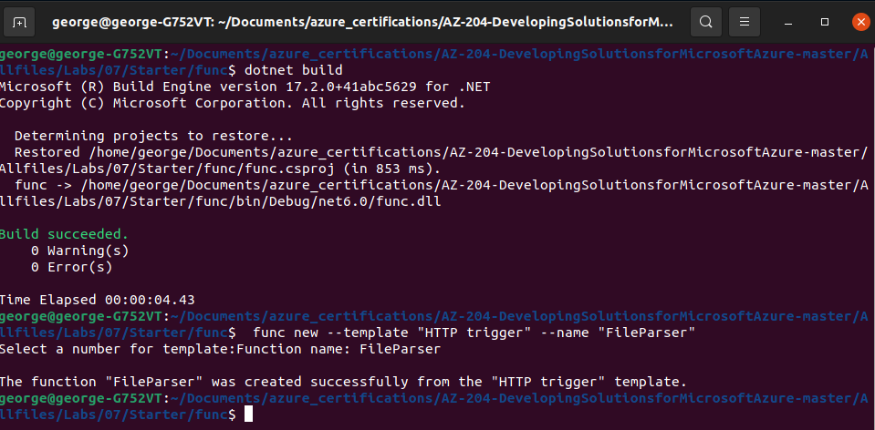

  

# Day 23 - Azure AZ-204 Access resource secrets more securely across services

## Introduction

☁️ Today, I'm going to use an Azure Function app utilizing C# code to access a storage account, and then download the contents

## Prerequisite

☁️ Azure Key Vault a cloud service for securely storing and accessing secrets

## Use Case

  

- Implement Secure Cloud Solutions
  - secure app configuration data by using App Configuration or Azure Key Vault
  - develop code that uses keys, secrets, and certificates stored in Azure Key Vault
  - implement Managed Identities for Azure resources

## Cloud Research

- Secret - anything you want to tightly control access to
  - API Keys
  - Passwords
  - Certificates
  - Cryptographic Keys

## My Experience

### Step 0 — Create Prerequisite Resources

Creating the storage account

  

Grabbing the access keys

  

Creating the Azure Key Vault

  

Creating a Function app

  
  

### Task 1 — Configure secrets and identities

Configure a system-assigned managed service identity

  
  

Create a Key Vault secret

  
  

Configure a Key Vault access policy

  
  
  
  

Create a Key Vault-derived application setting

  
  

### Task 2 — Build an Azure Functions app

Initialize a function project

  

Create an HTTP-triggered function

  

Configure and read an application setting

  
  

Validate the local function

  
  

Deploy the function using the Azure Functions Core Tools

  

Test the Key Vault-derived application setting

  
  
  
  

### Task 3 — Access Azure Blob Storage data

Upload a sample storage blob

  
  
  
  
  

Pull and configure the Azure SDK for .NET

  
  

Deploy and validate the Azure Functions app

  
  

## ☁️ Cloud Outcome

☁️ So close, yet, I'm met with failure again! I created an ARM template and parameters of the resource group and it's resources, and then deleted the rg. I came back to it later, using the ARM files to deploy the resources again. Unfortunately, the deployment failed, saying anomalies detected.

☁️ Yesterday, I believe the friction was between .NET Core 3.1 and .NET 6; the lab was originally created with the former, but I had .NET 6 installed for other labs and projects. For today, one area I might've goofed, was copying or inputting quotation marks in regards to the secret.

☁️ Alright, I've hit a few bumps. Obviously, doesn't feel great, but I need to keep trucking on. I have a week left until the exam.

## Next Steps

Tomorrow, I'm going to learn about creating a multi-tier solution using Azure services.

## Social Proof

[Linkedin Post](https://www.linkedin.com/posts/georgemontee_github-gmontee100daysofcloud-activity-6933047799831826432-peSV?utm_source=linkedin_share&utm_medium=member_desktop_web)
