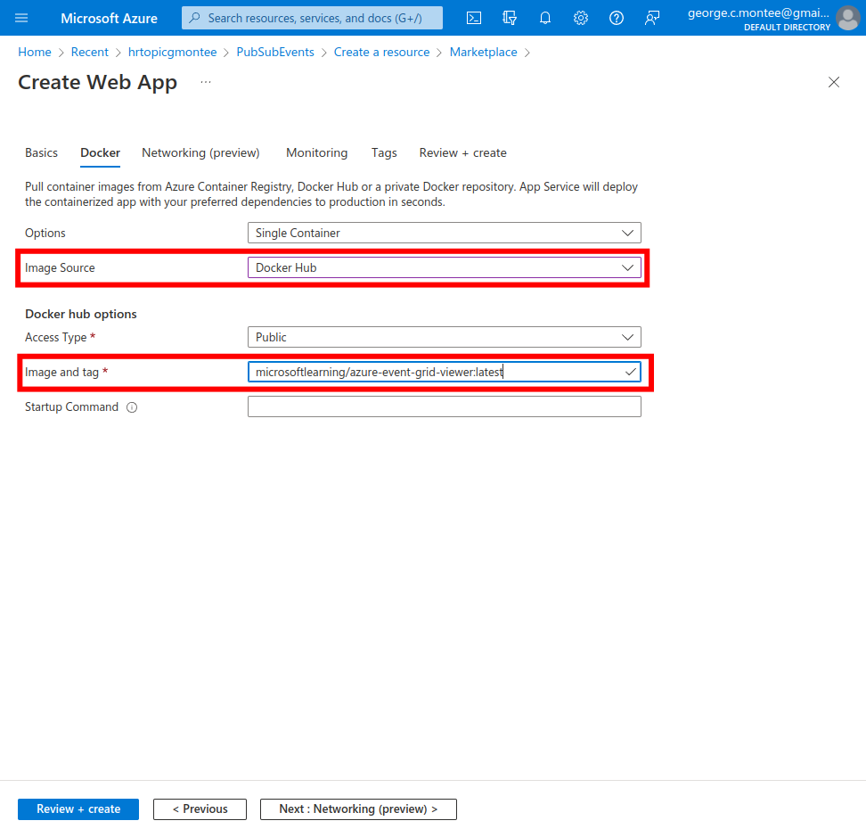

  

# Day 25 - Azure AZ-204 Publish and subscribe to Event Grid events

## Introduction

☁️ Today, I'm going to publish new events to an Event Grid topic by using a .NET console application

## Prerequisite

☁️ [Azure Event Grid](https://docs.microsoft.com/en-us/azure/event-grid/overview) is an event routing service running on top of the Azure Service Fabric

## Use Case

  

- Develop event-based solutions
  - **implement solutions that use Azure Event Grid**
  - implement solutions that use Azure Event Hub

## Cloud Research

☁️ Events: data or information describing actions that took place in a system

☁️ Events will have properties like the source of an event, the time it occurred, and a unique identifier

- Event Grid Topics: classifies events into groups and provides an endpoint where the sources transmit events
  - System Topics: Azure services that can generate events, e.g., Container Registry, Internet-of-Things Hubs, Service Bus, etc
  - Custom Topics: Application and Third-party

☁️ API - enables two-way communication between software applications driven by requests

☁️ Webhook - a lightweight API that powers one-way data sharing triggered by events; sometimes referred to a "reverse APIs" since the communication is initiated by the application sending the data

## My Experience

### Step 0 — Create Prerequisite Resources

To start off, I need to create an Event Grid topic, and an Azure Event Grid viewer to a Web App

  
  

Deploy the Azure Event Grid viewer to a web app

  
  

### Task 1 — Create an Event Grid subscription

I'm going to create a new subscription, validate it's registration, and record the credentials required to publish a new event to the topics.

  
  

Create a new subscription

  
  

Observe the subscription validation event

  

Record subscription credentials

  

### Task 2 — Publish Event Grid events from .NET

Now, I'm going to create a .NET console app in order to publish new events to my Event Grid topic

  
  
  

Modify the Program class to connect to Event Grid

  

Publish new events

  

Observe published events

  

## ☁️ Cloud Outcome

☁️ The Azure Event Grid service provides a way of feeding (pushing) events to an application, letting it know an action had occurred. A project I had put on hold due to moving was a smart hydroponic garden. I could have an IoT sensor send an event that water level is low, the pumped has stopped, etc, and I could have that kickoff a workflow which sends me an email and/or text notification of that event.

## Next Steps

Tomorrow, I'm going to learn about reading and deleting message from the Azure Service Bus queue

## Social Proof

[Linkedin Post](https://www.linkedin.com/posts/georgemontee_github-gmontee100daysofcloud-activity-6934499037052104705-omXA?utm_source=linkedin_share&utm_medium=member_desktop_web)
