

  

# Day 27 - Azure AZ-204 Monitor services that are deployed to Azure

## Introduction

☁️ Today, I'm going to configure and test Application Insights logging of an web API app

## Prerequisite

☁️ Application Insights monitors Azure services for availability, performance, failures, and usage by combining data from Application Insights SDKs with Azure Diagnostics data from your cloud services

## Use Case

  

- Troubleshoot solutions by using metrics and log data
  - **configure an app or service to use Application Insights**
  - review and analyze metrics and log data
  - implement Application Insights web tests and alerts

## Cloud Research

☁️ Application Insights is a feature of Azure Monitor

- Application Insights provides:
  - automatically detect performance issues
  - help diagnose issues
  - see what users are actually doing in the app
  - help continuously improve app performance and usability

☁️ Telemetry: the automatic measurement and wireless transmission of data from remote sources

## My Experience

### Step 0 — Create Prerequisite Resources

Create an Application Insights resource

  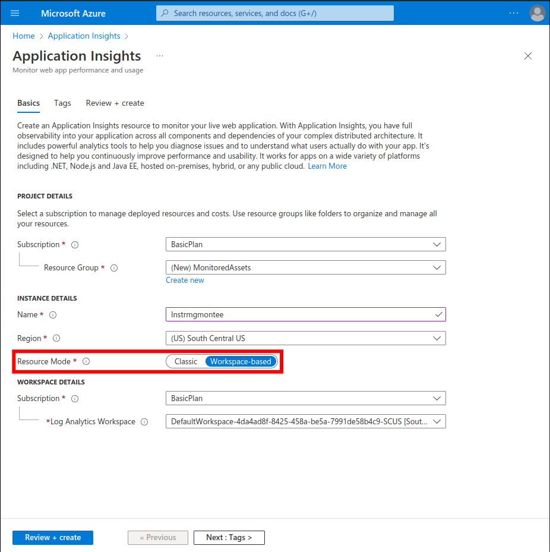
  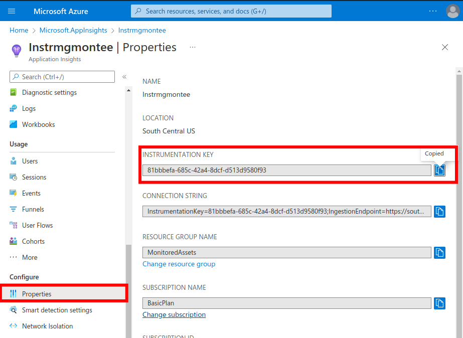

### Task 1 — Create an Azure Web API resource

Create an Azure Web API resource

  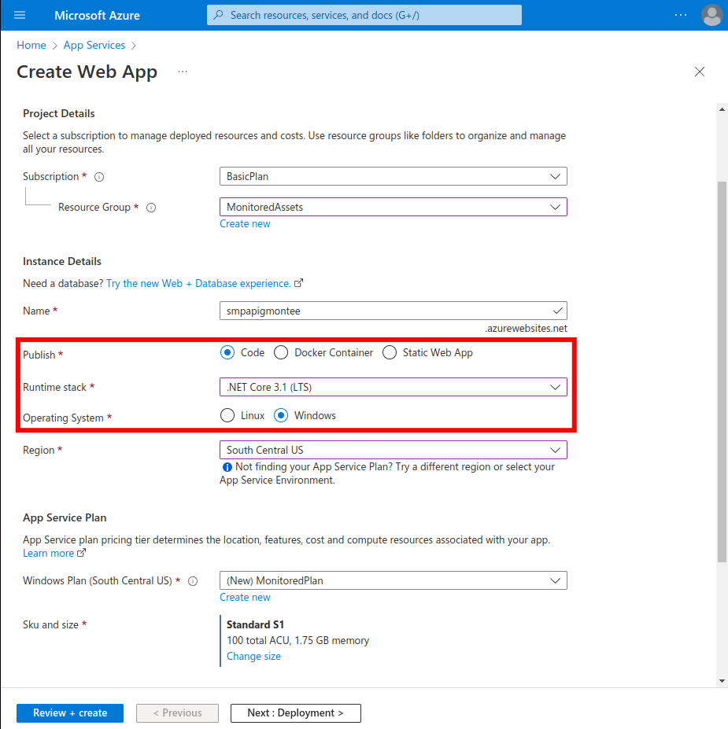
  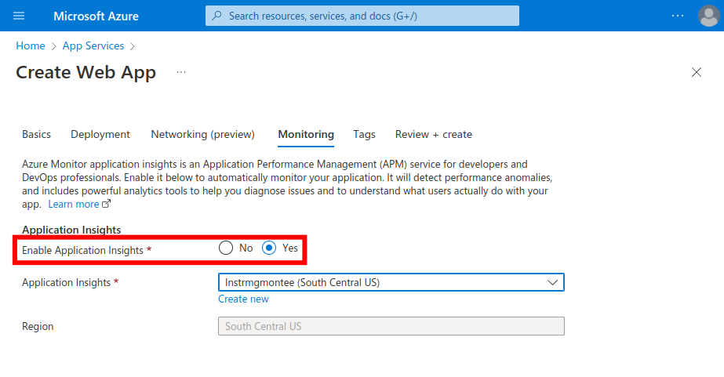
  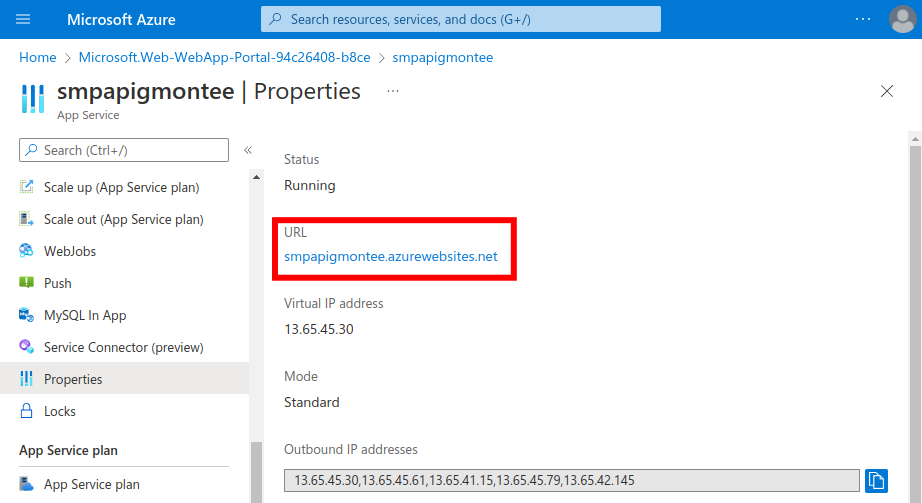

Configure web API autoscale options

  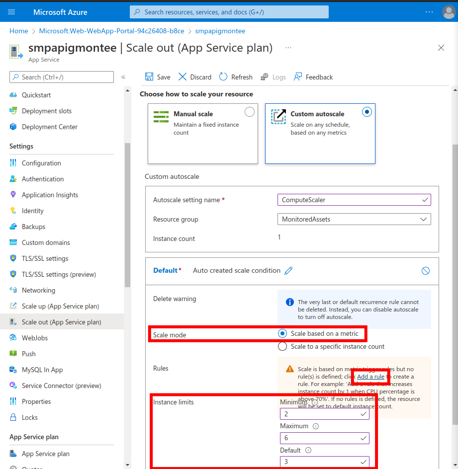
  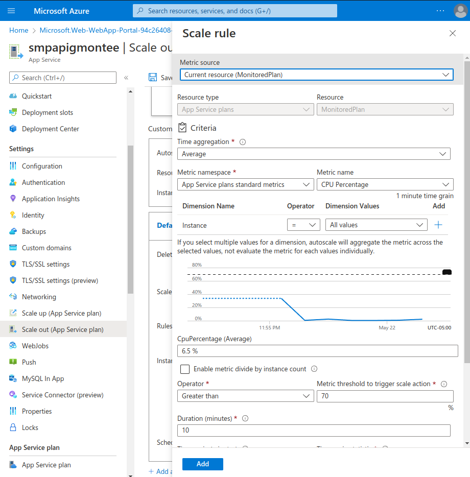

### Task 2 — Monitor a local web API by using Application Insights

Build a .NET Web API project

  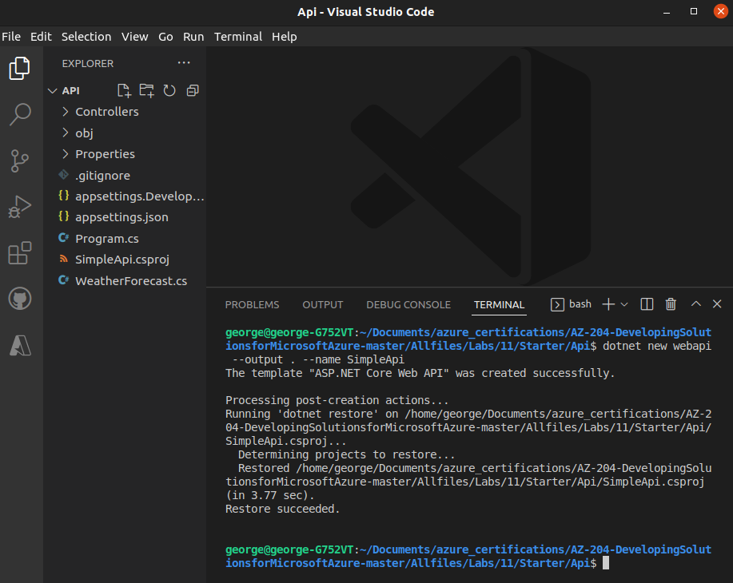
  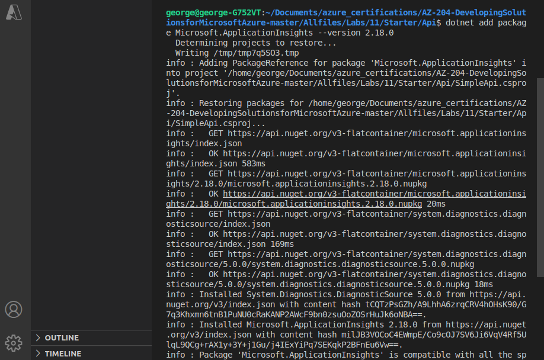
  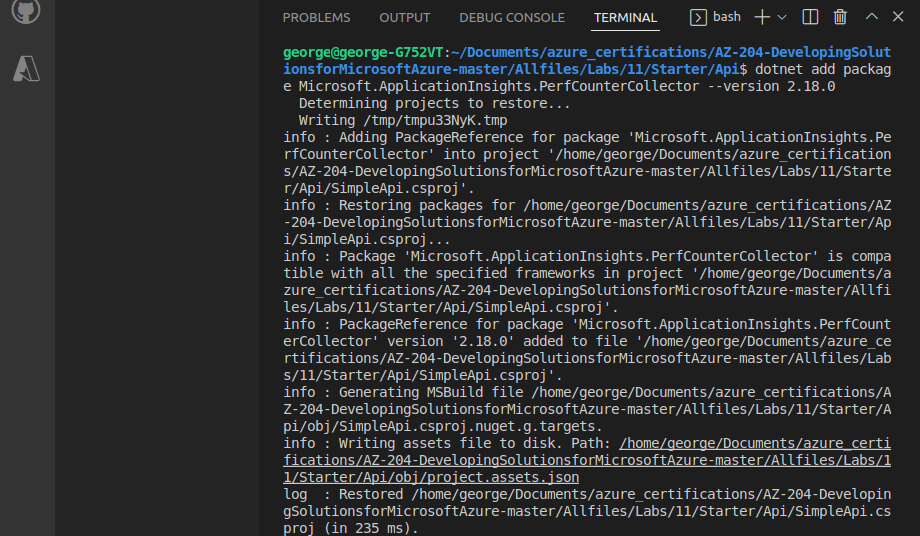
  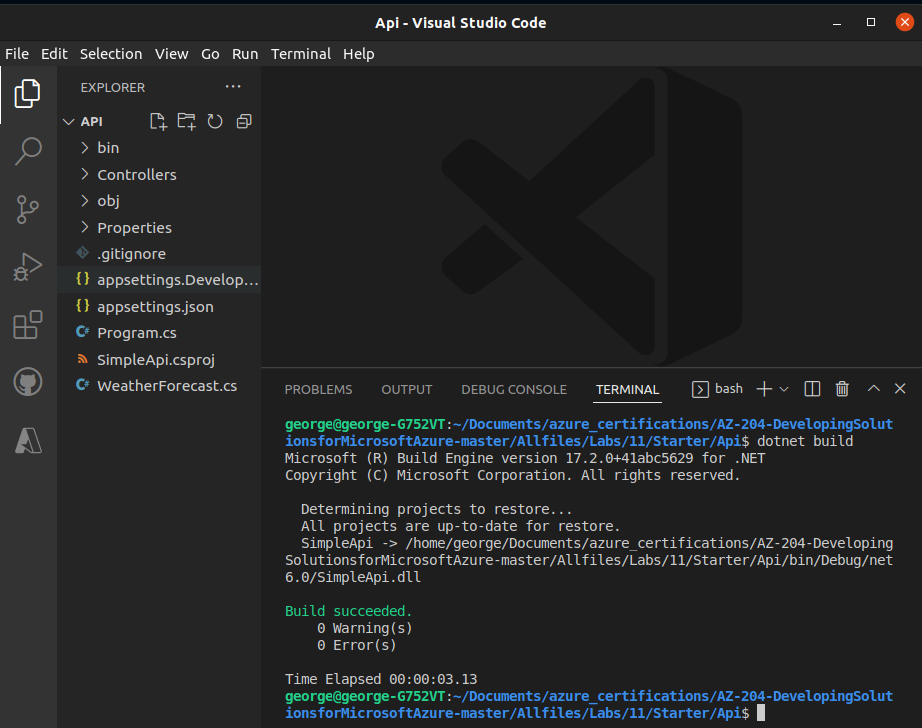

Update app code to disable HTTPS and use Application Insights

  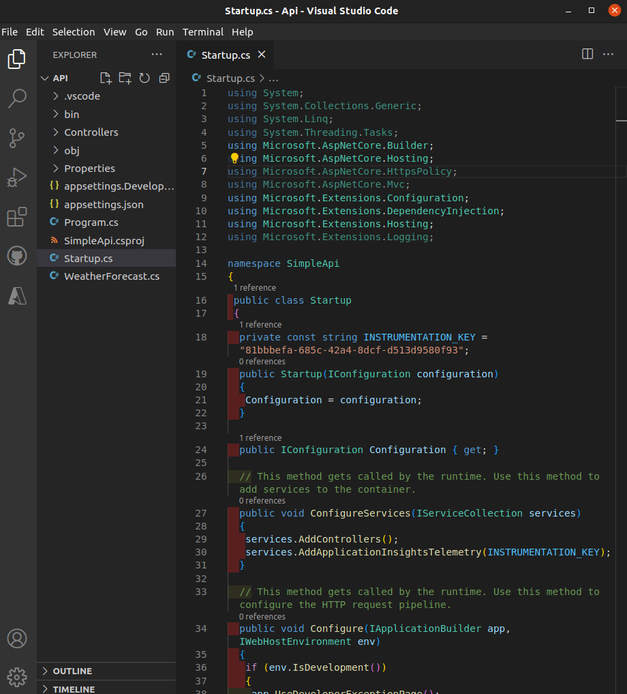

Test an API application locally

  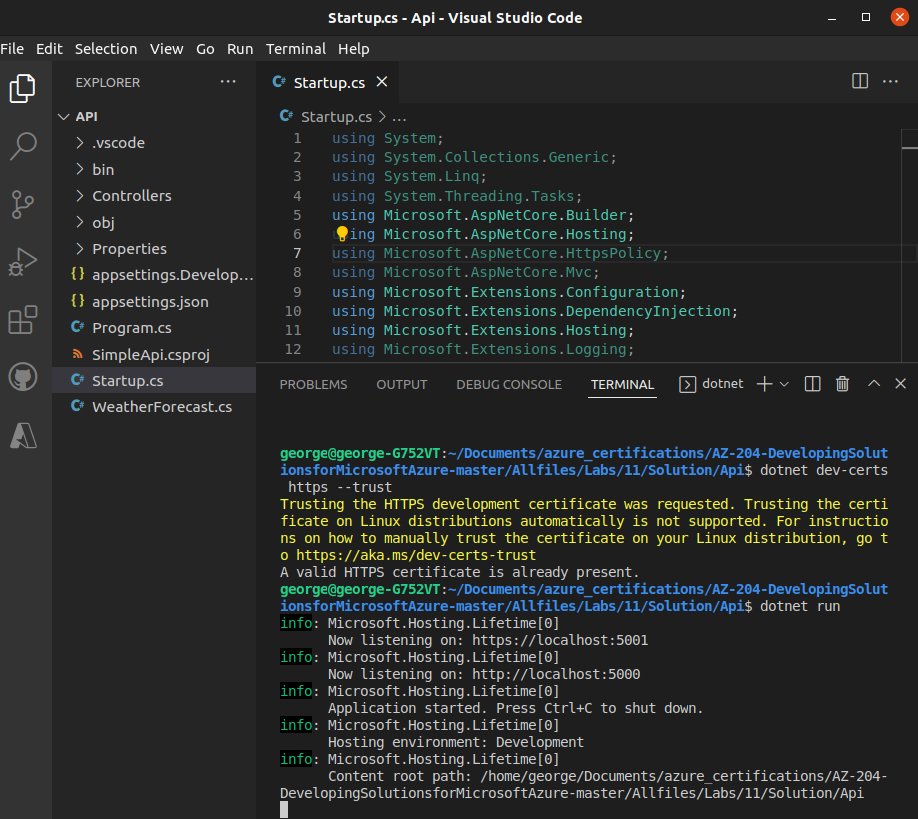
  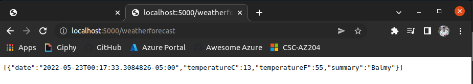

Review metrics in Application Insights

  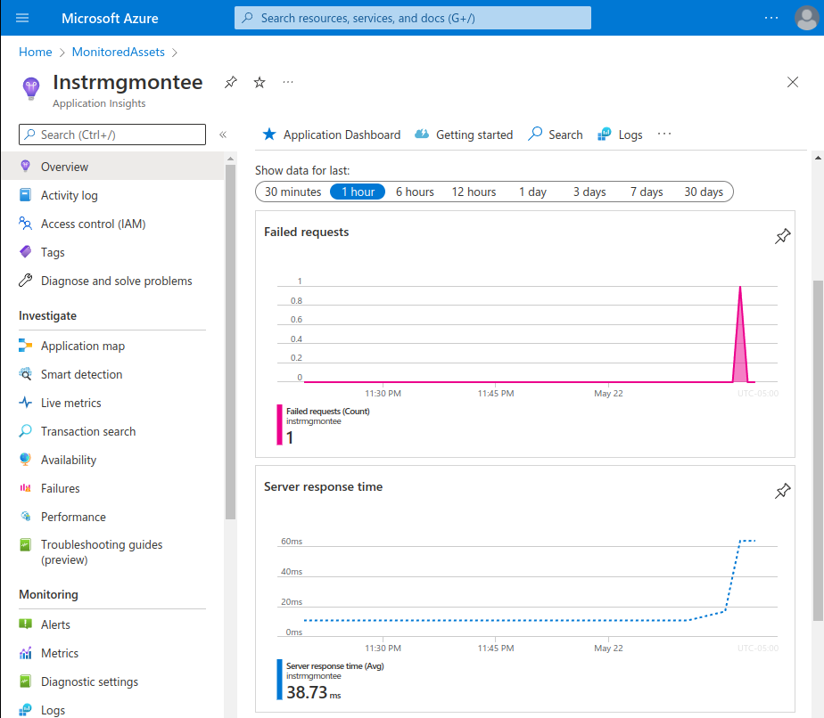

## ☁️ Cloud Outcome

☁️ Obviously, just scratching the mere surface of what is possible with Application Insights

## Next Steps

Tomorrow, I'm going to learn about utilize Azure Content Delivery Network

## Social Proof

[Linkedin Post](https://www.linkedin.com/posts/georgemontee_github-gmontee100daysofcloud-activity-6935235821570519041-NoiN?utm_source=linkedin_share&utm_medium=member_desktop_web)
