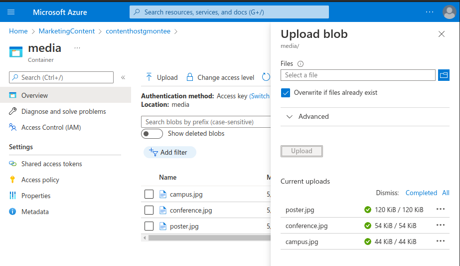

  

# Day 28 - Azure AZ-204 Enhance a web application by using the Azure Content Delivery Network

## Introduction

☁️ Today, I'm going to update a web app to use Content Delivery Network to serve multimedia content and to serve the web application itself

## Prerequisite

☁️ Content Delivery Network (CDN) is a distributed network of servers that can efficiently deliver web content to users

## Use Case

  

- Implement caching for solutions
  - configure cache and expiration policies for Azure Cache for Redis
  - **implement secure and optimized application cache patterns including data sizing, connections, encryption, and expiration**

## Cloud Research

☁️ Designed to send audio, video, apps, photos, and other files using servers closet to each user

- Benefits of using a CDN
  - better performance
  - improved user experience for end users
  - large scaling to better handle instantaneous high loads
  - distribution of users requests
  - serving content directly from edge servers, instead of origin server

## My Experience

### Step 0 — Create Prerequisite Resources

Create a Storage account

  

Create a web app by using Azure App Service

  
  

### Task 1 — Configure Content Delivery Network and endpoints

Register the Microsoft.CDN provider

  

Create a Content Delivery Network profile

  
  

Configure Storage containers

  

Create Content Delivery Network endpoints

  
  

### Task 2 — Upload and configure static web content

Observe the landing page

  

Upload Storage blobs

  

Configure Web App settings

  

Validate the corrected landing page

  

### Task 3 — Use Content Delivery Network endpoints

Retrieve endpoint Uniform Resource Identifiers (URIs)

  

Test multimedia content

  

Update the Web App settings

  

Test the web content

  
  

## Next Steps

Tomorrow, I'm going to take the AZ-204 Azure Developer exam!

## Social Proof

[Linkedin Post](https://www.linkedin.com/posts/georgemontee_github-gmontee100daysofcloud-activity-6935590185220915200-rM9G?utm_source=linkedin_share&utm_medium=member_desktop_web)
