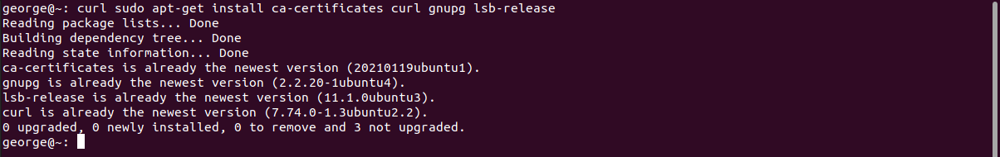
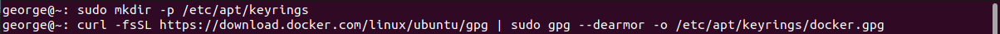
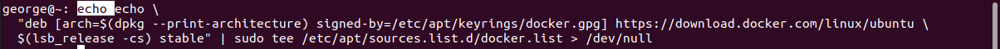
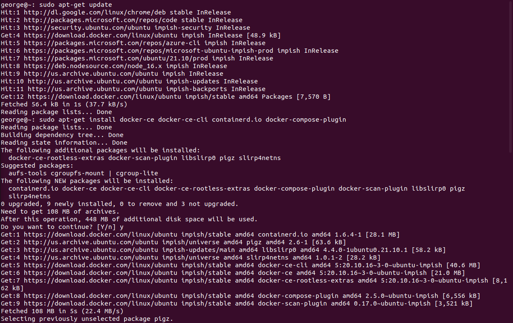
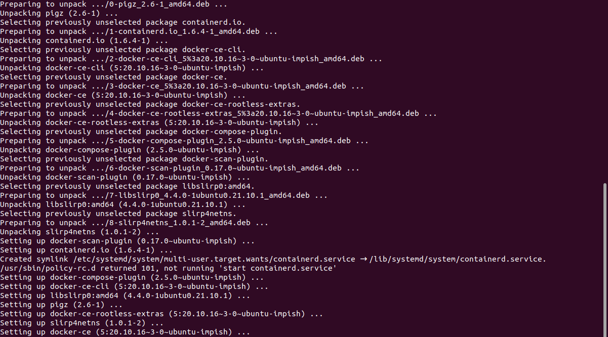
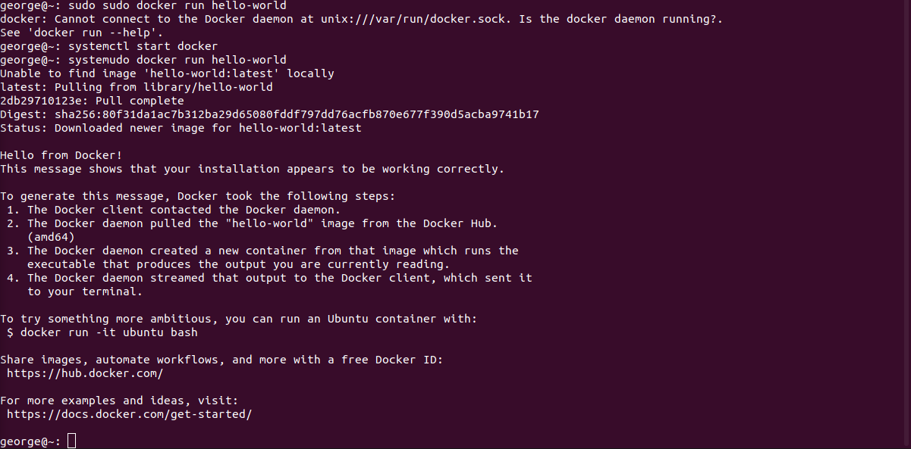

  

# Day 30 - Introduction to Docker

## Introduction

Today, I'm going to start learning about Docker

## Prerequisite

☁️ Explain

## Use Case

  

## Cloud Research

☁️ Research

## My Experience

### Task 1 — Install Docker Engine via it's repository

First, I need to make sure everything is up-to-date, and then ensure prerequisites are installed

- ca-certificates: used to verify identity of 3rd parties, and encrypt data between you and them
- curl: stands for client URL; used to download/upload data using protocols like HTTP, HTTPS, SCP, SFTP, and FTP
- gnupg: stands for GNU Privacy Guard; used to encrypt files or sign files for integrity and authenticity
- lsb-release: lsb stands for Linux Standard Base; common runtime environment for 3rd party packages

  

Now, I need to add Docker's official GPG key, which in the next step will be used to authenticate the repository

  

Adding the docker repository

  

Now to install the Docker Engine

- Docker-CE: community edition of the docker engine
- Docker-CE-CLI: command line interface for docker engine
- Containerd.io: daemon, manages the complete container lifecycle of it's host system
- Docker.Compose-plugin: tool for defining and running multi-container Docker applications

  
  

I initially had trouble running the Hello World image, so I had to start the docker service

  

### Task 2 — Summary of Step

  

### Task 3 — Summary of Step

  

## ☁️ Cloud Outcome

(Result) Describe your personal outcome, and lessons learned.

## Next Steps

Next I'm going to

## Social Proof

[Linkedin Post](link)
