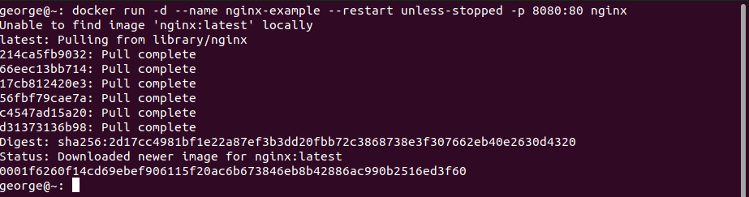
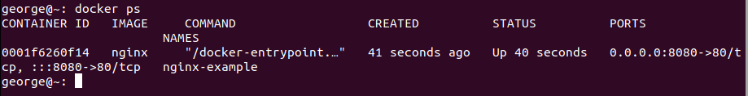
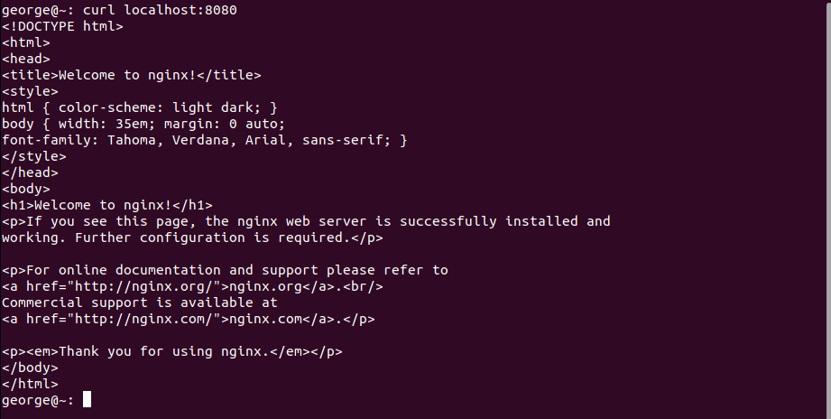
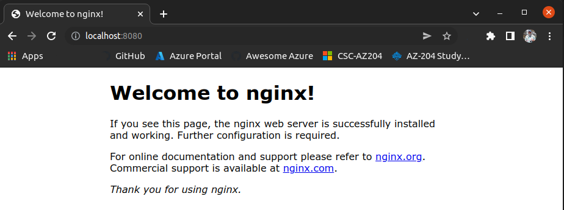
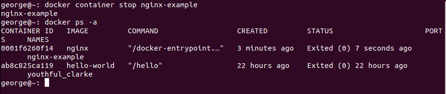
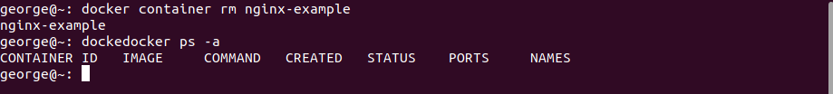

  

# Day 31 - Running a Container

## Introduction

Today, I'm going to run some containers

## Prerequisite

☁️ Docker Container is a virtualized runtime environment where users can isolate applications from the underlying system

## Use Case

  

## Cloud Research

☁️ We can run containers using the following command
docker run [OPTIONS] IMAGE[:TAG] [COMMAND] [ ARG...]

- IMAGE: which container we want to run
- TAG: usually reference a specific version
- COMMAND: command to run inside the container
- ARG: arguments to pass when running the command

- Commonly used run options:

  - -d: run container in detached mode (runs in background)
  - --name: allows assignment of a more descriptive name
  - --restart: options for automatic restarts
    - no (default)
    - on-failure (fails with non-zero exit code)
    - always
    - unless-stopped (was stopped manually)
  - -p: host post:container port
  - --rm: automatically removes the container when it exits
  - --memory: hard limit memory usage
  - --memory-reservation: soft limit on memory usage

  - Common Docker Commands
    - docker ps - lists all currently running contianers
    - docker ps -a - includes stopped containers
    - docker container stop <container name>
    - docker container start <container name>
    - docker container rm <container name> - for deleting

☁️ [NGINX](https://www.nginx.com/resources/glossary/nginx/) (pronouced like "engine-ex") is an open-source web server. It's quite popular because it's lightweight, and has ability to scale on minimal hardware

- Common uses for NGINX are:
  - Web Server
  - Reverse Proxy
  - HTTP Load Balancer
  - Media Streaming
  - Email Proxy for IAMP, POP3, and SMTP

## My Experience

### Task 1 — Run NNGINX in a container

I'm going to start up a container hosting nginx, running port 8080, and it's going to run in the background so that I can have my terminal back

The command for reference:
docker run -d --name nginx-example --restart unless-stopped -p 8080:80 nginx

  

I'm checking to see that it's running

  

Here I'm viewing the web server from my command line

  

Here I'm viewing the web server from my local browser

  

Stopping the container; notice the "hello world" container from yesterday

  

Now, I'm removing the container

  

## ☁️ Cloud Outcome

☁️ One thing to note, is by default images are pulled from [Docker Hub](https://hub.docker.com/), which can be good and bad. Docker Hub does provide options to filter by "Docker Official Images", which is a curated set of images. There's a filter for Verified Publishers, and those in the Docker Open Source Program. The danger is with, as of this writing, 9.1 **million** images available, there is a number that have unpatched vulnerabilities, or worse. Sorting by recently updated, there's quite a few with no description, tags, or anything meaningful to what they contain. If you follow the news, some bad actors will create images based on misspellings of popular packages.

## Next Steps

Next, I'm going to learn about logging in Docker

## Social Proof

[Linkedin Post](link)
