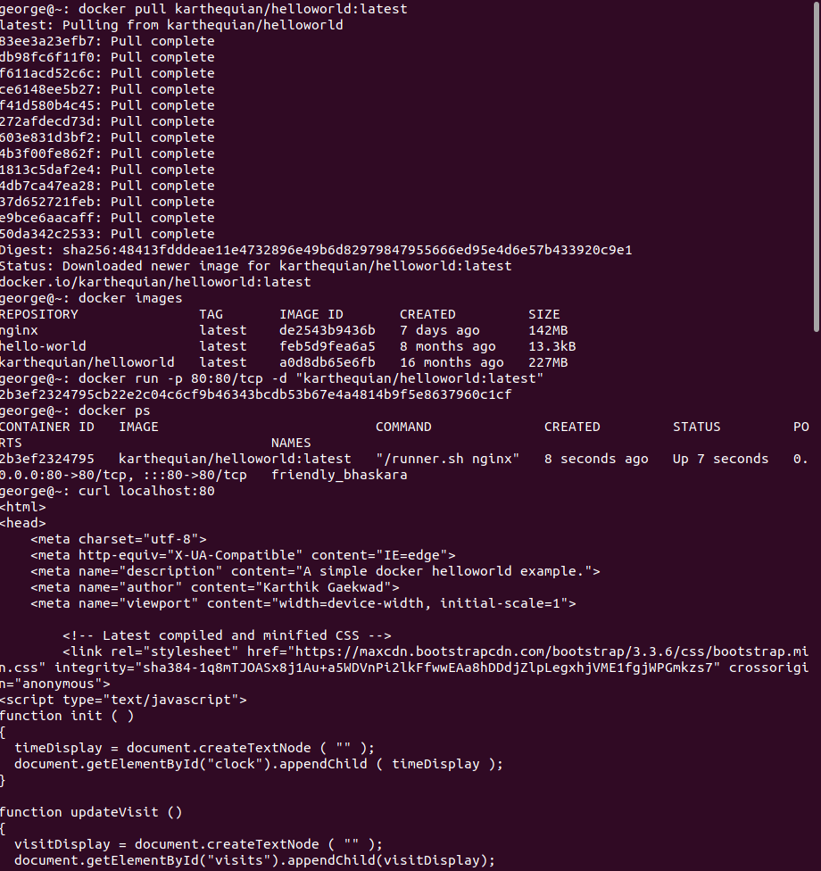
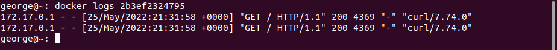
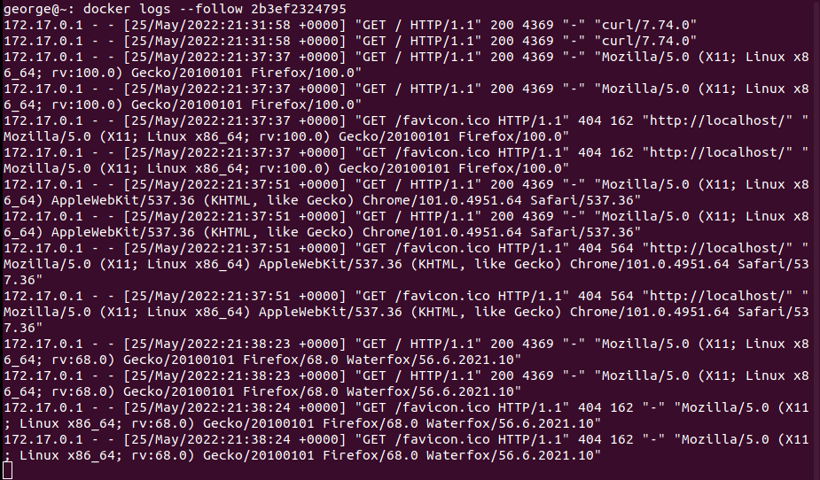
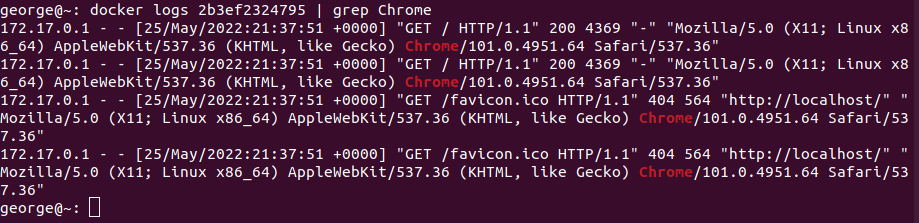
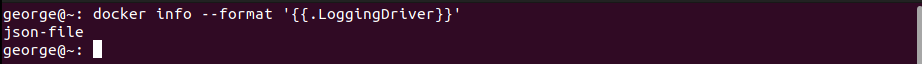
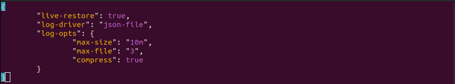
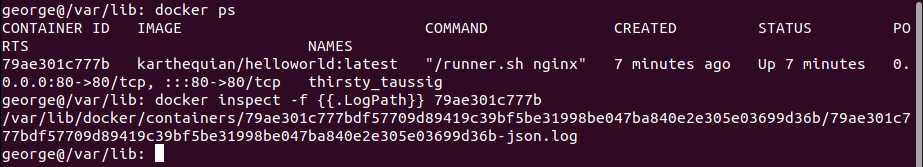
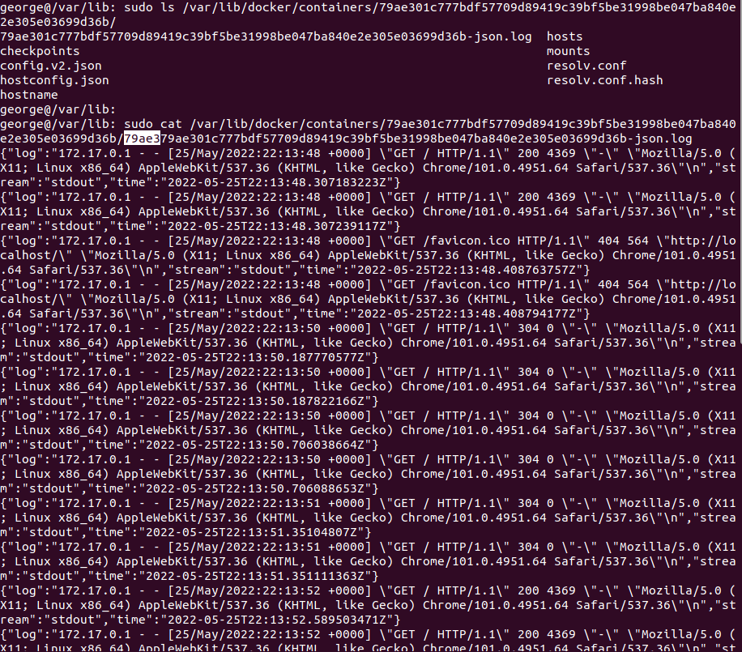

  

# Day 32 - Logging in Docker

## Introduction

Today, I'm going to learn about logging in Docker

## Prerequisite

☁️ Given the nature of containers being ephemeral, the traditional storing of logs on the filesystem would be lost. The need is still there for logging; so we need a logging strategy in place. Typically options is storing logs to a file, a log collector on the host, or to a log management service endpoint (cloud or on-premises)

## Use Case

  

## Cloud Research

☁️ Logging Drivers are a pluggable framework for accessing log data from services and containers in Docker

- Configure teh default logging driver by setting log-driver and log-opts in /etc/docker/daemon.json
  - can be overridden during docker run using the --log-driver and --log-opt flags

## My Experience

### Task 1 — Downloading a sample Docker image

I'm going to pull down a hello world app running on nginx made by Karthequaian. Then I'll run it in the background, on Port 80.

  

### Task 2 — Viewing Docker container logs

Now to look at the log entries generated by me visiting the web site

  

This is hard to see in this format, but I used the --follow option to display live updates as I visited the site. You can see I visited the site from Firefox, Chrome, and Waterfox browsers

  

I can use a filter to show only entries having "Chrome" in them display

  

### Task 3 — Working with Docker logging drivers

Docker supports a wide variety of [logging drivers](https://docs.docker.com/config/containers/logging/configure/#supported-logging-drivers). Here a _few_ of them: json-file, syslog, fluentd, awslogs, splunk.

  

### Task 4 — Configuring the json-file logging driver

Editing the daemon.json file, I can [config a variety of options for the json-file logging driver](https://docs.docker.com/config/containers/logging/json-file/). Setting the max-size, in this case to 10 megabytes, it will "roll" log entries to a new file when the current one reaches the size limit. The next entry, max-file, is the number of files that will be present; when the "fourth" log file is created, the oldest file is deleted.

The "live-restore is not related directly to logging. The container will continue to run if the Docker Daemon becomes unavailable, e.g., crashes, planned outage, upgraded.

  

### Task 5 — Viewing the json-file log entries

I'll need the full container id to find the log file. Then with that, I can view the log.

   
  

## ☁️ Cloud Outcome

☁️ One of the options for the json-file logging driver, is the mode, which has two possible entries: blocking, non-blocking. With blocking used, the driver will block **all** other operations the container is doing, until the log message is delivered. Obviously, this could have performance impacts in certain scenarios. In the non-blocking mode, log entries are stored in a memory buffer until the log driver is available to process them. The danger of this mode is if the memory buffer fills up, entries can be lost.

- Choosing a Logging Strategy
  - Application-based: the application handles logging through it's own logging framework
  - Logging Driver: I used one type of logging driver in the above tasks
  - Data Volumes: this involves linking a container directory to a directory on the Docker host
  - Dedicated Logging Container: using a dedicated container for aggregating and centralizing logs
  - Sidecar Approach: a Docker container has it's own dedicated logging container

## Next Steps

Next, I'm going to learn about Docker Swarm!

## Social Proof

[Linkedin Post](link)
