

  

# Day 33 - Docker Swarm

## Introduction

Today, I'm going to learn about Docker Swarm

## Prerequisite

☁️ Docker has a capability called '[Swarm Mode](https://docs.docker.com/engine/swarm/)', which is a light-weight, easy-to-use container orchestration platform built into the Docker ecosystem

## Use Case

  

- Features
  - Cluster Management integrated with Docker Engine
  - Declarative Service Model
  - Scaling
  - Desired State Reconciliation
  - Multi-host Networking
  - Service Discovery
  - Load Balancing
  - Rolling Updates

## Cloud Research

- [Docker Cluster Key Concepts](https://docs.docker.com/engine/swarm/key-concepts/)
  - Nodes
  - Services
  - Tasks

☁️ Nodes: an instance of the Docker engine participating in the swarm

- Manager Nodes: handles cluster management tasks: maintaining cluster state, scheduling services, serving swarm mode HTTP API endpoints
- Worker Nodes: receive and execute tasks dispatched from manager nodes

☁️ Services: the definition of tasks to execute on the manager or worker nodes; central structure of the swarm system; primary root of user interaction with the swarm

☁️ Tasks: carries a Docker container and the commands to run inside the container; atomic scheduling unit of swarm

## My Experience with building a Docker Swarm

### Task 1 — Install Docker CE on all nodes

First, I need to login into what will be the Manager node

  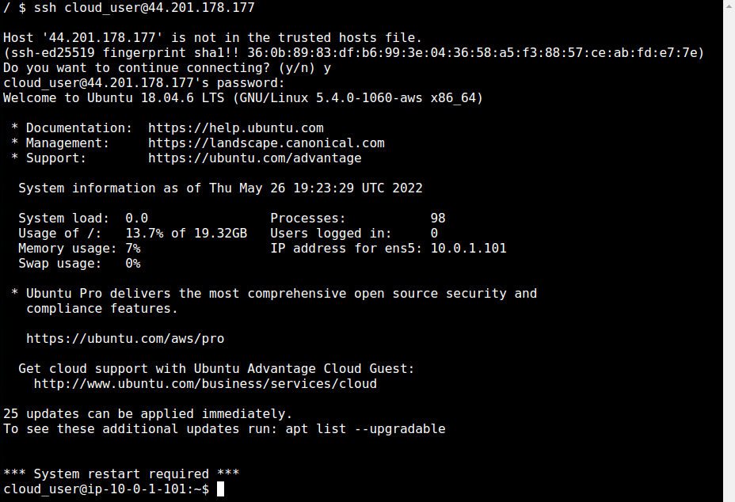

Making sure everything is up to date...

  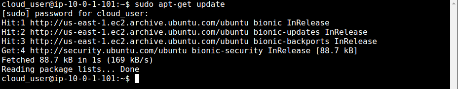

Making sure the following packages are installed: apt-transport-https, ca-certificates, curl, gnupg-agent, software-properties-common

  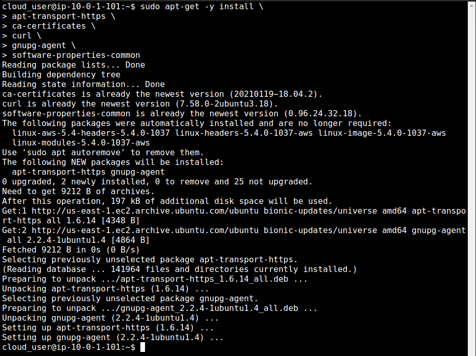

Download Docker's public key, and add to the keyring

  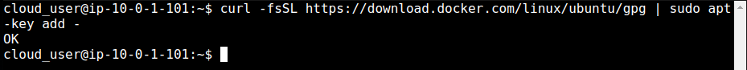

Verifying I have the correct key using the last 8 characters of the fingerprint

  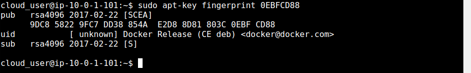

Adding the stable repository for Docker

  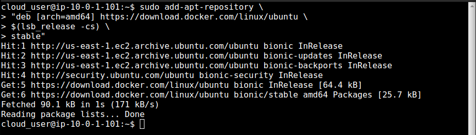

Getting updates again, now with the Docker repo available

  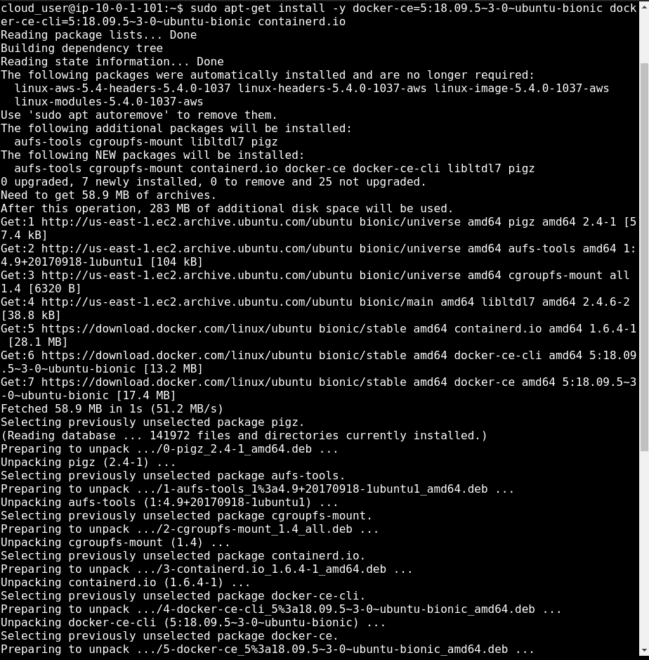

Installing the Docker packages

  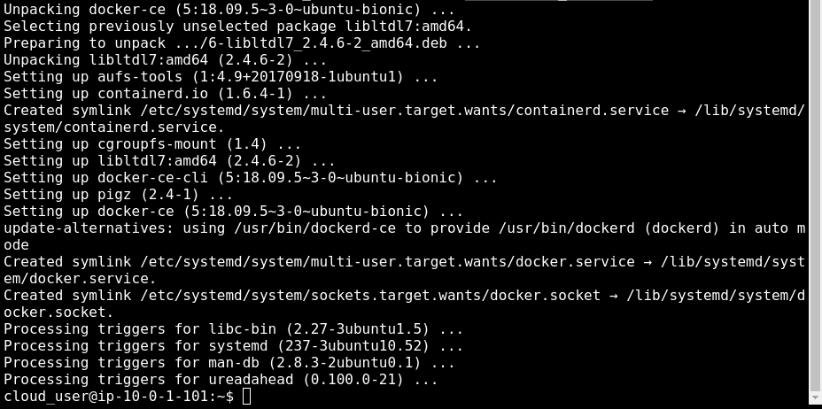

Adding my user to the Docker group so I can run commands

  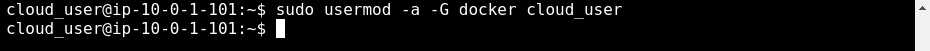

### Task 2 — Configure the Swarm Manager

I'm initializing the Swarm

  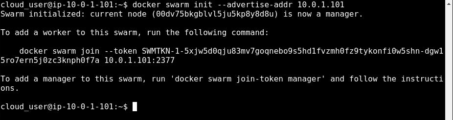

Using Docker Info, I'm able to see the swarm mode has been activated

  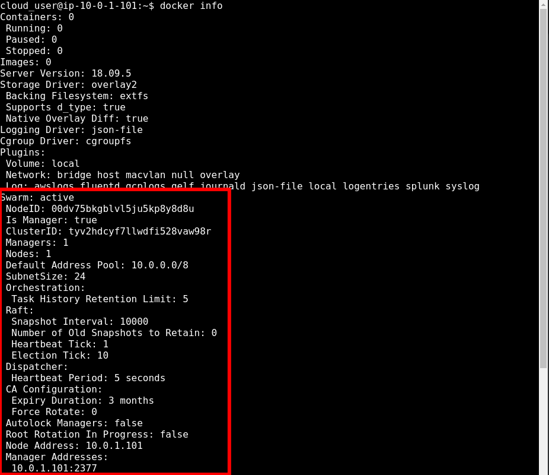

Since I haven't joined the worker nodes yet, the only node available is the manager node

  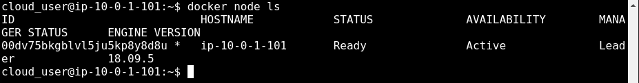

### Task 3 — Join Worker Nodes to the Cluster

For the other two nodes I completed all the steps I did in task 1.

Using the worker token command I received on the Manager node, I imput it on the worker node, and it tells me it joined as a worker

  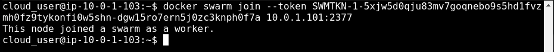

Back on the Manager node, running a list of nodes will show my cluster. If you noticed under the "Manager Status" heading, the second node has "Reachable"; I accidentally used the manager token when joining that node, so it's available as a potential manager node. The third node, which I did correctly (step above), has an empty string under that heading.

  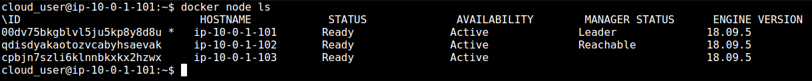

## ☁️ Cloud Outcome

☁️ I imagine in my learning I'll find out how to have all the steps in Task 1 in a script, for faster rollout.

☁️ Why not just use Kubernetes? The classic answer is "it depends". From what I gathered, Kubernetes is popular, and offers more capability since it's more extensive and customizable, higher fault tolerance, etc. The cost of that is more complexity, steeper learning curve, and more overhead. Docker Swarm mode requires only a little more setup than installing Docker, making it good for prototyping, testing, small, straightforward workloads.

## Next Steps

Next, I'm going to learn about creating my own Docker image

## Social Proof

[Linkedin Post](link)
