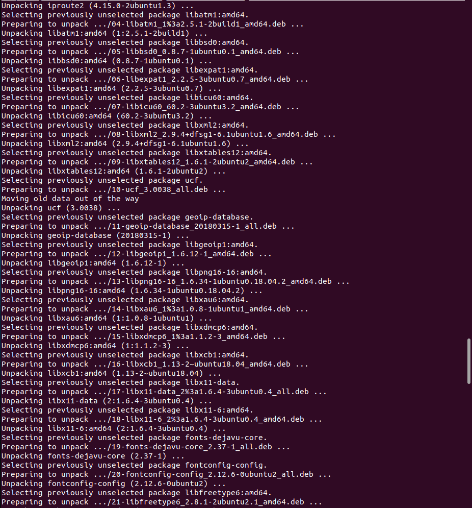

  

# Day 34 - Docker Image

## Introduction

Today, I'm going to learn about creating Docker images

## Prerequisite

☁️ Docker Image - a file containing the code and components needed to run software in a container

## Use Case

  

## Cloud Research

☁️ Container and images use a layered file system; each layer contains only the differences from the previous layer

- The image consists of one or more read-only layers, while the container adds one addition, a writable layer.
  - Docker Image
    - Base OS image
    - Dependencies, e.g., nginx, PostgreSQL, Python
    - Web Application
  - Docker Container
    - Docker Image (above)
    - Writable container layer

☁️ Docker File - set of instructions which are used to construct a Docker image; instructions are called directives

- Directives
  - FROM - starts a new build stage and sets the base image
  - ENV - set environment variables
  - RUN - creates a new layer on top of previous layer
  - CMD - default command used to run a container at execution time

## My Experience

### Task 1 — Looking at an image

Here I'm pulling down the latest image of nginx. It shows 6 different pulls. Looking at the history, I can see 6 entries that have non-zero bytes

  

### Task 2 — Making my own image

Making a file called 'Dockerfile', and using Directives to define the image.

  

Building my new Docker Image

  
  
  
  
  
  
  
  
  
  
  

### Task 3 — Testing the image

To test my new image, I have docker run it, and I'm able to curl the page

  

## ☁️ Cloud Outcome

☁️ A lot of possibilities, and I'm just scratching the surface

## Next Steps

Next, I'm going to learn about creating a Docker registry

## Social Proof

[Linkedin Post](link)
