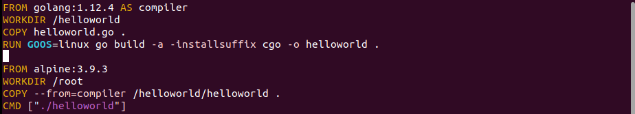
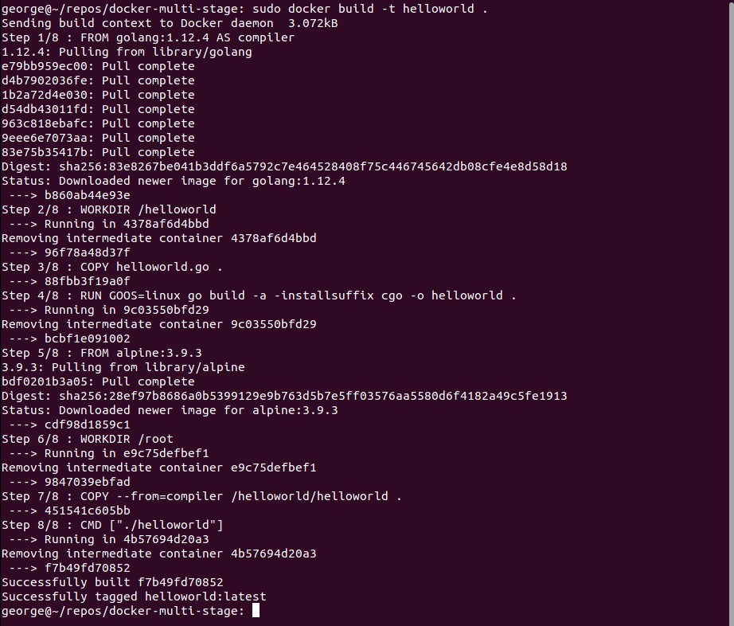
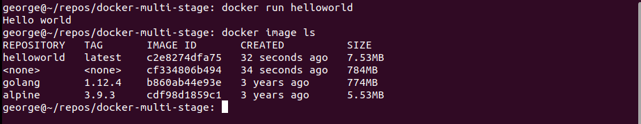
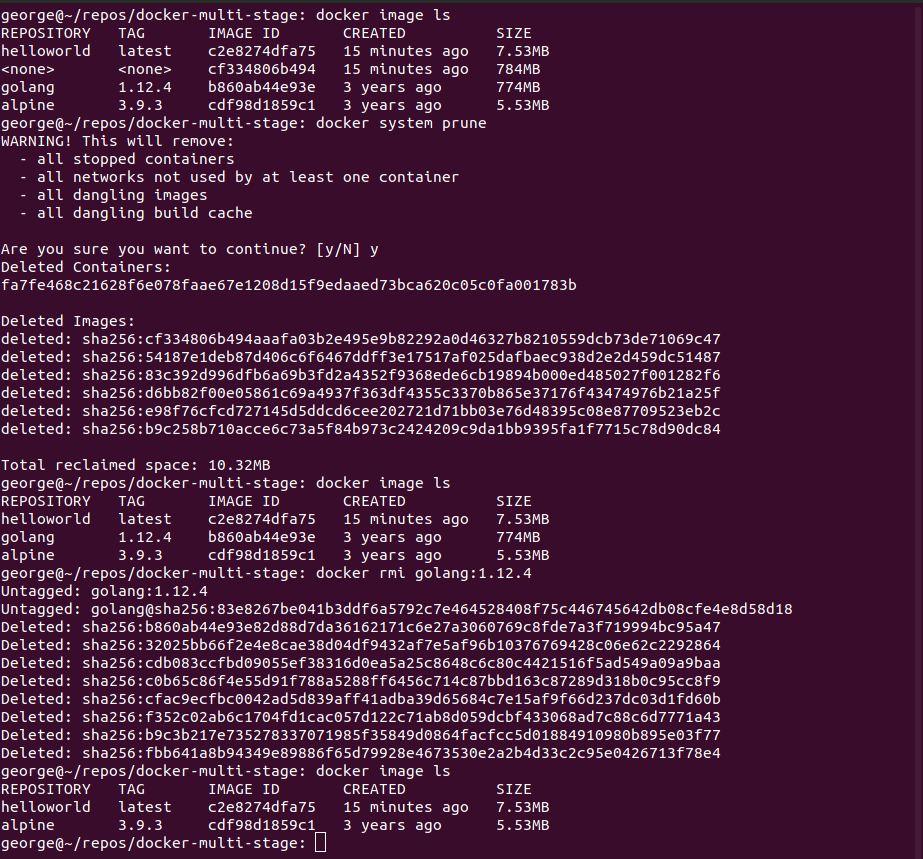
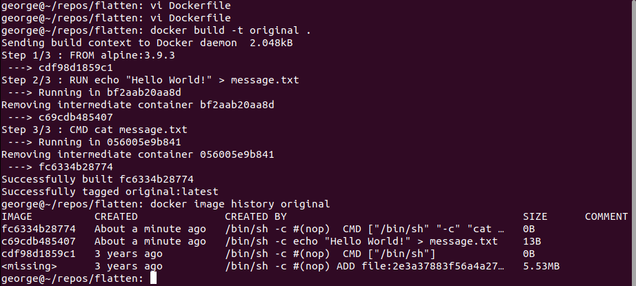
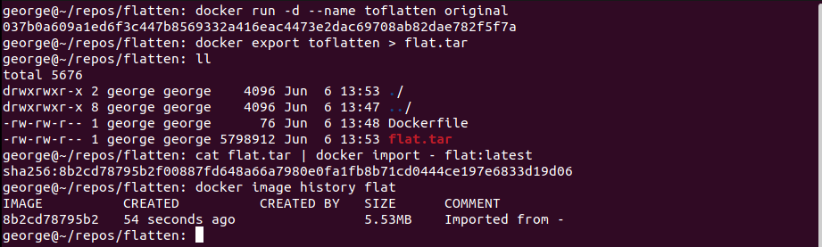

  

# Day 35 - Docker Images Part Deux

## Introduction

Today, I'm going to learn even MORE about Docker images

## Prerequisite

☁️ Docker Image - a file containing the code and components needed to run software in a container

## Use Case

  

## My Experience

### Task 1 — Multi-stage Builds

Docker images can get quite large. Sometimes part of that will be carrying unnecessary baggage forward. In this task, I'll create a Docker file with two stages, one for compiling the Golang Hello World program, then the second stage will take that executable program and place it on top of the Alpine O/S.

  

Building...

  

The helloworld image is a mere 7.53 MB, instead of the potential 784 MB if I had stayed with only the first stage.

  

One thing to keep in mind, is to clean up unneeded images going forward.
The command `docker system prune` will remove any dangling resources (images, containers, volumes, networks) that are not tagged or associated with an container. I can also remove specific images using `docker rmi <imagename>`

  

### Task 2 — Flattening an Image to one layer

This is more niche, but sometimes there is a need to flatten all the layers of an image into one layer. Here, I created a simple image with a few layers.

  

To flatten the image, I run it and then export it for archiving. I can import the tar to create a new image, which will only have one layer.

  

## ☁️ Cloud Outcome

☁️ I can definitely see the benefit of using multi-stage builds to create smaller images with the end results I'm looking to leverage. The flattening method appears to be quite limited in use, for particular niche problems; otherwise there is this Docker [best practices for writing Dockerfiles](https://docs.docker.com/develop/develop-images/dockerfile_best-practices/).

## Next Steps

Next, I'm going to learn about Docker registry

## Social Proof

[Linkedin Post](link)
