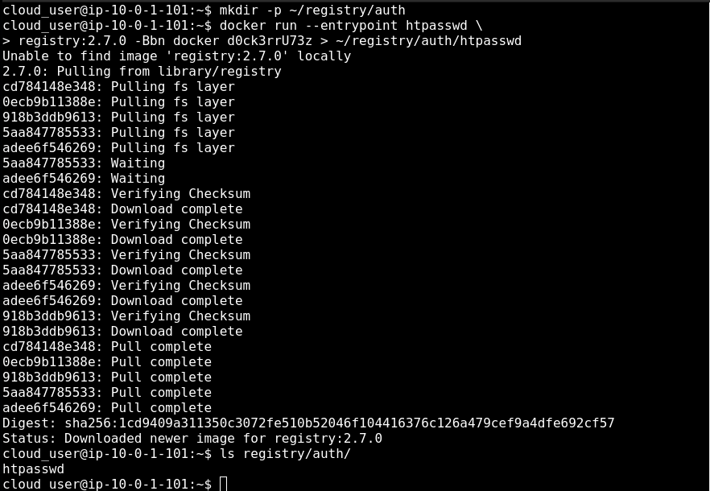
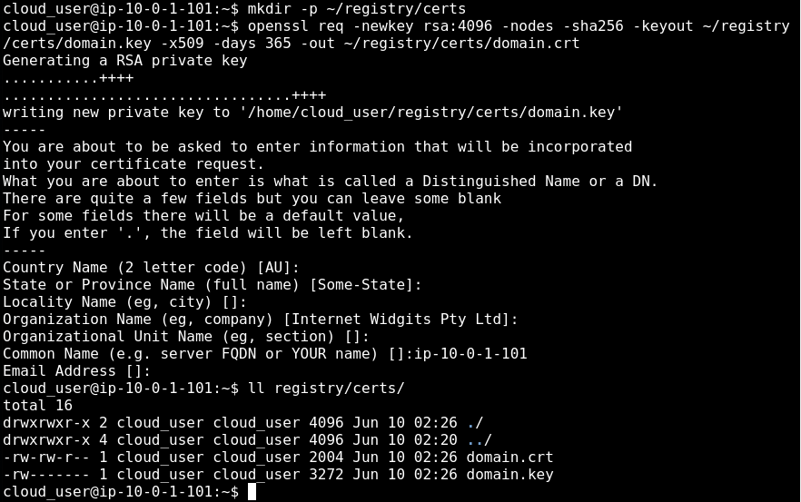
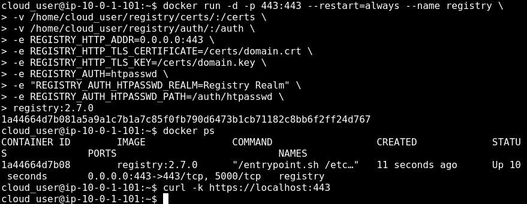
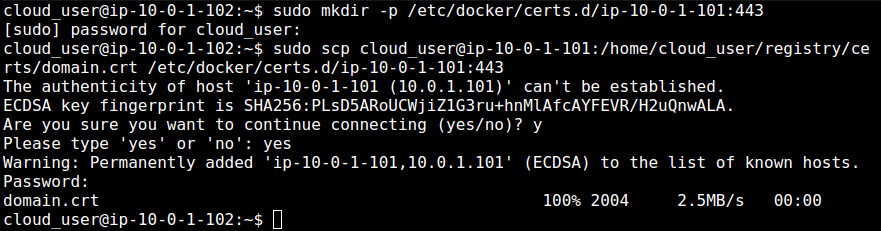
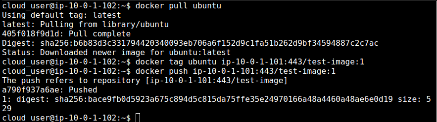
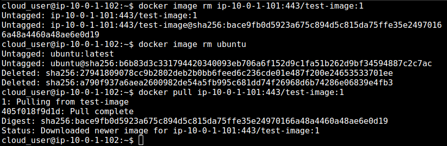

  

# Day 36 - Docker Registry

## Introduction

Today, I'm going to learn about Docker Registry

## Prerequisite

☁️ Docker Registry - a stateless, highly scalable server side application that stores and lets you distribute Docker images

## Use Case

  

- Use Cases:
  - tightly control where your images are being stored
  - fully own your images distribution pipeline
  - integrate image storage and distribution tightly into your in-hose development window

## Cloud Research

☁️ Default public registry is [Docker Hub]{https://hub.docker.com/)

☁️ Options are Docker's open source registry software, or the Enterprise Solution, Docker Trusted Registry

☁️ htpasswd is used to create and update the flat-files used to store usernames and password for basic authentication of HTTP users

☁️ x.509 Certificate is a standard format for public key certificates that securely associate cryptographic key pairs with identities such as websites, individuals, or organizations

☁️ bcrypt is a password-hashing function based on the Blowfish cipher

## My Experience

### Task 1 — Set up Private Registry

Set up basic authentication; options used are -B (bcrypt encryption for passwords), -b (batch mode), -n (display the results on standard output)

  

Creating self-signed certificates

  

Creating the registry; mounting volumes for the certificate and password files

  

### Task 2 — Test the registry from a docker workstation server

Need to trust the self-signed certificate, then test authentication against private registry

  

Pushing an image to the private registry

  

Pulling an image from the private registry

  

## ☁️ Cloud Outcome

☁️ Setting up the Registry with all the environment variables seemed a bit tedious to me. Having worked in the Government sector, I can see the need for creating a private registry for images you want tight control for security reasons.

## Next Steps

Next, I'm going to learn about Docker Compose!

## Social Proof

[Linkedin Post](link)
