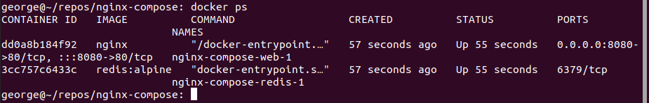

  

# Day 37 - Docker Compose

## Introduction

Today, I'm going to learn about Docker Compose

## Prerequisite

☁️ [Docker Compose](https://docs.docker.com/compose/) is a tool for defining and running multi-container Docker applications.

## Use Case

  

## Cloud Research

☁️ Docker Compose uses YAML, which is a human-readable data-serialization language

☁️ Docker Compose can activate all the services (containers) using a single command

- Benefits of Docker Compose

  - Single host deployment: This means you can run everything on a single piece of hardware
  - Quick and easy configuration: Due to YAML scripts
  - High productivity: Docker Compose reduces the time it takes to perform tasks
  - Security: All the containers are isolated from each other, reducing the threat landscape

  ☁️ Redis is an open source key-value store that functions as a data structure server

## My Experience

### Task 1 — Install Docker Compose

  

### Task 2 — Set up Docker Compose project

  
  

### Step 3 — Start and Stop the Compose App

  
  
  
  

## ☁️ Cloud Outcome

☁️ I discovered that YAML is sensitive to spacing. Yeah, I suppose it's more readable than JSON, but in a way I miss the predictability of parenthesis and curly brackets.

## Next Steps

Next, I'm going to learn about volumes in Docker

## Social Proof

[Linkedin Post](link)
