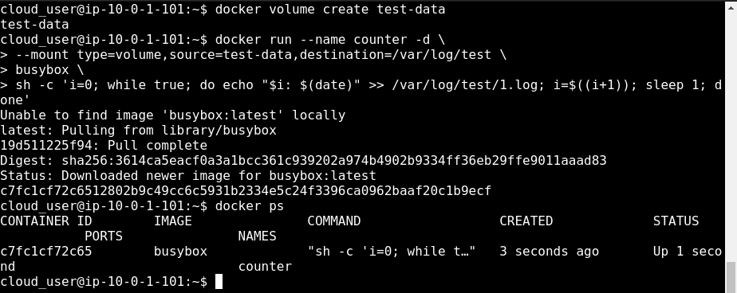
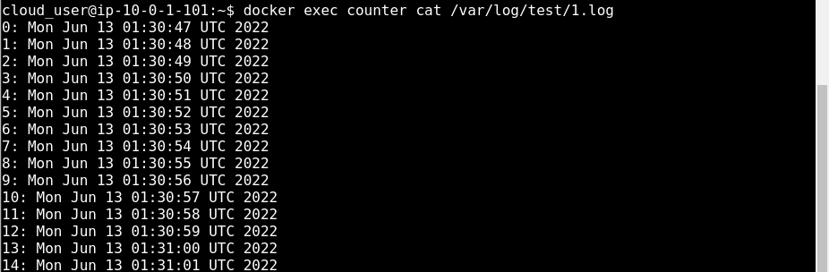
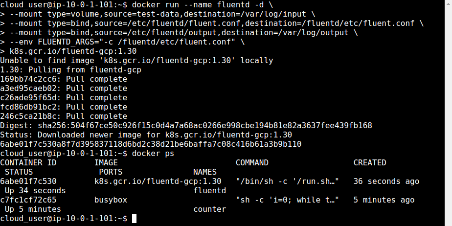
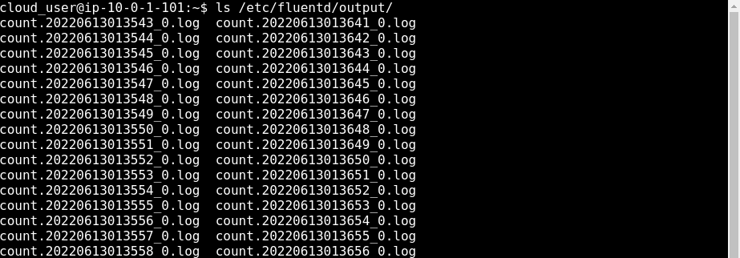
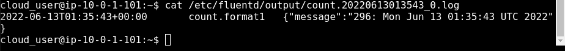

  

# Day 38 - Docker Volumes

## Introduction

Today, I'm going to learn about volumes in Docker

## Prerequisite

☁️ Volumes are used in Docker to persist data generated and used by Docker containers

## Use Case

  

## Cloud Research

☁️ Bind Mount - a file or directory on the host machine that is mounted into a container

☁️ Volume - a new directory is created within Docker's storage directory on the host machine; since volumes are not tied to any container, they can be attached to multiple running containers at the same time

- Benefits of using Volumes over Bind Mounts

  - Portable, making it easier to back up or migrate
  - directly manage volumes using Docker CLI commands
  - works with both Linux and Windows containers
  - Can be shared among multiple containers

  ☁️ Overlay2 is the preferred storage driver for all currently supported Linux distributions, and requires no extra configuration

- Storage Models
  - Filesystem: data is stored in the form of a file system; efficient use of memory
  - Block: stores data in blocks; efficient with write-heavy workloads
  - Object: stores data in an external object-based store; flexible and scalable but application must be designed to use object-based storage

## My Experience

I'm going create two containers, one to generate some log output in a file, then a second container with fluentd that will read the log output from the first container, transform it, and out the transformed data to another file on the host machine.

### Task 1 — Create a Shared Volume and First Container

First, I'm going to create a volume; then secondly, a container that will mount the shared volume, and through a command generate silly test data

  
  

### Task 2 — Create Second Container

Creating the second container that will utilize fluentd to process the log entries

  

### Task 3 — Review FluentD output

I can now look at the output, and see that Fluentd is processing the files, and adding context to the log entries with dates

  
  

## ☁️ Cloud Outcome

☁️ I was able to utilize both bind mounts and volumes to process log data. I learned that fluentd is used to capture log events from a diverse range of possible sources, and unifies them into a consolidated JSON format for use by other services.

## Next Steps

Next, I'm going to learn about networking in Docker

## Social Proof

[Linkedin Post](https://www.linkedin.com/posts/georgemontee_github-gmontee100daysofcloud-activity-6942857872053608448--g5C?utm_source=linkedin_share&utm_medium=member_desktop_web)
