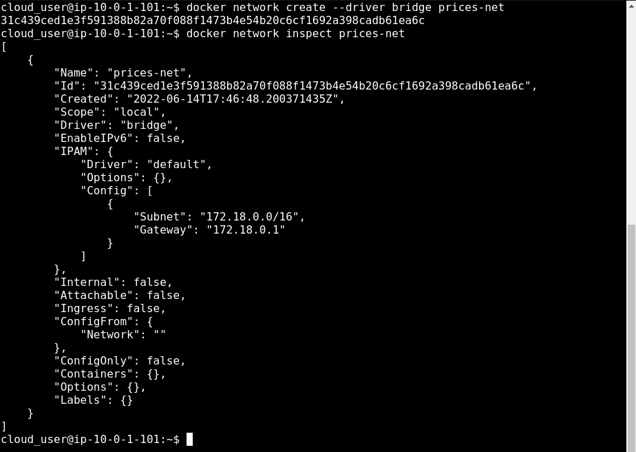
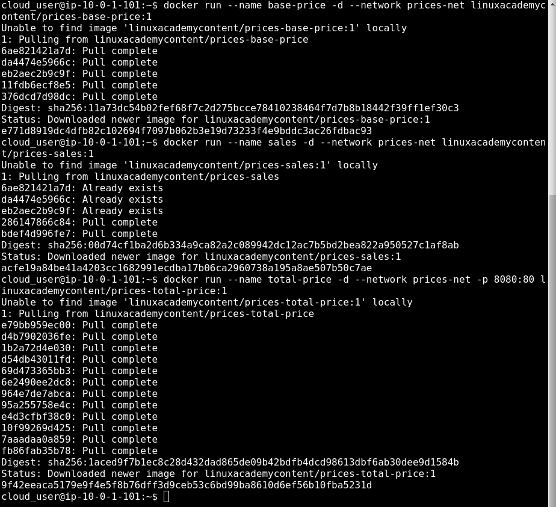
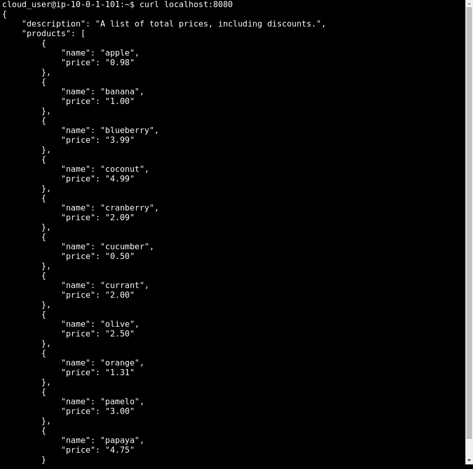

  

# Day 39 - Docker Networking

## Introduction

Today, I'm going to learn about networking in Docker

## Prerequisite

☁️ Docker provides a number of ways to connect containers and services, and even non-Docker workloads, together

## Use Case

  

## Cloud Research

☁️ Container Networking Model (CNM) - specification proposed by Docker where there is a network controller that is responsible for pairing a driver to a network; each driver is responsible for managing the network it owns

- CMN Concepts

  - Sandbox: an isolated unit containing all networking components associated with a single container
  - Endpoint: connects a sandbox to a network; each sandbox/container can have any number of endpoints, but has exactly one endpoint for each network it's connect to
  - Network: a collection of endpoints connected to one another
  - Network Driver: handles the actual implementation of the CNM concepts
  - IP Address Management (IPAM) Driver: automatically allocates subnets and IP addresses for networks and endpoints

- Network Drivers
  - Host: containers use the host's networking resources directly, no sandboxes; no two containers can use the same port(s)
  - Bridge: default, isolated containers running on a single host; creates a Linux bridge for each Docker network
  - Overlay: provides connectivity between containers across multiple Docker hosts (Docker Swarm), automatically configures network interfaces, bridges, etc on each host as needed
  - MACVLAN: uses direct association with Linux interfaces instead of a bridge interface; harder to configure; more lightweight and less latency
  - None: container is completely isolated from other containers and the host; any networking must be done manually

## My Experience

### Task 1 — Setting up a Bridge Network

Setting up the bridge network; technically I don't need to specify the driver type since bridge is the default, but it helps for clarity

  

### Task 2 — Setting up the various Application Containers

Need three containers, first one has a list of the food products sold, second one has a list of products that are on sale, and discount percentage, and the third one for calculating the price

  

### Task 3 — Testing for Connectivity

Since items and prices show up, we know the total-price container is retrieving information from the base-price and sales containers for it's calculations

  

## ☁️ Cloud Outcome

☁️ I can see using this type of network for prototyping a concept or quickly testing an update on a dev machine. In a production environment you most likely will have a Docker Swarm setup, which would require an Overlay network.

## Next Steps

Next, I'm going to learn about security in Docker

## Social Proof

[Linkedin Post](https://www.linkedin.com/posts/georgemontee_github-gmontee100daysofcloud-activity-6943195820288610304-jcLw?utm_source=linkedin_share&utm_medium=member_desktop_web)
