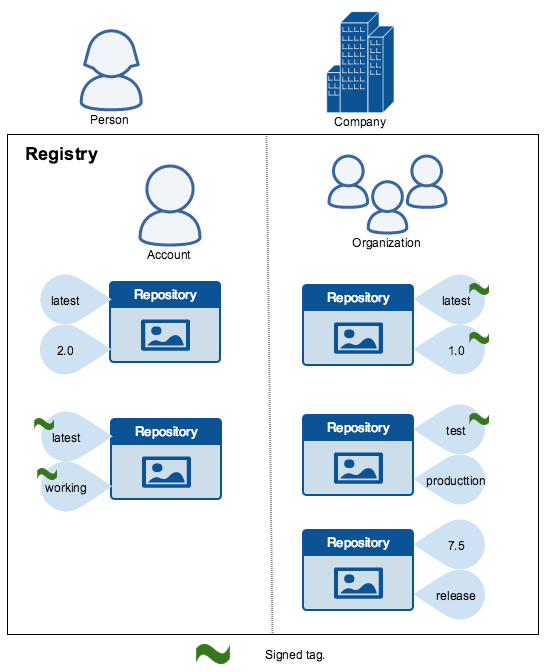
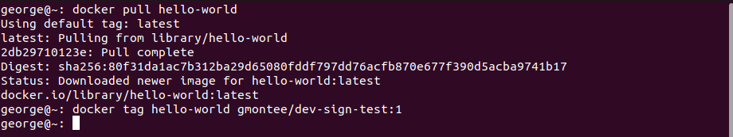
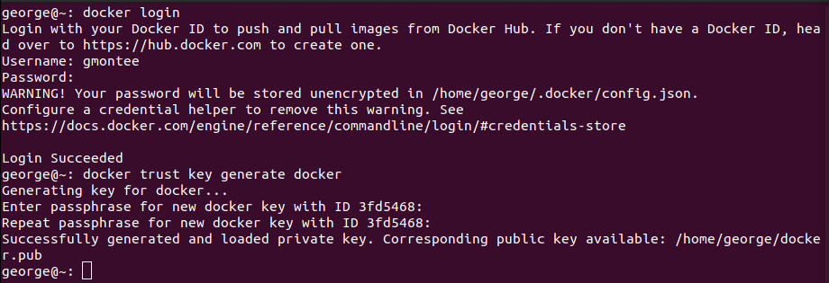
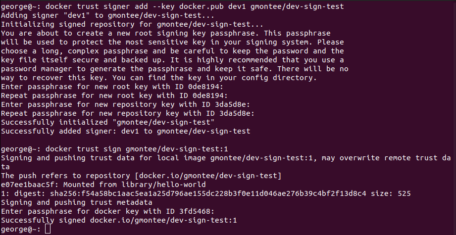

  

# Day 40 - Docker Security

## Introduction

Today, I'm going to learn about security in Docker

## Prerequisite

☁️ [Docker Content Trust (DCT)](https://docs.docker.com/engine/security/trust/) is a secure way to verify the integrity of images before you pull or run them

## Use Case

  

## Cloud Research

☁️ Using DCT, the image creator can sign each image with a certificate, which clients can use to verify the image before running it

## My Experience

### Task 1 — Tag an Image

I'm just going to pull the hello world image, and tag it

  

### Task 2 — Generate Trust Key

I need to login into Docker Hub, and then create the Trust Key

  

### Task 3 — Add a Signer

Adding myself as a signer to the repo

  

### Task 4 — Test

Pulling the image with DCT turned on

  

## ☁️ Cloud Outcome

☁️ I noticed when exploring images on Docker Hub, they had a category for "Trusted Content". There's the Docker Offical images, as they frame it curated open source and drop-in solutions. Next, they have Verified Publishers, where you'll see images from all the big names, e.g., Nginx, Redis, Ubuntu, Postgres, Node, MySQL, etc.

☁️ I saw there's a tool called Notary, which helps mitigrate attacks a variety of ways; digitally signing each layer to prevent image tampering, providing transparent key rotation to prevent key compromises, and timestamping keys to prevent replay attacks.

☁️ Earlier this year (March 2022), I saw Microsoft Azure developers were the target of malicious packages. Attackers had created node packages, naming them with common typos, in hopes a developer would download with mistyping. In that respect, in the Docker world DCT would help prevent that type of attack vector.

- Keys
  - Trust Key: identifies me as a user
  - Root Key: sometimes called the offline key; root of trust for repo, can be used for multiple repos
  - Repository Key: used to sign image tags, generated by the provider

## Next Steps

Next, I'm going to learn about Ansible, an open-source IT automation and configuration management tool

## Social Proof

[Linkedin Post](link)
