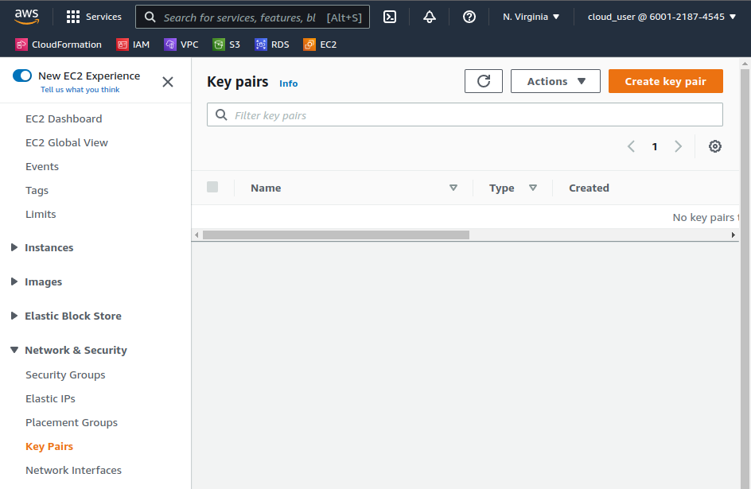

  

# Day 43 - Introduction to Ansible

## Introduction

Today, I'm going to get started with using Ansible

## Prerequisite

☁️ Ansible is an IT automation system. It handles configuration management, application deployment, cloud provisioning, ad-hoc task execution, network automation, and multi-node orchestration.

## Use Case

  

Use Case Scenarios (What can I automate?)

- Mass Deployments
- Scaling
- Migrating Environments
- Failure Prevention

## Cloud Research

- Advantages

  - Automated deployments
  - Manage multi-server systems
  - Make configurations one time
  - Produce reliable and repeatable systems
  - Reduce human error

- Infrastructure as Code

  - Build entire system in code
  - Leverage source control
  - Roll back changes (if needed)
  - Share code that was previously hidden

- Features
  - Written in Python
  - Script commands using YAML syntax
  - Sends commands to nodes via SSH
  - Commands are executed sequentially on each node
  - Each node runes commands in parallel

## My Experience

### Task 1 — Setup Inventory

First, I need to create SSH keys that I will use to access my servers

  
  
  

Using AWS CloudFormation, and [a YAML script](https://github.com/ACloudGuru-Resources/Course_Introduction_to_Ansible/blob/master/02_02_Introduction_To_Ansible/setup-env.yml), to create 2 servers and 1 load balancer

  
  
  

### Task 2 — Installing Ansible

I'm using a Linux distro, and already have Python 3.x installed

  
  
  

### Task 3 — Ensuring End-to-End

Using the ssh key created earlier, I ssh into the vm's, ensuring I have access

  

## ☁️ Cloud Outcome

☁️ It's really nice that Ansible is agentless; as long as you can ssh into the servers, you're golden.

## Next Steps

Next, I'm going to learn about setting up an Inventory file in Ansible

## Social Proof

[Linkedin Post](https://www.linkedin.com/posts/georgemontee_100daysofcloud-activity-6945061035624058880-IoGK?utm_source=linkedin_share&utm_medium=member_desktop_web)
