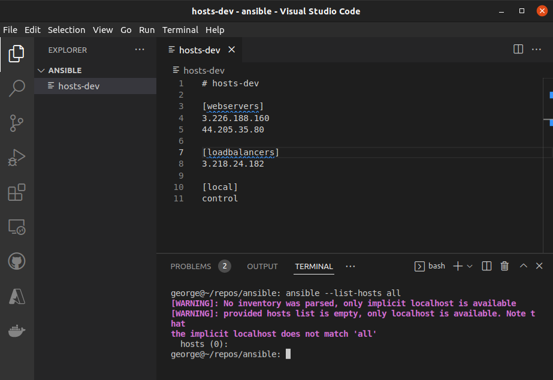
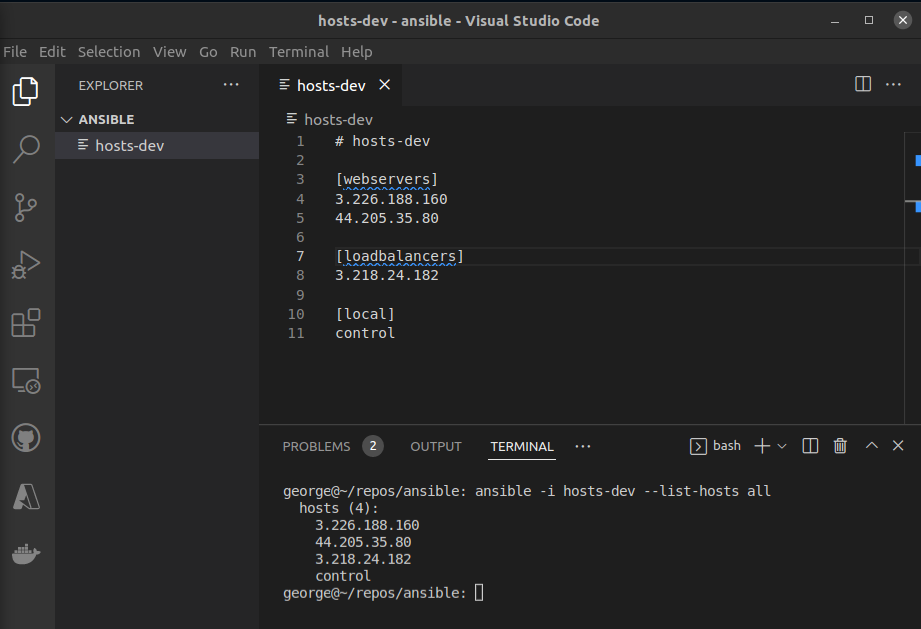
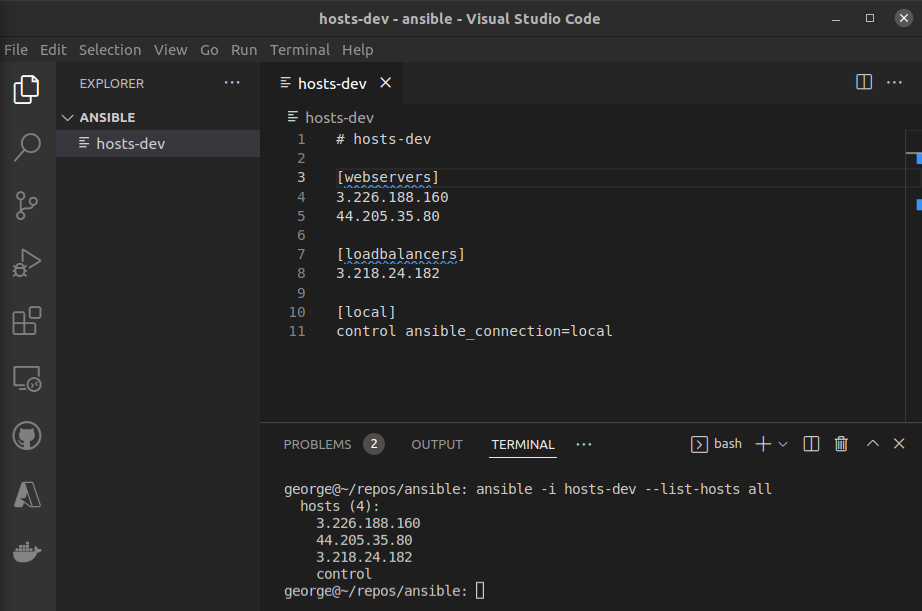
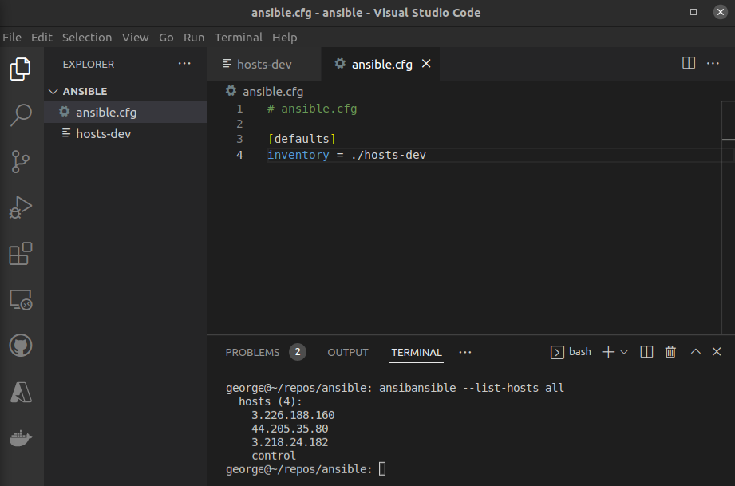
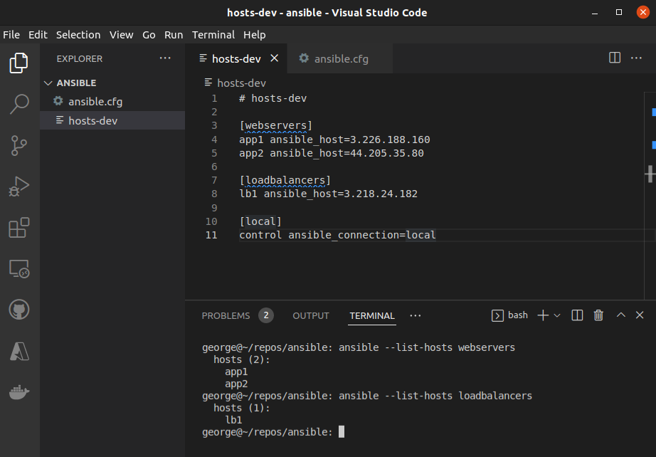
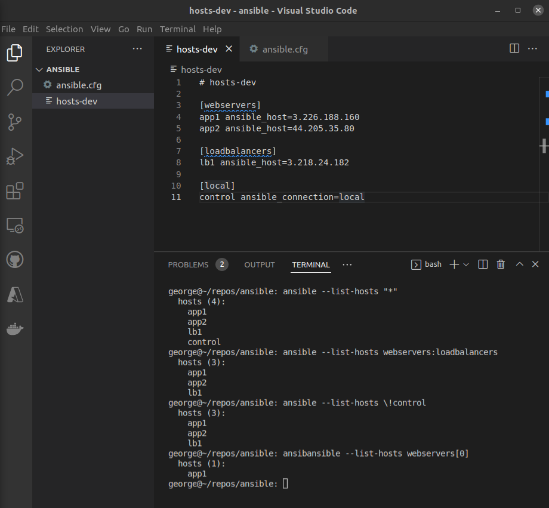

  

# Day 44 - Ansible - Setup

## Introduction

Today, I'm going to learn about setting up an Inventory file in Ansible

## Prerequisite

☁️ Inventory File - provides a way for Ansible to reference our inventory servers; it contains the host names and groups; can be static or dynamic

## Cloud Research

☁️ Inventory files be written in INI-like format, and also YAML. The inventory can specify non-standard ssh ports, and create alias.

☁️ Default Ansible inventory is located in `/etc/ansible/hosts`; can reference a different inventory using `-i <path> option`

## My Experience

### Task 1 — Setting up Hosts-Dev file

Using Visual Studio Code, I create an hosts-dev file which specifies the ip addresses of the web servers, load balancer, and what I'm using for control, in this case my local machine. Initially, trying to list available hosts, since Ansible is still looking the default inventory file location

  

Specifying the location of the inventory file, it shows available hosts

  

Since I'm using my local machine as control, I add `ansible_connection=local` to let Ansible it doesn't need to ssh into control

  

### Task 2 - Configuration

Here I'm creating an ansible.cfg file, which will specify the inventory file location

  

Adding to the hosts-dev file, I can specify alias

  

Here I'm showing I can query the list of hosts using a variety of filters

  

## ☁️ Cloud Outcome

- Configuration file will be search in the following order:
  - ANSIBLE_CONFIG (environment variable if set)
  - ansible.cfg (in the current directory)
  - ~/.ansible.cfg (in the home directory)
  - /etc/ansible/ansible.cfg

## Next Steps

Next, I'm going to learn about tasks in Ansible

## Social Proof

[Linkedin Post](link)
