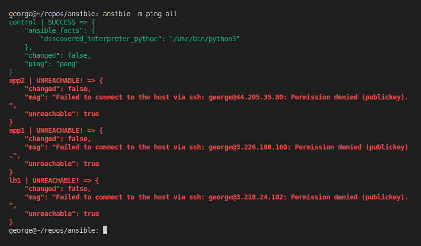
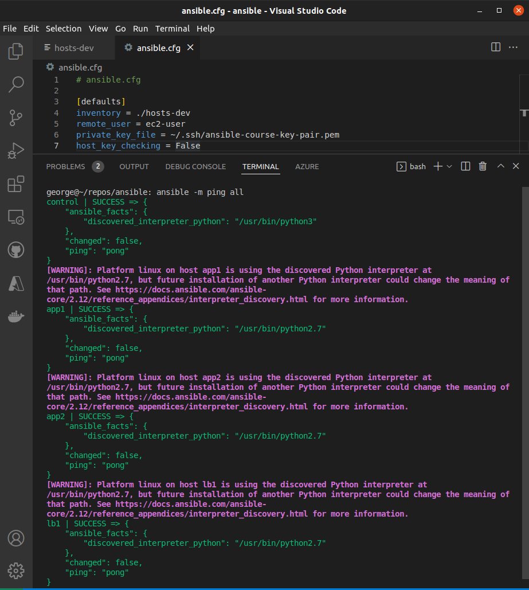
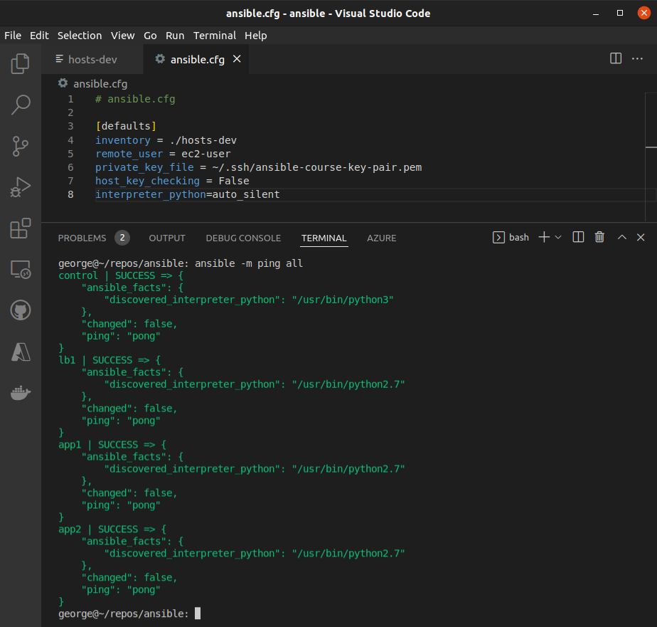
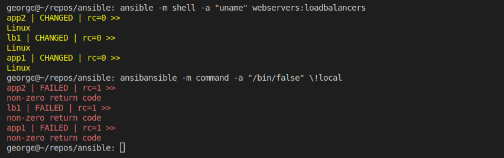
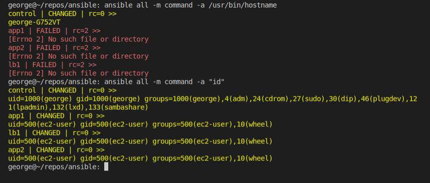
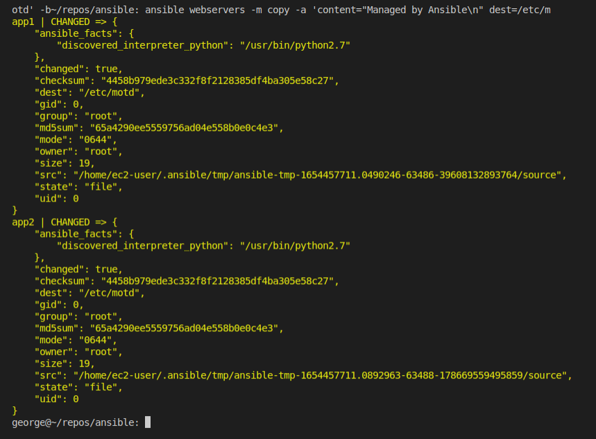
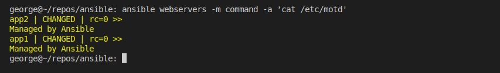

  

# Day 45 - Ansible - Tasks

## Introduction

Today, I'm going to learn about tasks in Ansible

## Prerequisite

☁️ Ansible tasks are a way to run adhoc commands against our inventory in a one-line single executable. Tasks are the basic building block of Ansible's execution and configuration.

## Use Case

  

`$ ansible [pattern] -m [module] -a "[module options]"`

## Cloud Research

☁️ [Ansible Modules](https://docs.ansible.com/ansible/2.9/modules/modules_by_category.html) provide reusable, standalone scripts. For instance, under the Cloud module, there are scripts for running commands on AWS, Azure, Google Cloud, Docker, VMWare, etc. Another example is the Files module, enabling such capability as fetching, copying, finding, replacing, etc files.

## My Experience

### Task 1 — Summary of Step

Here I attempt to ping all the resources in my inventory, and for the non-local resources I get a permission denied

`ansible -m ping all`

  

In the Ansible config file, I set the default remote user, which since I'm using AWS is ec2-user. I also tell Ansible where to find the needed ssh key. Finally, I disable host key checking, since I don't want an interactive experience when using Ansible

  

I received a warning, where Ansible found a Python interpreter at a certain path, but warns that might change with installation of another future Python interpreter. For now, I add a line to silence the warning.

  

### Task 2 — Summary of Step

Here I'm trying different commands, with two potential return codes, e.g., 0 (success), 1 (failure). The first command is merely executing a command to retrieve system name, version, and other details. The second command is a binary that immediately exists returning false.
`ansible -m shell -a "uname" webservers:loadbalancers`
`ansible -m command -a "/bin/false/" \!local`

  

Getting the UID of each of the created users, leveraging the 'id' command to get the user id, group id, groups associated with that user.
`ansible all -m command -a /usr/bin/hostname`
`ansible all -m command -a "id"`

  

I'm changing the Message of the Day for the web servers, and then looking at the message (the command glitched in the screenshot). The dash b at the end is for "become", meaning to escalate privileges.
`ansible webservers -m copy -a 'content="Managed by Ansible\n" dest=/etc/motd -b`

  

Let's take a look
`ansible webservers -m command -a 'cat /etc/motd'`

  

## ☁️ Cloud Outcome

☁️ Running adhoc tasks is great for troubleshooting and quick testing against inventory

☁️ The returned results will give us details about the success or failure of the executed commands

## Next Steps

Next, I'm going to learn about Ansible Playbooks

## Social Proof

[Linkedin Post](link)
