

  

# Day 44 - Ansible - Playbooks

## Introduction

Today, I'm going to learn about utilizing Playbooks in Ansible

## Prerequisite

☁️ Ansible Playbook - a blueprint of automation tasks, which are complex IT actions executed with limited or no human involvement

## Use Case

  

- Playbook: one or more plays
  - Play: maps a group of hosts to tasks that used to call Ansible modules
    - Task(s): unit(s) of action

## Cloud Research

☁️ Use Cases: regularly used to automate IT infrastructure (such as operating systems and Kubernetes platforms), networks, security systems, and developer personas (such as Git)

☁️ Playbooks declare configurations and orchestrate steps to ensure the remote resources are configured as expected

☁️ Written tasks can be run synchronously or asynchronously

☁️ Utilizing Playbooks means it can be source controlled

## My Experience

### Task 1 — Creating a Playbook to install Apache

Setting up my inventory file

  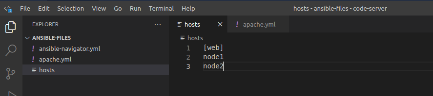

Creating a playbook to install an Apache HTTP Server

  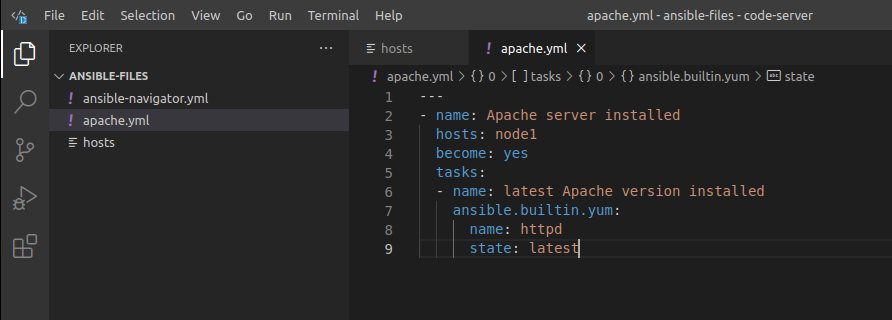

Running the playbook we see a change on node1; the "Gathering Facts" task is built-in and Ansible uses it to collect information about the managed node(s)

`ansible-navigator run apache.yml -i hosts`

  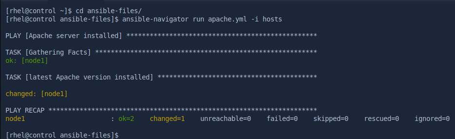

SSHing into node1 I can manually check that httpd is installed (I could've also just used an Ad Hoc Ansible command)

`rpm -qi httpd`

  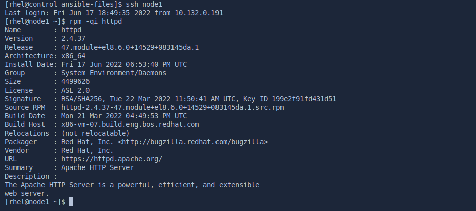

### Task 2 - Expanding the Playbook to enable httpd

I'm expanding the Apache playbook to not only install httpd, but enable it

  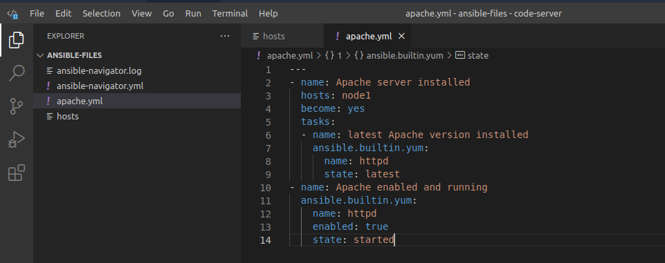

YAML files are sensitive to spacing. In this case there was a space in front of the dash starting the name line.

  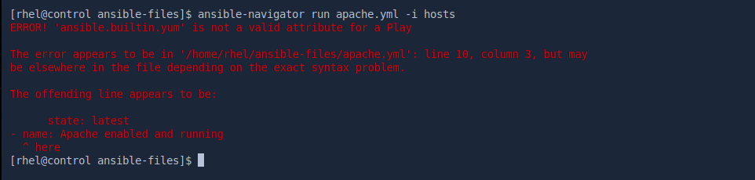

Alright, now we're in business. SSHing back into node1 I can check the status of the Apache HTTP Server

`systemctl status httpd`

  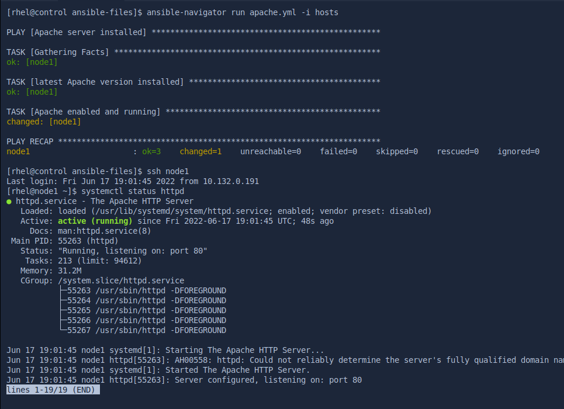

### Task 3 - Expanding the Playbook to copy web.html over

Adding a html file I can use to copy to webservers

  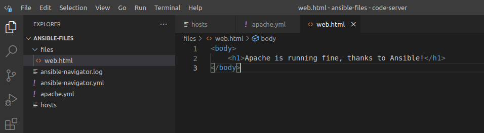

I'm extending the playbook file again to now copy the web.html I just created

  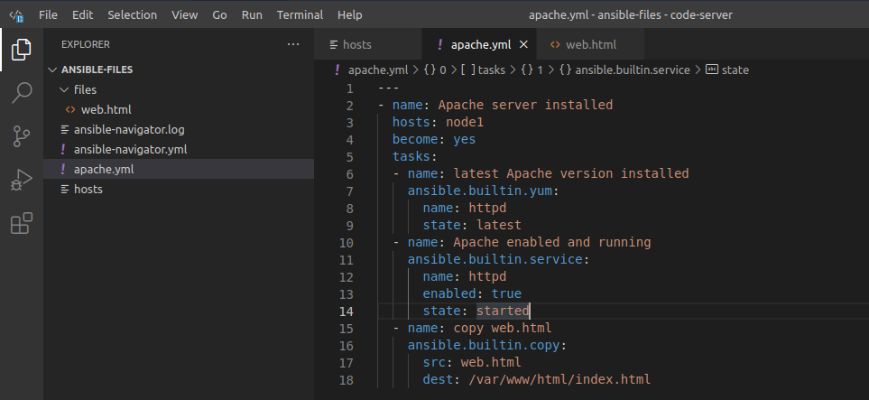

Success again! Utilizing curl I can see the html page on node1

`curl http://node1`

  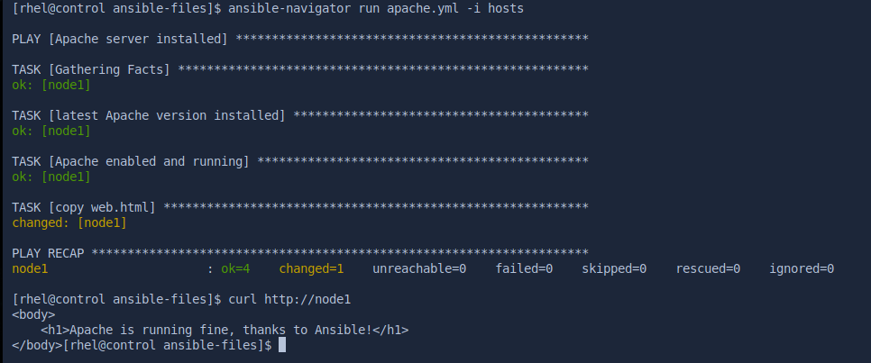

I went to the Apache playbook and changes hosts from node1 to webserver; now when I run the playbook it now affects node2; this is a good example of a playbook being idempotent

  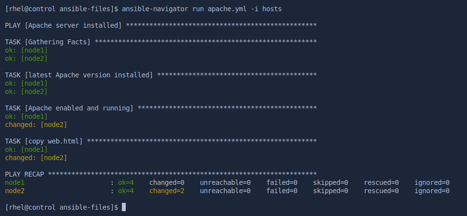

## ☁️ Cloud Outcome

☁️ Good Playbooks are idempotent, meaning repeated execution always leads to the same result.

☁️ Once you have a playbook written, it's amazing to think all the work it's saving you by not having to manually log into each server, perform the tasks, etc, and hope you don't make any mistakes.

## Next Steps

Next, I'm going to learn about leveraging variables in Ansible

## Social Proof

[Linkedin Post](link)
