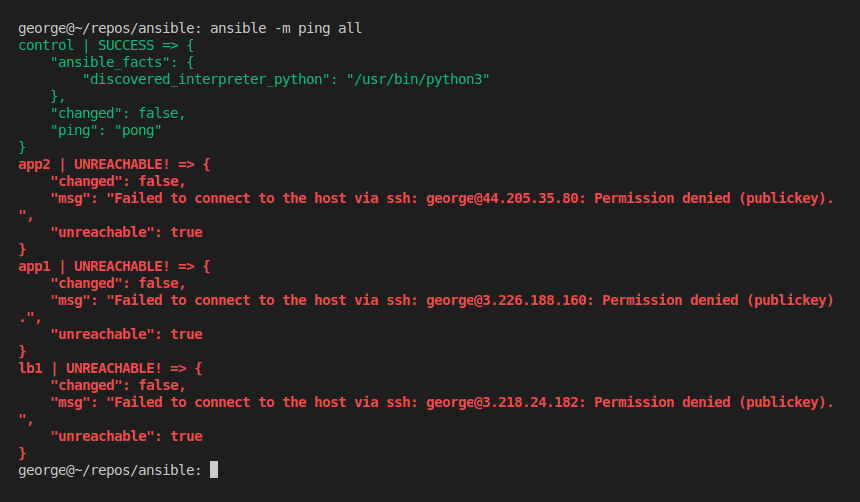
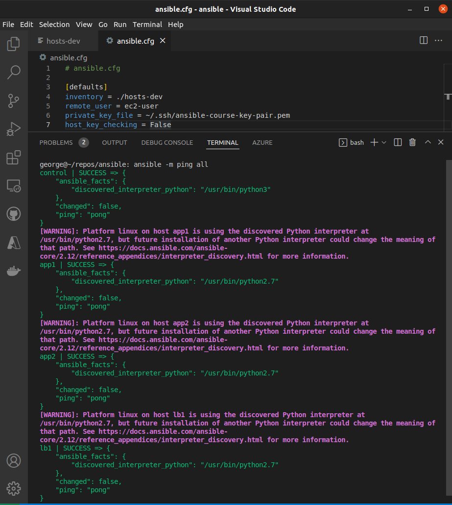
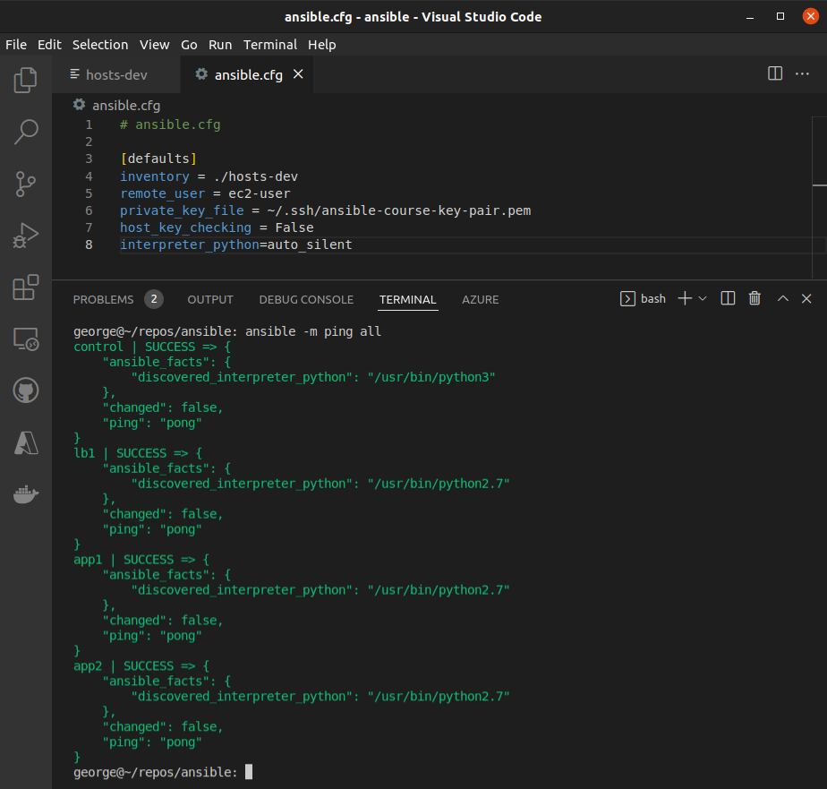
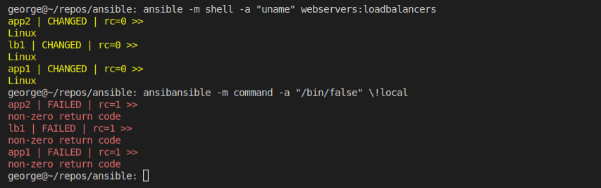
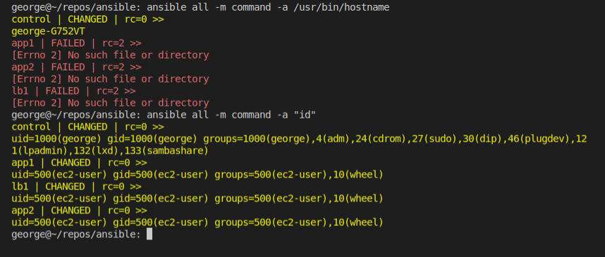
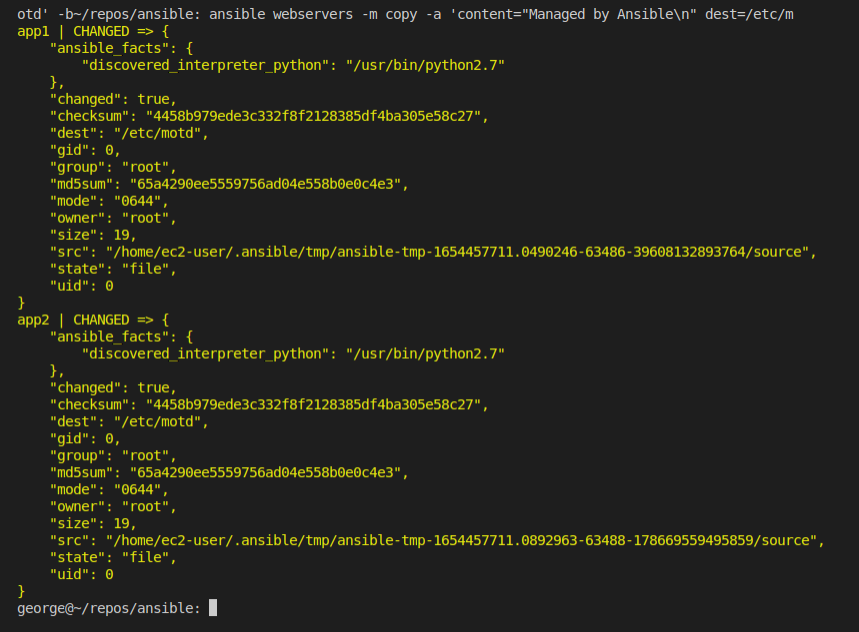
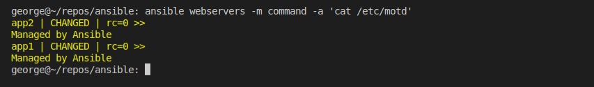

  

# Day 45 - Ansible - Tasks

## Introduction

Today, I'm going to learn about

## Prerequisite

☁️ Ansible tasks are a way to run adhoc commands against our inventory in a one-line single executable. Tasks are the basic building block of Ansible's execution and configuration.

## Use Case

  

`$ ansible [pattern] -m [module] -a "[module options]"`

## Cloud Research

☁️ [Ansible Modules](https://docs.ansible.com/ansible/2.9/modules/modules_by_category.html) provide reusable, standalone scripts. For instance, under the Cloud module, there are scripts for running commands on AWS, Azure, Google Cloud, Docker, VMWare, etc. Another example is the Files module, enabling such capability as fetching, copying, finding, replacing, etc files.

## My Experience

### Task 1 — Summary of Step

Here I attempt to ping all the resources in my inventory, and for the non-local resources I get a permission denied

  

In the Ansible config file, I set the default remote user, which since I'm using AWS is ec2-user. I also tell Ansible where to find the needed ssh key. Finally, I disable host key checking, since I don't want an interactive experience when using Ansible

  

I received a warning, where Ansible found a Python interpreter at a certain path, but warns that might change with installation of another future Python interpreter. For now, I add a line to silence the warning.

  

### Task 2 — Summary of Step

Here I'm trying different commands, with two potential return codes, e.g., 0 (success), 1 (failure)

  

Getting the UID of each of the created users

  

I'm changing the Message of the Day for the web servers, and then looking at the message

  
  

## ☁️ Cloud Outcome

☁️

## Next Steps

Next, I'm going to learn about

## Social Proof

[Linkedin Post](link)
