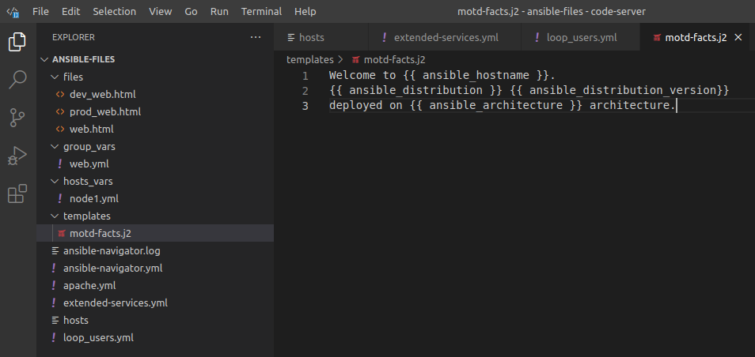

  

# Day 45 - Ansible - Variables

## Introduction

Today, I'm going to learn about leveraging variables in Playbooks

## Prerequisite

☁️ Variables can be used in inventories, playbooks, roles, command line, etc to leverage dynamic values

## Cloud Research

☁️ Variables in Ansible Playbooks are referenced by placing the variable name in double curly braces: {{ variable1 }}

☁️ The recommended practice to provide variables in the inventory is to define them in files located in two directories named host_vars and group_vars. Host variables take precedence over group variables

## My Experience

### Task 1 — Utilizing a basic variable

Creating web page configurations for what stage it is

  
  

Creating html pages for each stage

  
  

I'm updating the playbook to use the variable from the web page configs

  

### Task 2 — Playbook utilizing variables for different host groupings

Add another resource pattern, a database

  

Creating another playbook; take note of when clauses

  

Because of the when clause, the MTA task only applied to the web server nodes, skipping the database node; and for the flipping for installing the database

  

### Task 3 — Using variables in a loop

defining loop to create 3 types of users: dev, qa, prod

  

For node2, the task shows 3 items changed

  

### Task 4 - Using templates to update files

Creating a MOTD using J2 file and variables

  

Playbook to add the template to node2

  

With the change made, SSHing into node2 shows the custom Message of the Day

  

## ☁️ Cloud Outcome

☁️ Obviously, a whole host of potential for using variables dynamic data, looping, conditionals, etc

☁️ Jinja2 is one of the most used template engines for Python; Ansible uses Jinja2 templating to modify files before they are distributed to managed hosts

## Next Steps

Next, I'm going to learn about scheduling with the 'at' command

## Social Proof

[Linkedin Post](link)
