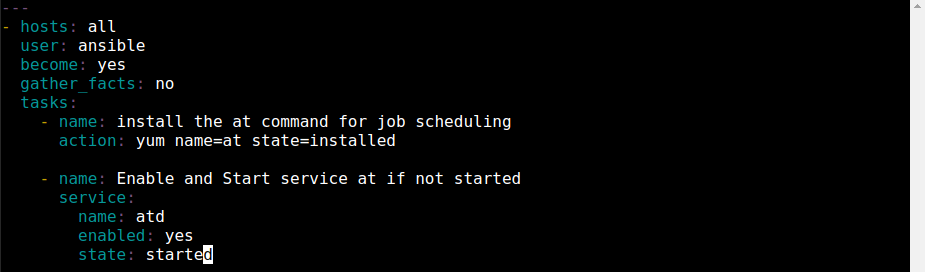
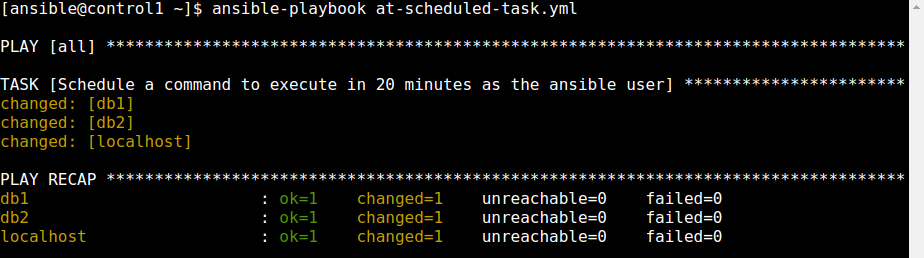

  

# Day 46 - Ansible - Scheduling with the 'at' command

## Introduction

Today, I'm going to learn about leveraging the 'at' command to schedule tasks

## Prerequisite

☁️ 'at' is a command-line utility that allows you to schedule commands to be executed at a particular time; they are executed only once.

## Cloud Research

☁️ The syntax for the 'at' command is:
`at [OPTION..,] runtime`
followed by prompts for you to enter one or more commands. Pressing Ctrl-D with exit the prompt and save the job

☁️ 'atd' is a job scheduler daemon that runs jobs scheduled for later execution

☁️ 'atq' displays the list of pending jobs which are scheduled by the user

## My Experience

### Task 1 — Create Install At Playbook

First, I need to log into my control server, switch to the Ansible user, and ping the servers to ensure all is well.

`su - ansible`

`ansible all -m ping`

  

Creating the playbook to install the 'at' command for job scheduling, and start the service

  
  

Executing the playbook...

`ansible-playbook install-at.yml`

  

### Task 2 — Create Scheduled Task Playbook

Creating a playbook to schedule a task

  
  

Executing the playbook...

  

Since I had the 'at' command installed and the task scheduling on the host, I can check to see for a job

`atq`

`atq -c 1`

  

### Step 3 — Create Remove At Task Playbook

Now, I'm creating a playbook to remove the scheduled tasks

  
  

Checking for jobs, I can see it's gone form the queue

`atq`

  

## ☁️ Cloud Outcome

☁️ Previously, I had worked with cron jobs via crontab, scheduling repeatable tasks. The 'at' command is new to me, and it's for one off scheduled tasks.

## Next Steps

Next, I'm going to learn about using Templates within Ansible

## Social Proof

[Linkedin Post](link)
