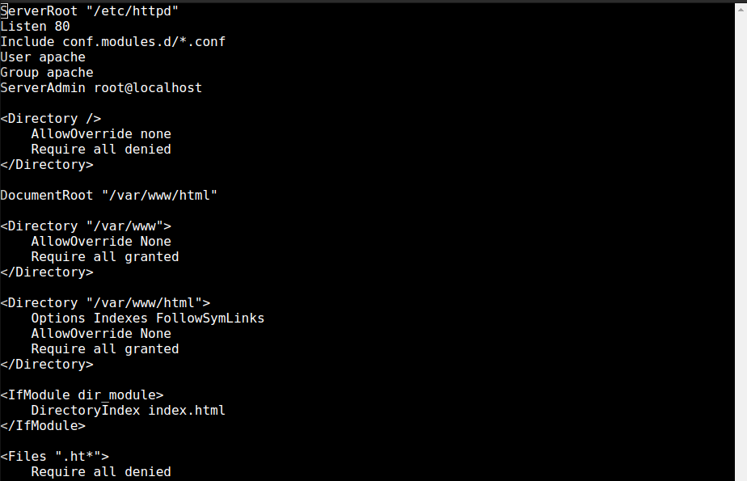
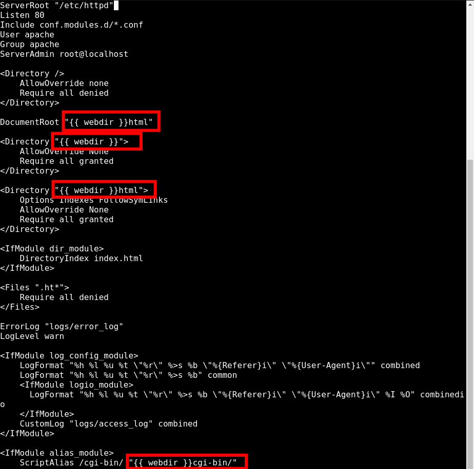
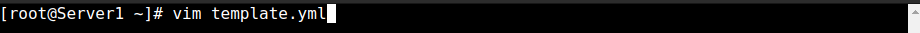
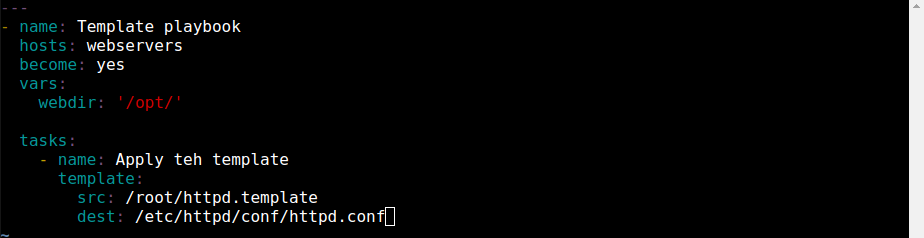
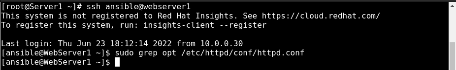
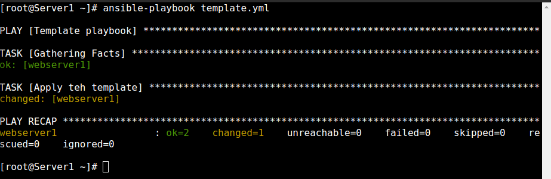
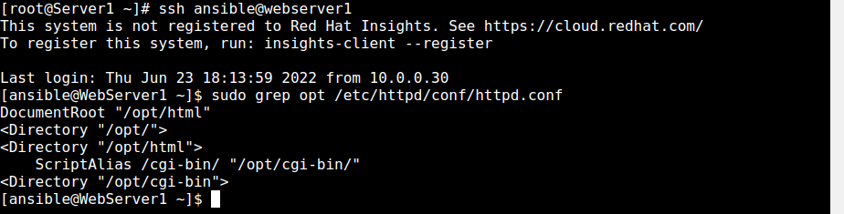

  

# Day 47 - Ansible - Using Templates in Ansible

## Introduction

Today, I'm going to learn about utilizing Templates in Ansible

## Prerequisite

☁️ [Templates](https://docs.ansible.com/ansible/latest/user_guide/playbooks_templating.html) give the ability to define text files with variables instead of static values, and replace those variables at playbook runtime

## Use Case

  

## Cloud Research

☁️ Ansible templates are built on the [Jinja2 templating language](https://jinja.palletsprojects.com/en/3.1.x/) with a j2 file extension

## My Experience

### Task 1 — Insert Variable into Template

I have a template file for httpd.conf

  

I manually change all the /var/www/ references to {{ web dir }}, so the location reference can change as needed

  

### Task 2 — Create the Playbook

I create my playbook, and give a value to the variable 'webdir'

  
  

Before I execute the playbook, I jump onto the web server and confirm there is no reference to 'opt'

  

### Task 3 — Verify Results

Executing the playbook....

  

Jumping back onto the web server, I can see that the file was updated to reference the 'opt' location

  

## ☁️ Cloud Outcome

☁️ The copy function is usually used for copying files over, but utilizing templates, dynamically text files can be created on remote hosts

## Next Steps

Next, I'm going to learn about working with confidential data in Ansible

## Social Proof

[Linkedin Post](link)
