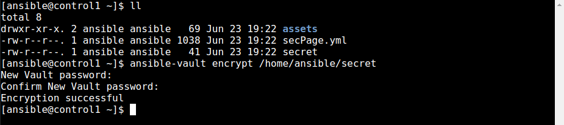

  

# Day 48 - Ansible - Working with Confidential Data

## Introduction

Today, I'm going to learn about working with confidential data in Ansible

## Prerequisite

  

☁️ Ansible Vault encrypts variables and files to protect sensitive data like usernames, passwords, and other secrets

## Cloud Research

☁️ Encryption for Ansible Vault only protects 'data at rest'; responsiblity for 'data in use' falls under play and plugin authors

☁️ Ansible recommends utilizing the attribute 'no_log', either for a task or the entire playbook, to prevent sensitive data spilling out during verbose logging mode

☁️ Ansible also recommends securing your text editors, like vim, emacs, by disabling the system clipboard, creation of backup files, autosaving, etc

## My Experience

### Task 1 — Encrypt a secret

Encrypting the secret file

`ansible-vault encrypt /home/ansible/secret`

  

Trying to view the file, just shows an encrypted hash

  

### Task 2 — Execute a Playbook using a Vault Password File

Being prompted for a password when runing playbooks hinders automation; since my server is secure, I create a vault file containing the password, which the playbook will reference

  

Executing the playbook...

  

### Task 3 — Verify secure page deployed correctly

Attempting to curl the page without password shows an authorized page; entering the correct password shows the actual page

`curl -u bond http://node1/secure/classified.html`

  

## ☁️ Cloud Outcome

☁️ Doing some more research, Ansible recommends not using the decrypt command, unless you want to do so permanently. For viewing or editing such files or playbooks, there's ansible-vault view, and ansible-vault edit

☁️ If you don't want to include the file path during command runtime, there's an environment variable that can be set

☁️ If you do use a vault password file, ensure it's added to .gitignore to avoid being committed to source control

## Next Steps

Next, I'm going to learn about renewing IAM access keys in Ansible

## Social Proof

[Linkedin Post](https://www.linkedin.com/posts/georgemontee_100daysofcloud-activity-6948314019367718912-BhwV?utm_source=linkedin_share&utm_medium=member_desktop_web)
