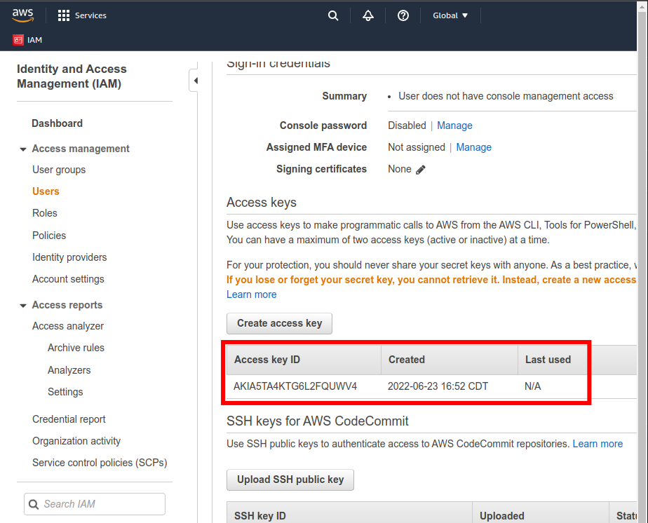
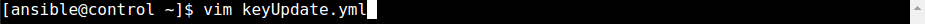
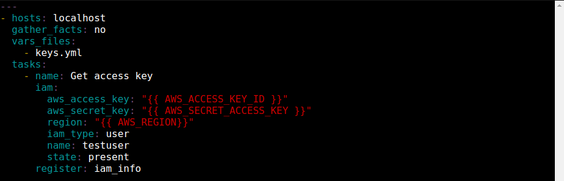
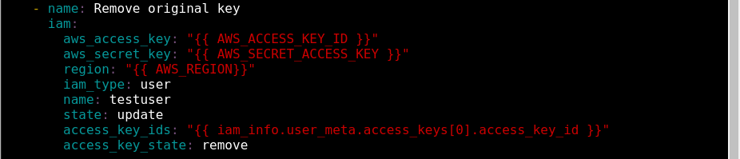
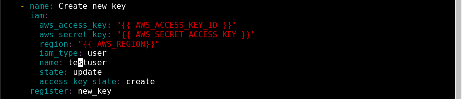
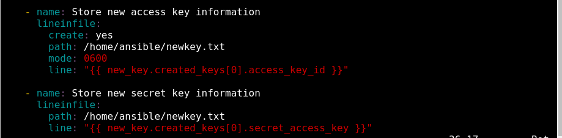
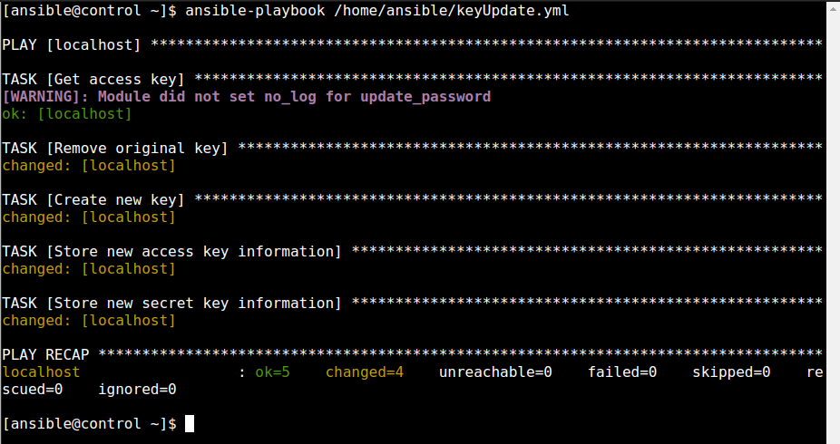
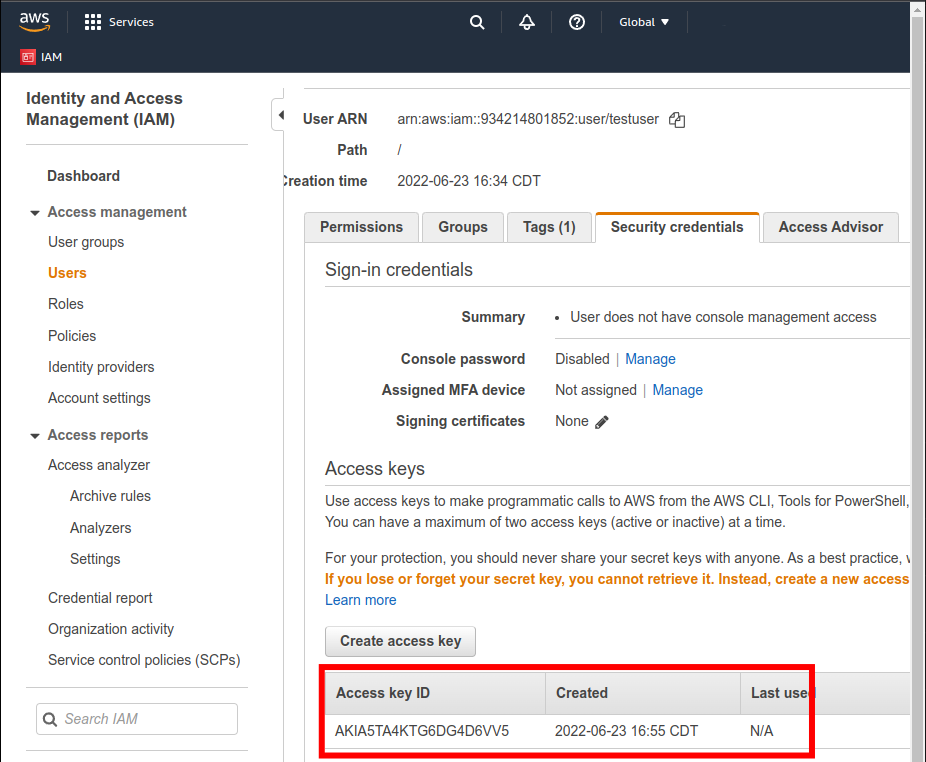

  

# Day 49 - Ansible - Renewing IAM Access Keys

## Introduction

Today, I'm going to learn about renewing IAM access keys in Ansible

## Prerequisite

☁️ Access keys are long-term credentials for an IAM user or the AWS account root user

## Use Case

  

## Cloud Research

☁️ Access keys consist of two parts, the access key ID, and the secret access key

☁️ AWS's recommended best practice is to use temporary security credentials, e.g., IAM roles, instead of access keys. However, if you do use them, they recommend rotating them every 90 days

## My Experience

### Task 1 — Create the Playbook

I log into AWS, and there's my current Access Key ID, ending in UWV4

  

Now, to create the playbook. First task is to get the current access key

  
  

Next task, remove that original key

  

Create our new key

  

We need to store the new key's access key id and the secret itself

  

### Task 2 — Execute the Playbook

Executing the playbook...

  

### Step 3 — Verify Key Change

Refreshing the AWS IAM page, I see a new key, ending in 6VV5

  

## ☁️ Cloud Outcome

☁️ E

## Next Steps

Next, I'm going to reflect on my journey so far.

## Social Proof

[Linkedin Post](link)
