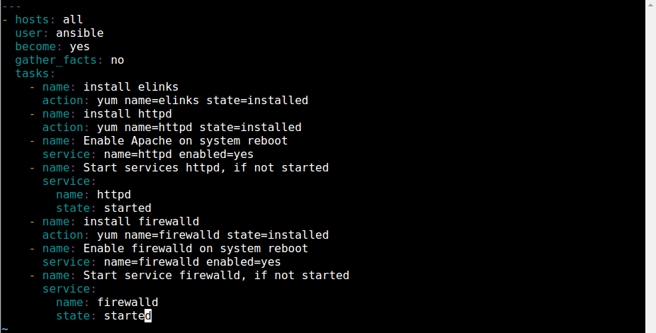

<div id="cover photo" align="center">
  
</div>

# Day 50 - Using Ansible Firewall Rules

## Introduction

☁️ Today, I'm going to learn about managing firewall rules in Ansible

## Prerequisite

☁️ The [ansible.posix.firewalld module](https://docs.ansible.com/ansible/latest/collections/ansible/posix/firewalld_module.html) allows for the addition or deletion of services and ports in either running or permanent firewalld rules

## Use Case

<div id="use case" align="center">
  
</div>

## Cloud Research

- [firewalld](https://firewalld.org/) is a firewall management tool for Linux O/S

  - support for IPv4, IPv6 firewall settings
  - ethernet bridges and IP sets
  - separation of runtime and permanent configuration options
  - interface for services or applications to add firewall rules directly

- elinks is a free text-based web browser for Linux systems

## My Experience

### Task 1 — Confirm current situation

I'm checking that firewalld is not already installed on the managed nodes

`sudo systemctl status firewalld`

<div align="center">
  
</div>

### Task 2 — Create Apache Web Server playbook

Creating our playbook with tasks to install Apache Web Server, httpd, and elinks

`vim setup-server.yml`

<div align="center">
  
</div>

Executing the playbook...

<div align="center">
  
</div>

Testing the elinks

`elinks http://node1`

<div align="center">
  
</div>

### Task 3 — Add install firewalld tasks

Modifying the playbook to install firewalld

`vim setup-server.yml`

<div align="center">
  
</div>

Executing the playbook

`ansible-playbook setup-server.yml`

<div align="center">
  
</div>

Trying the elinks again, we find that with firewalld now in place, they are unreachable

<div align="center">
  
</div>

### Task 4 — Add Firewall rule for Port 80

Make changes to the firewalld tasks to allow port 80

<div align="center">
  
</div>

Executing the playbook again...

`ansible-playbook setup-server.yml`

<div align="center">
  
</div>

### Task 5 — Verify the Rule

Success!

<div align="center">
  
</div>

## ☁️ Cloud Outcome

☁️ First, I learned about [elinks](http://elinks.or.cz/); a rich text mode web browser. It suppots colors, table rendering, background downloading, menu driven config interface, tabbed browsering, ans slim code. Overall, that's a neat capability to have in a command line interface.

☁️ Second, I was looking over the firewalld module documentation. I was able to enable Port 80 by specifying the HTTP in the service parameter. I can also use the port parameter to specify a specific port and/or range; see the code block below

```
- name: do not permit traffic in default zone on port 8081/tcp
  ansible.posix.firewalld:
    port: 8081/tcp
    permanent: yes
    state: disabled
```

## Next Steps

☁️ Tomorrow, I'm going to dive into error handling the Ansible way

## Social Proof

[Linkedin Post]()
