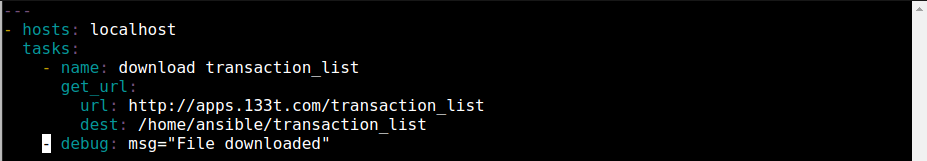
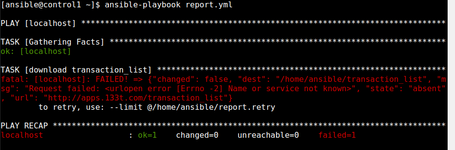
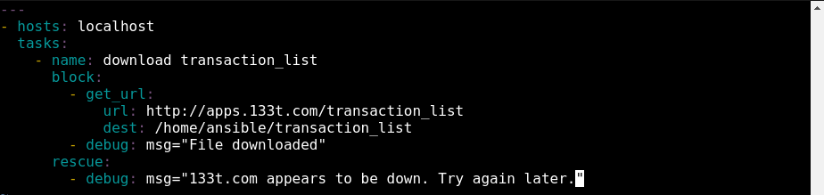
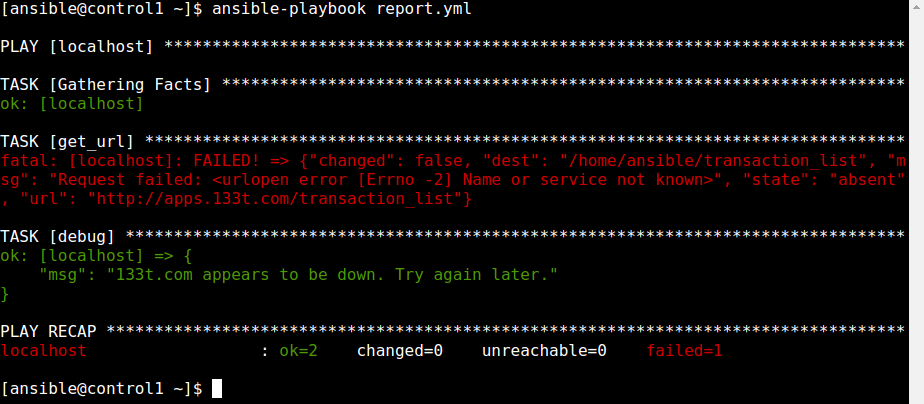
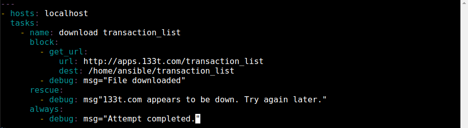
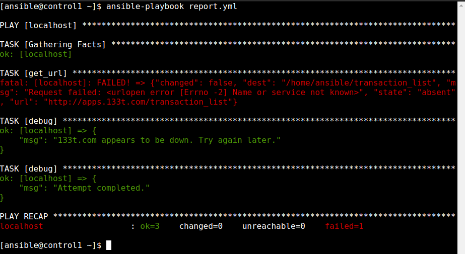
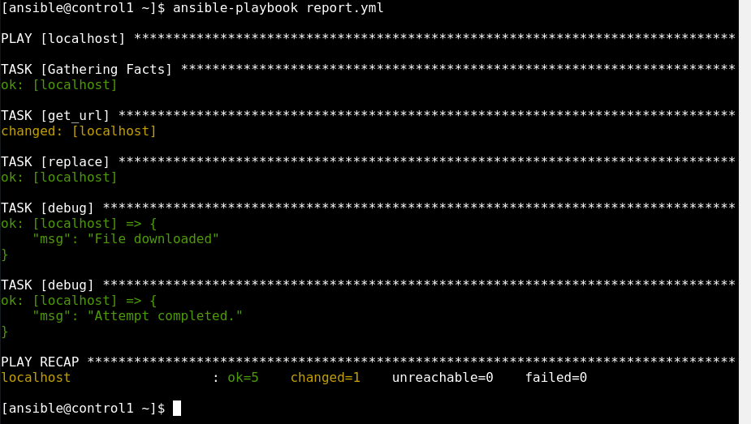

  

# Day 51 - Ansible - Error Handling in Playbooks

## Introduction

☁️ Today, I'm going to dive into error handling the Ansible way

## Prerequisite

☁️ Per the Ansible documentation, "When Ansible receives a non-zero return code from a command or a failure from a module, by default it stops executing on that host and continues on other hosts. However, in some circumstances you may want different behavior. Sometimes a non-zero return code indicates success. Sometimes you want a failure on one host to stop execution on all hosts."

## Cloud Research

- Blocks are logical groups of tasks; they offer ways to handle task errors similar to exception handling

- Rescue blocks specify tasks to run when an earlier task in a block fails

  - runs only when task returns a 'failed' state, not bad task definitions or unreachable hosts

- Always will run no matter when the task status is

## My Experience

### Task 1 — Create a Playbook to download a file

Creating a playbook to download a file from a site that doesn't exist

  

Running the playbook it the download fails, of course

`ansible-playbook report.yml`

  

### Task 2 — Add Task for Connection Failure

Adding a rescue parameter to playbook

  

Executing again...

  

### Task 3 — Add Task for Attempt Result

Adding a clause to let us know the attempt was completed

  

Always message shows up

  

### Task 4 — Successful Attempt

Here's what a successful attempt looks like (I modified the file to download to something valid)

  

## ☁️ Cloud Outcome

☁️ There are various parameters one can add, e.g., ignore_errors, ignore_unreachable. You can have the playbook abort if there is a failure on just one host, or a certain percentage of hosts. Speaking of failures, Ansible allows you to define what is failure using failure_when.

## Next Steps

☁️ Tomorrow, I'm going to work with roles in Ansible

## Social Proof

[Linkedin Post](https://www.linkedin.com/posts/georgemontee_100daysofcloud-activity-6950441075224317952-ONH8?utm_source=linkedin_share&utm_medium=member_desktop_web)
