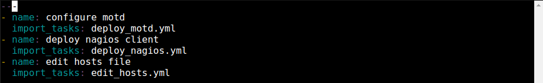

  

# Day 52 - Ansible - Working with Roles

## Introduction

☁️ Today, I'm going to be working with roles in Ansible

## Prerequisite

☁️ Roles allow you to reuse content such as vars, files, tasks, handlers, and other Ansible artifacts

## Use Case

  

## Cloud Research

- Nagios is an open-source application to monitors systems, networks, and infrastructure

## My Experience

### Task 1 — Create a Role

Creating a role names "baseline"; I goofed the first time, forgetting the roles directory.

`mkdir /etc/ansible/roles/baseline/{template,tasks,files}`

  

### Task 2 — Configure the Role to Deploy MOTD

Copying a previously made template to our new baseline's template directory

  

Writing the short task to utilize our motd template

  

Adding our deploy motd task to the main playbook

  

### Task 3 — Configure the Role to Install Nagios Client

Creating and editing a task for install the Nagios client

  

Using Yum to install the latest version of the Nagios client

  

Adding our install nagios task to the main playbook

  

### Task 4 — Configure the Role to add Nagios entry

Creating and editing the edit hosts playbook

  

Creating a task to add the Nagios server info to the hosts file

  

Adding our add server entry task to the main playbook

  

### Task 5 — Configure the Role to Create noc User

Creating and editing playbook to create noc user

  

Adding task to import the noc user's public key

  

Adding our create noc user task to the main playbook

  

### Task 6 — Deploy the Role

Just needed to add the roles reference to our web playbook

  

Showtime!

  

## ☁️ Cloud Outcome

☁️ Roles give the ability to create a template that is modular, loose-coupling, allowing you to edit the role as needed without changing the main playbook

## Next Steps

☁️ Tomorrow, I'm going to put it all together by deploying a web server, with confidential data stored in an Ansible vault

## Social Proof

[Linkedin Post]()
