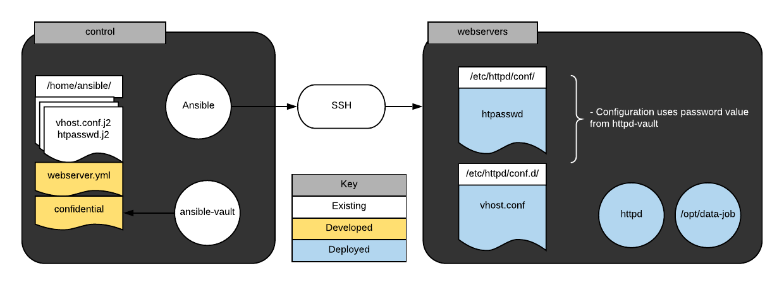
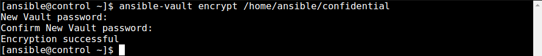
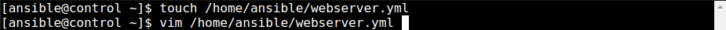
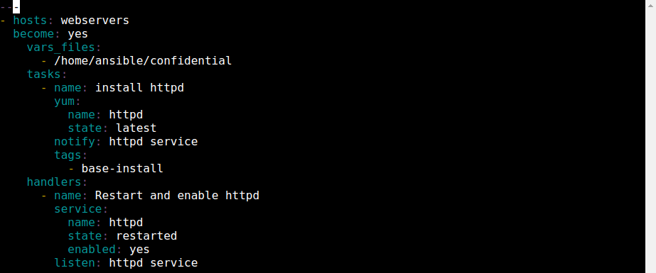
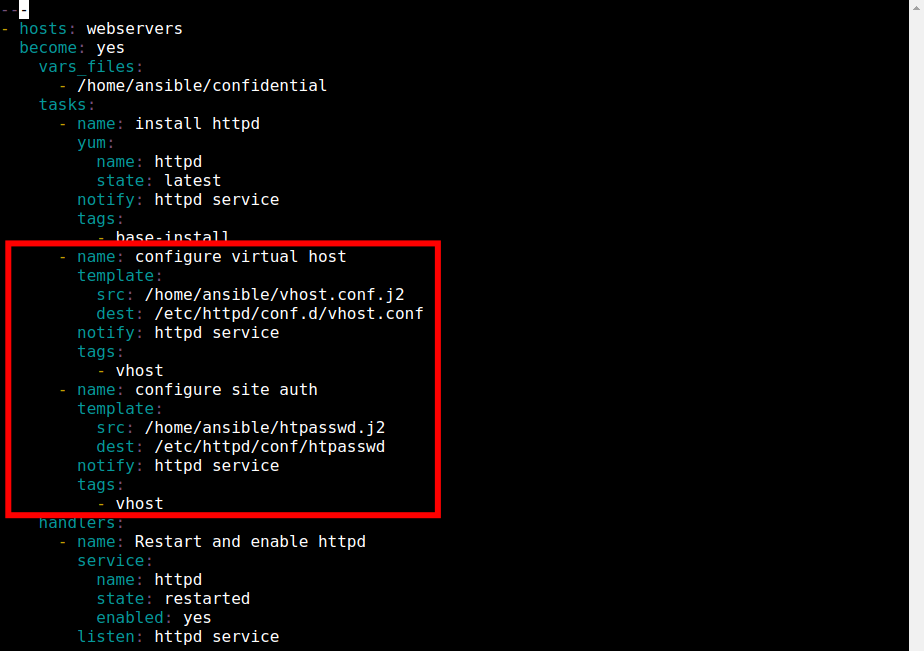
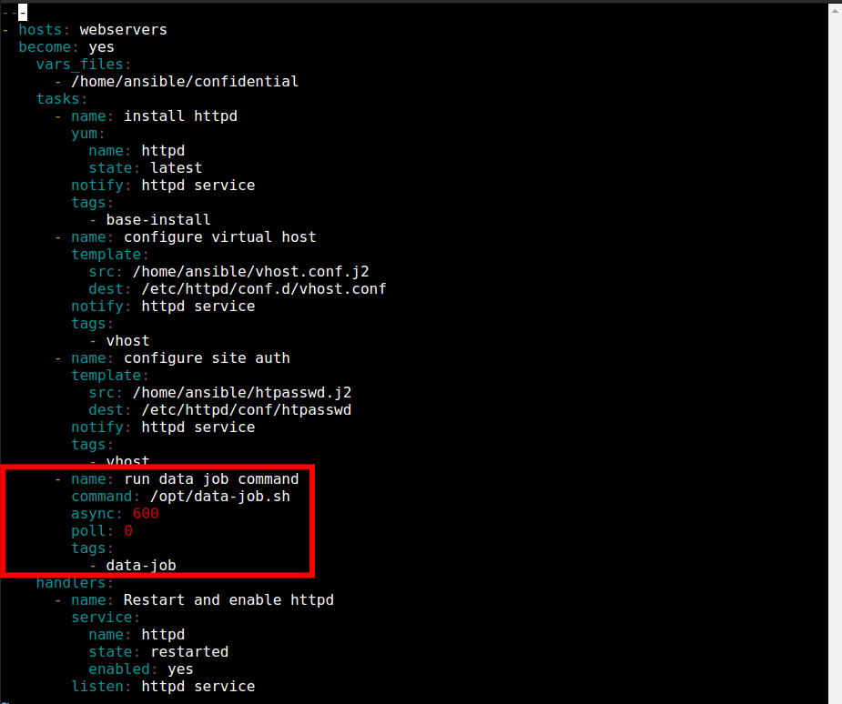
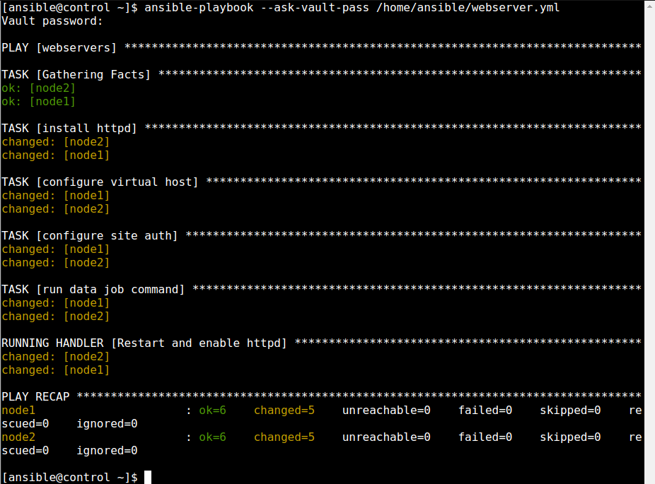

  

# Day 53 - Ansible - Putting it Together

## Introduction

☁️ Today, I'm going to put it all together by deploying a web server, with confidential data stored in an Ansible vault

## Prerequisite

☁️ On day 47 I learned about [Ansible Templates](../047/Readme.md); to which today I'm going to use to populate the virtual host configuration file, and httpd configuration password

☁️ A few days I learned about securing [Ansible Confidential Data](../050/Readme.md), today I'll use for securing a password

## Use Case

  

## Cloud Research

- LET'S GOOOOOOOOOOOOO!!

## My Experience

### Task 1 — Protect Confidential Information

Encrypting our confidential info

  

### Task 2 — Playbook to deploy httpd

Creating and editing the deploy httpd playbook

`ansible-vault encrypt /home/ansible/confidential`

  

The webserver playbook; handler restarts the httpd daemon that is flagged by both installation and service manipulation for httpd

  

### Task 3 — Deploy templates to webservers group

Task for deploying the vhost.conf.j2 and htpasswd.j2 templates

  

### Task 4 — Asynchronously execute data-job on webservers

Task for executing data-job script with a timeout of 600 seconds and no polling

  

### Task 5 — Execute the Playbook

The parameter --ask-vault-pass will prompt the user for the vault password when the playbook needs to access confidential data

`ansible-playbook --ask-vault-pass /home/ansible/webserver.yml`

  

## ☁️ Cloud Outcome

☁️ Although, this is the 13th day of Ansible, there's still a lot for me to learn and master. My temptation is to spend a lot of time on something, a trait that has worked well for me in the past, but for the purpose of my 100 days of Cloud journey I want to get exposure to a variety of items in this "short" period of time.

## Next Steps

☁️ Tomorrow, I'm going to reflect on my journey so far

## Social Proof

[Linkedin Post]()
