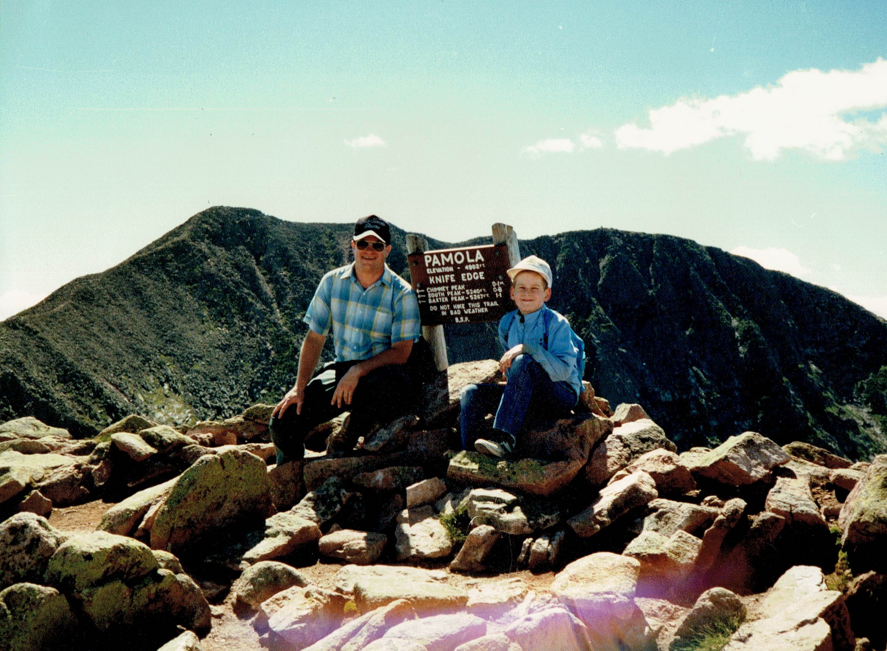
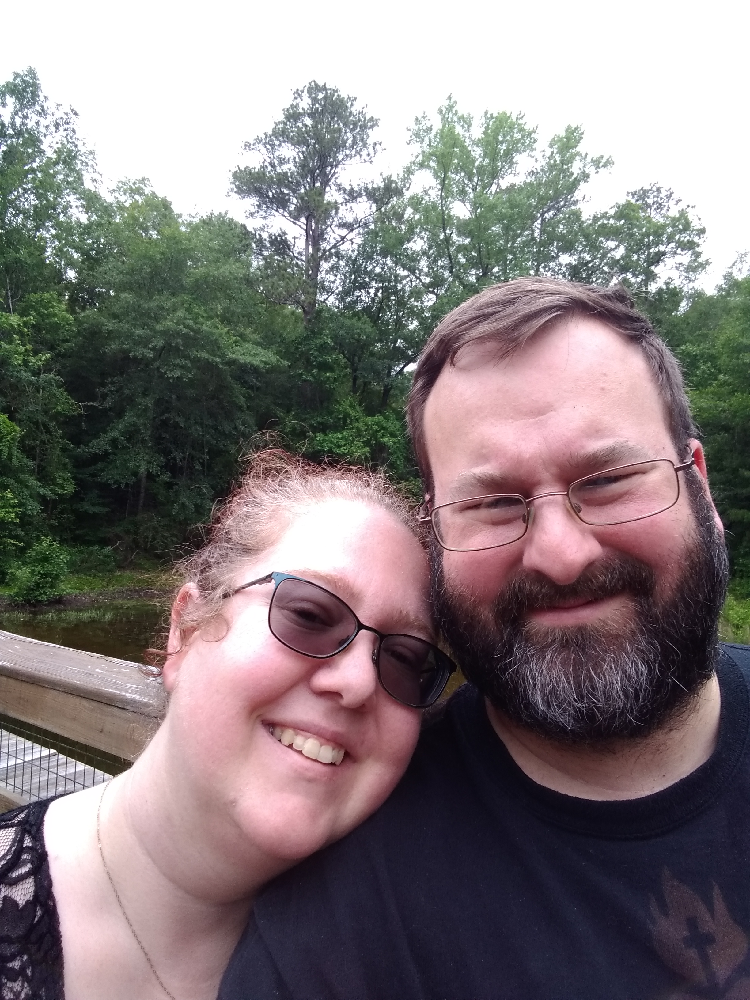

  

# Day 54 - Reflections on Climbing the Mountain

  

## The Past

I had an awesome childhood, growing up in Northern Maine. Aroostook County to be exact. I spent a tremendous amount of my childhood in the great outdoors: hiking, backpacking, canoeing, cycling, fishing, hunting, snowmobiling, and camping throughout the year; through all the seasons: summer, fall, winter, and even "mud season".

During my teenage years, a couple of times Dad and I did the hike of hikes, climbing Mount Katahdin, which is darn close to a mile high at 5,269 feet.

It was a hike that had to be planned, as it was barely doable in a day. To even get down there was a long, three-hour drive; which meant waking up well before dawn to get on the road. The average range for hiking up and down Katahdin is 8 to 12 hours.

The critical factors for success were being in good shape, an experienced hiker, and broken in hiking shoes. Initially, the trail was a gradual slope but a third of the way up the elevation started dramatically increasing. Similar to running, we fell into a sustainable rhythm as we climbed. At an elevation of ~3,500 feet the trees would disappear, leaving only glacially carved granite to be scrabbled over.

One of the peaks is called Pamola, named after a mythological Abenaki bird spirit that caused storms and cold. _All the effort and struggle_ to get there dwarfed the miniscule time we had to enjoy that view. It was a temporary reprieve, **standing there above the clouds**, before having to return down the mountain in order to make it back before dusk.

---

  

## The Present

I suffer greatly from **imposter syndrome**. Over the years, it has come and gone; but this past year it has hung around, like a rain cloud. I have these near constant feelings of self-doubt. The anxiety of being found out that I'm a fraud puts me in a perpetual state of fight or flight. Like a tide, the panic attacks roll in and out. It is suffocating to live like this.

Puzzlingly, I'm not sure what feeds it. I know I tend to under-estimate what I know, and over-estimate what everyone else knows. My default assumption is when I was climbing up a 5,000 foot Appalachian Mountain, everyone else was scaling up 14,000+ feet Rocky Mountains. The reality is _some_ were, but the vast majority of folks were not.

I know, logically, it _doesn't make sense_ to feel this way. I've been working with computers since age ten, when I received my Grandfather's old Zenith Z-150, which gave way to an Apple II, Tandy 1000, Pentium II, etc. I created web pages in the '90s, with the newly released HTML. My Eagle Scout project was a database for the local historical society. I went to community college, learning the IBM AS/400, with it's Report Program Generator that had been extended into a bastardized programming language.

I spent 16 of my 20 years in the Air Force doing software engineering; specifically quality assurance testing, database development, identity management, scrum master, and full stack development. From monolithic mainframe programs to modern single-page web applications; small and large teams; specialized and cross-functional; waterfall to Agile.

I have a lifetime of experience and knowledge. However, to quote Aristotle, "The more you know, the more you realize you don't know". I occasionally look at the [Cloud Native Computing Foundation landscape map](https://landscape.cncf.io/), and I cry out. Logically, it's amazing there is an entire ecosystem of tooling. So many options and opportunities. Psychologically, I'm humbled and reminded of what I don't know.

---

  

## The Future

During my Air Force career, I felt many decisions were made for me. Where I would be stationed, which unit, the mission, all decided by Uncle Sam. When I transitioned out and joined Booz Allen Hamilton, I found myself in a Cloud Engineering role, doing Infrastructure-as-a-Service work. It was challenging, but I learned a tremendous amount. More importantly I found the Cloud ecosystem to be massive, and had so much potential. You didn't have to worry about getting silo'd to a particular development stack. I knew where I wanted to steer the second half of my career; _The Cloud_.

I began the [100 Days of Cloud challenge](https://100daysofcloud.com/) as a framework to structure, guide, and document my journey to learning the Cloud ecosystem. I was worried that devoting a little time each day to learn and document would be burdensome, but like my hikes up Mount Katahdin, I found a sustainable rhythm to progress.

**To build the endurance and strength to climb a mountain in order to reach the clouds doesn't happen overnight, nor over days, or weeks, or even months.**

Deliberate, regular training is needed over uneven, unfocused spurts. One needs a road map, with milestones and ultimately, a destination. To properly know and break in one's gear. To keep an eye on the weather. Knowing when to push, and when to rest. To accept setbacks, and tend to wounds. To have realistic expectations. Finally, most importantly, acknowledging and celebrating accomplishments.

---

## Next Steps

☁️ Tomorrow, having rested, I'm going to get back on the trail, and start working with Terraform

## Social Proof

[Linkedin Post]()
