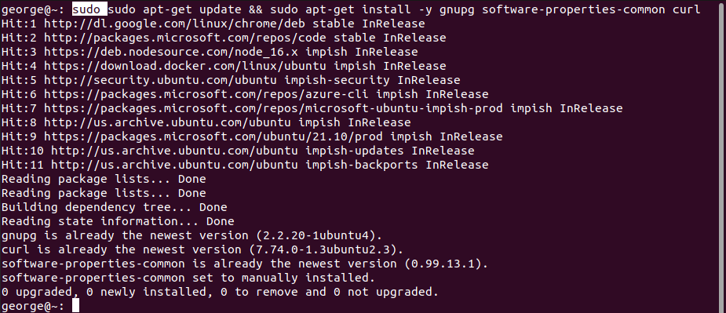
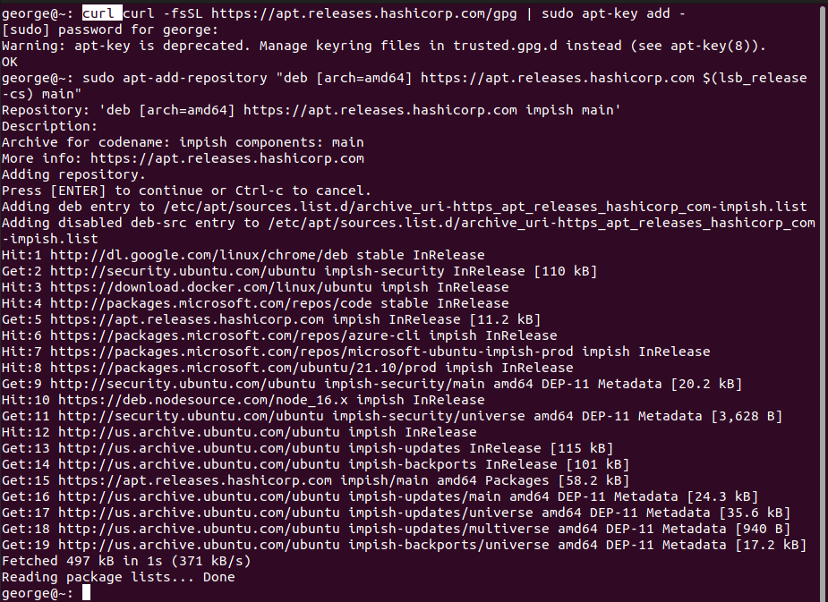
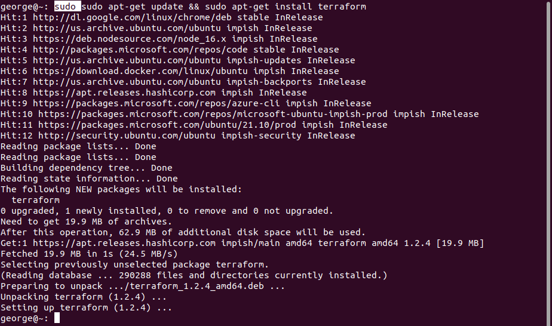
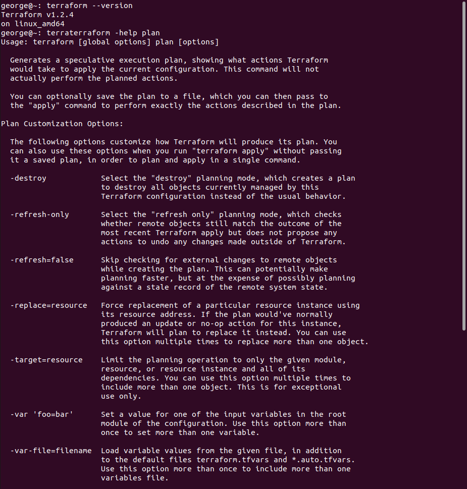
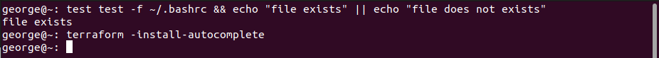

  

# Day 55 - Terraform - Infrastructure as Code

## Introduction

☁️ Today, I'm learn about the concept of Infrastructure as Code (IaC), and getting Terraform setup.

## Prerequisite

☁️ Infrastructure as Code (IaC) is the managing and provisioning of infrastructure through code, instead of manual processes

## Use Case

  

## Cloud Research

☁️ Why IaC? Follows in the footsteps of CI/CD success to automate as much of the process as possible

- Benefits
  - Automation frees resources and folks to focus on other efforts
  - Reduces risk of human error when doing numerous, and sometimes repetitive, tasks
  - Faster deployment
  - Can be Source Controlled
  - Configuration consistency
  - Can help avoid Configuration Drift

☁️ Pets vs Cattle concept: with virtualized resources, and automation like IaC, resources can now be built, destroyed, and rebuilt quickly making them more easily replaceable than work that was previously manual, labor intensive, and non-repeatable

☁️ Imperative - How; specify list of commands to create resources

☁️ Declarative - What; request what resources you want

☁️ Idempotent - a process that can be executed multiple times with the same result

☁️ Immutability - the concept of replacing resources when changes are needed, rather than modifying them directly; prevents configuration drift

☁️ Terraform - an open-source IaC software tool created by HashiCorp; utilizes declarative configuration using HashiCorp Configuration Language or JSON; Terraform configuration is Idempotent, and creates Immutable infrastructure

## My Experience

### Task 1 — Installing Terraform

Ensuring I have gnupg and curl installed

`curl -fsSL https://apt.releases.hashicorp.com/gpg | sudo apt-key add -`

  

Adding the HashiCorp GPG key, and their official Linux repo

`sudo apt-add-repository "deb [arch=amd64] https://apt.releases.hashicorp.com $(lsb_release -cs) main"`

  

Installing Terraform...

`sudo apt-get update && sudo apt-get install terraform`

  

### Task 2 — Verify

Checking to see if Terraform installed properly and pulling up help for the subcommand 'plan'

`terraform --version`

`terraform -help plan`

  

### Task 3 — Install Autocompletion

To turn on autocomplete, I need to make sure my .bashrc file exists, and install that feature

`test -f ~/.bashrc && echo "file exists" || echo "file does not exists"`

`terraform -install-autocomplete`

  

## ☁️ Cloud Outcome

☁️ I'm excited at this point. I believe in one of my previous posts involving Ansible I mentioned doing AWS Infrastructure-as-a-Service work. It was at times repetitive work, and occasionally I made mistakes, forcing me to undo my mistake and try again. I'm excited to see how Terraform helps automate processes I previously did manually.

## Next Steps

☁️ Tomorrow, I'm going to learn about Terraform's workflow

## Social Proof

[Linkedin Post](https://www.linkedin.com/posts/georgemontee_100daysofcloud-activity-6971123771579535360-eUj6?utm_source=share&utm_medium=member_desktop)
