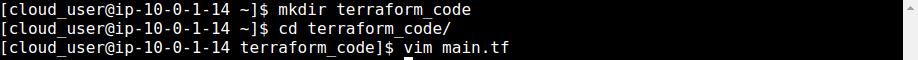
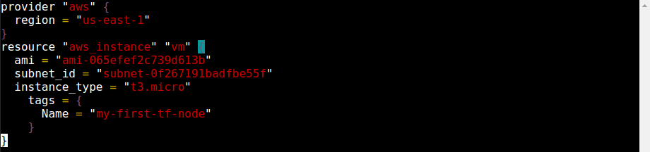
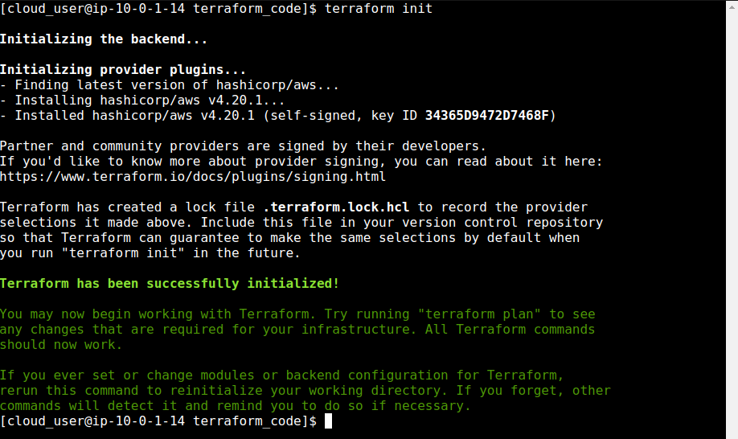
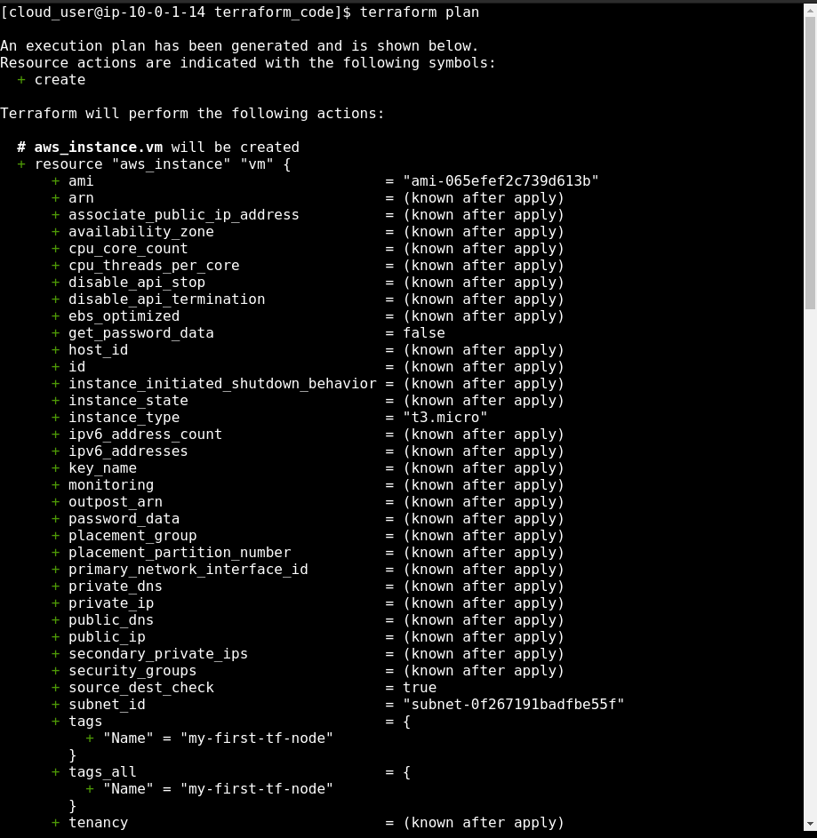
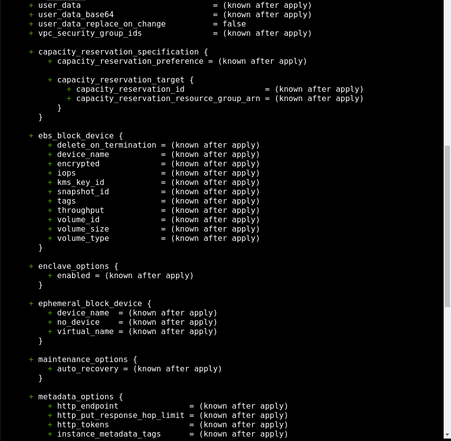
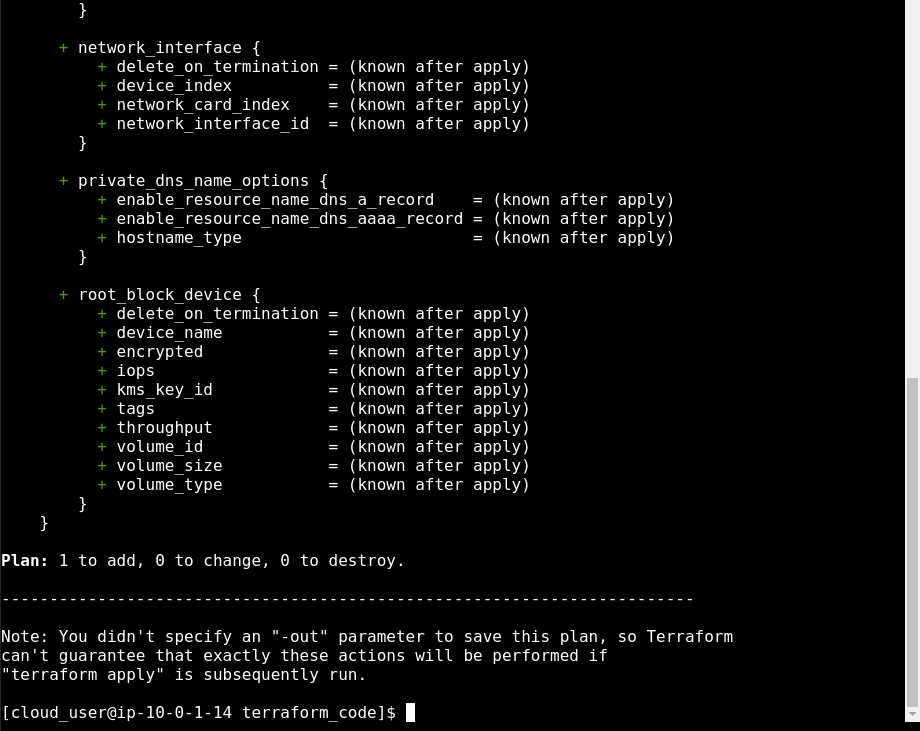
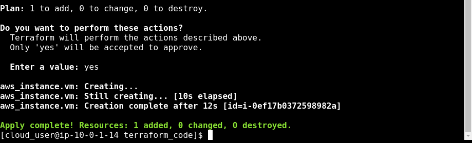
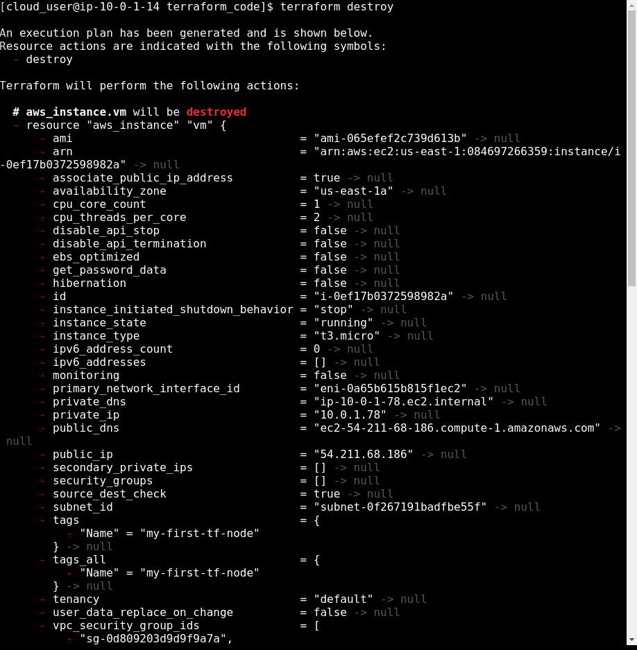
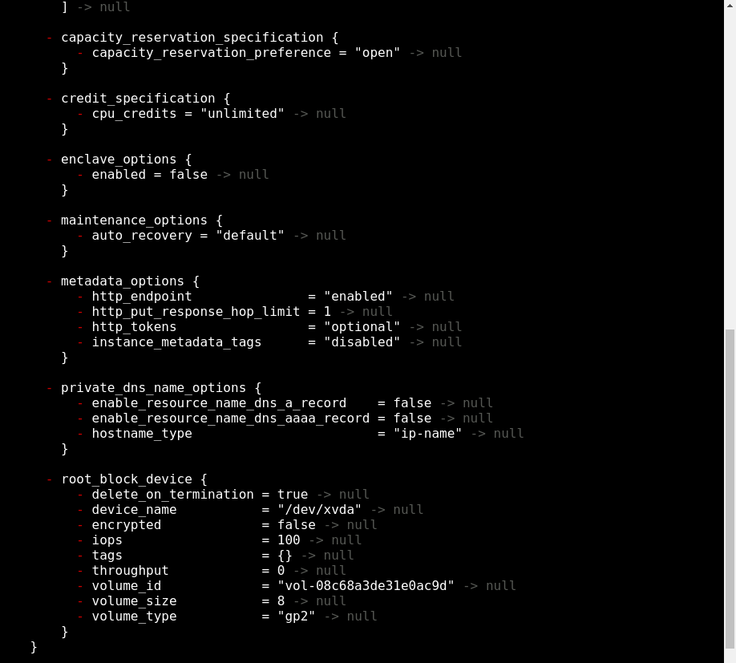
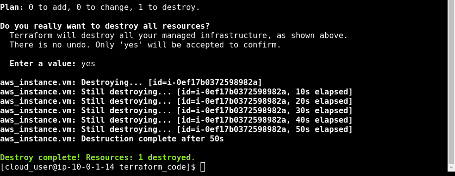

  

# Day 56 - Terraform - Workflow

## Introduction

☁️ Today I'm going to learn about Terraform's core workflow

## Prerequisite

☁️ Terraform workflows have 5 key steps: Write, Init, Plan, Apply, and Destroy

## Use Case

  

- Write: create changes to the code
- Init: initialize code to download the requirements mentioned in the code
- Plan: review changes and choose to accept them
- Apply: accept changes and apply them against real infrastructure
- Destroy: destroy created infrastructure

## Cloud Research

☁️ HashiCorp recommends teams utilize a shared Continuous Integration environment in order to protect sensitive inputs. Although source controlling IaC is a best practice, there is potential risk for secrets to be accidentally committed. There are a variety of options to migrate this risk, for example using Azure Key Vault to store subscription id, app id, password, and other secrets.

☁️ The ability to source control Terraform code enables pull requests and code reviews, sharing of code, and all the other advantages of software version control

☁️ HashiCorp HIGHLY recommends a human manually reviewing Plans. For instance, the Plan command has an option to output a plan file of the proposed changes, which can be reviewed by another person, and applied if correct. If approval isn't needed (non-critical infrastructure) there's an option:

`terraform apply -input=false -auto-approve`

## My Experience

### Task 1 — Write

First, we need to create out terraform file, which ends in .tf

  
  

### Task 2 — Init

This step initializes the directory, looking for all the Terraform configuration files

`terraform init`

  

### Task 3 — Plan

This step will show whether the execution plan matches my expectations on what will be added, changed, etc. In this, a new VM based off the Amazon Machine Image I specified.

`terraform plan`

  
  
  

The "warning" message at the bottom is for Terraform automation. Using a parameter to save the generated plan to a file on disk, which can later be passed to the terraform apply command as an extra argument

### Task 4 — Apply

Next, terraform will show what is the concrete plan, and asks for specific term, "yes", to proceed with the plan.

`terraform apply`

  

Logging in the AWS portal, we find out newly created EC2

  

### Task 5 — Destroy

If we wish to remove everything governed by terraform, we use the destroy command

`terraform destroy`

  
  
  

## ☁️ Cloud Outcome

☁️ When I was creating resources in Azure via the command line, leveraging Bash or PowerShell, it was faster than navigating through the Azure Portal. However, manually typing those commands invited the risk of mistyping, or goofing multi-line commands. You can create a scripts with all those commands, but then you would have to create a script to remove those resources. On the other hand, Terraform shows what it's going to do, and since it's tracking the state of the infrastructure, it can easily delete resources it's tracking.

☁️ Looking over the HashiCorp documentation, each of the subcommands has various parameters, but overall it's amazing how simple they CAN be, as opposed to all the parameters had to enter via traditional CLI commands.

## Next Steps

☁️ Tomorrow, I'm going to learn about Providers

## Social Proof

[Linkedin Post](https://www.linkedin.com/posts/georgemontee_100daysofcloud-activity-6971485485814755329-Wkcq?utm_source=share&utm_medium=member_desktop)
