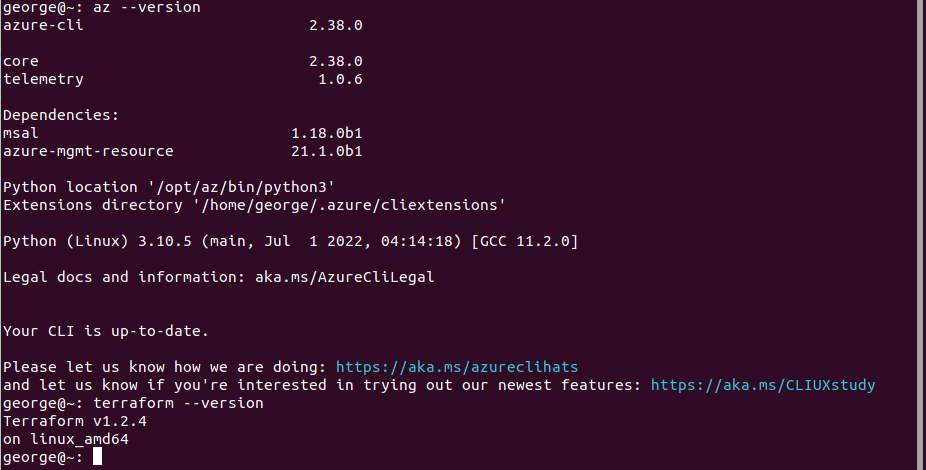
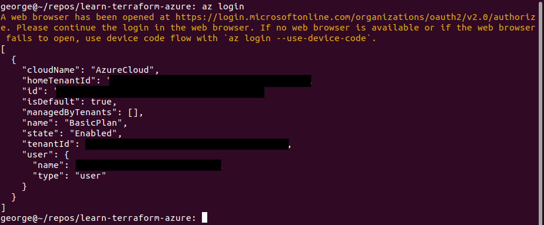
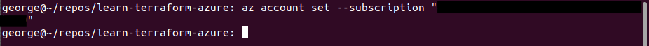
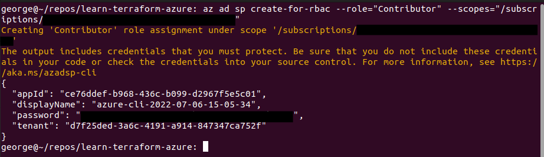
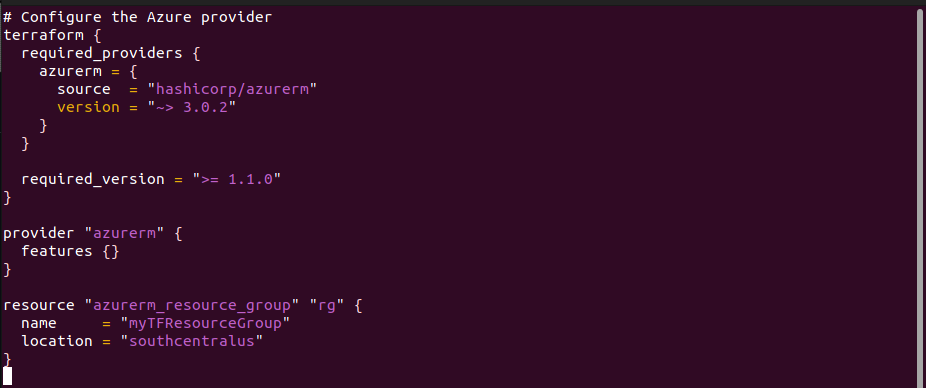
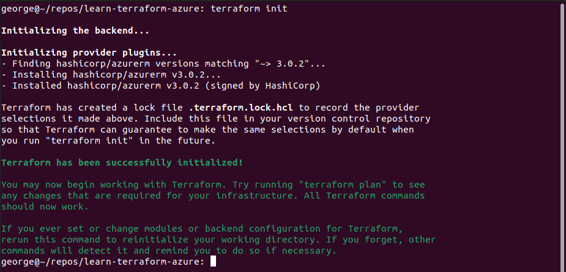
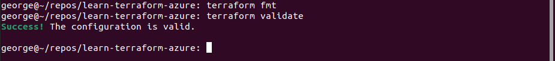
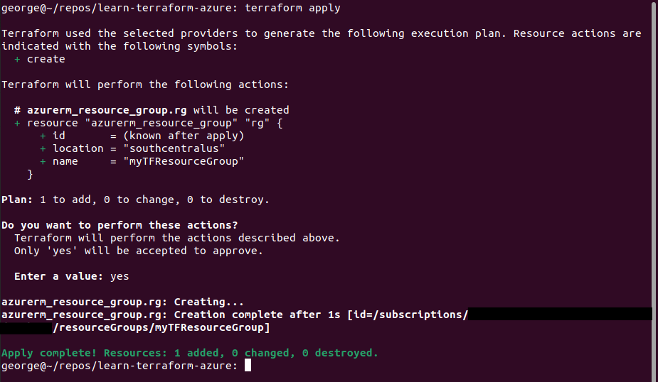
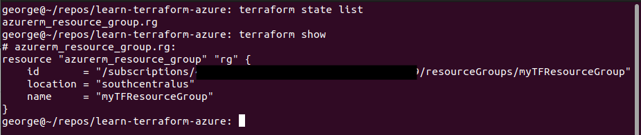
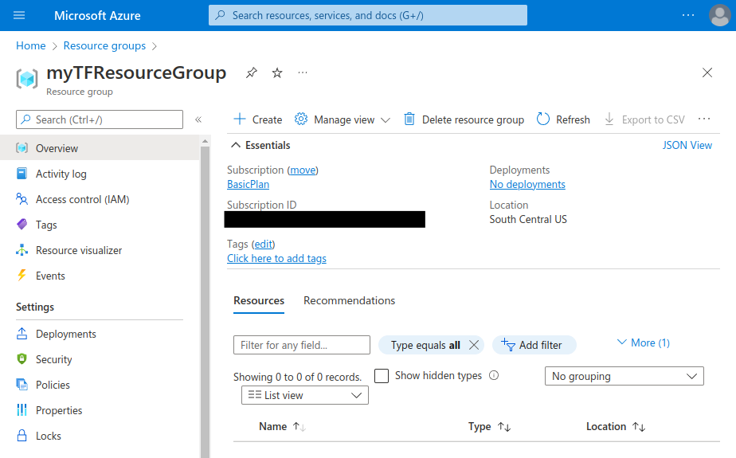

  

# Day 57 - Terraform - Providers

## Introduction

☁️ Today I'm going to learn about Providers in Terraform

## Prerequisite

☁️ Terraform uses plugins referred to as "providers" to interact with cloud providers, Service-as-a-Service providers, and other API's.

## Use Case

  

As of the writing of this post, there are a combined 251 Official and Verified Providers for Terraform. Official providers are owned and maintained by HashiCorp, while the Verified is owned and maintained by 3rd-party tech partners, e.g., auth0, F5 bigip, Cloudflare, VMWare nsxt, splunk, etc.

## Cloud Research

☁️ Terraform modules must declare which providers it requires via `required_providers` block, which includes local name, source location, and version constraint

☁️ Local names are module-specific, and must be unique per module; each Provider has a preferred local name, e.g., aws, azurerm, google

☁️ Source Addresses is it's global identifier, e.g., registry.terraform.io/hashicorp/http

☁️ Version Constraints is optional, although highly recommended to ensure functionality doesn't break unexpectedly with new versions

## My Experience

I'm following the [tutorial from HashiCorp](https://learn.hashicorp.com/tutorials/terraform/azure-build?in=terraform/azure-get-started) for getting started with building Azure Infrastructure

I already have Azure CLI, and Terraform installed

`az --version`

`terraform --version`

  

### Task 1 — Authenticate using Azure CLI

First, I need to authenticate with Azure

`az login`

  

Setting the subscription

`az account set --subscription "<my-subscription-id>"`

  

### Task 2 — Create Service Principal and Set Env Variables

Creating a Service Principal in Azure Active Directory which will have authentication tokens to let Terraform perform actions on my behalf

`az ad sp create-for-rbac --role="Contributor" --scopes="/subscriptions/<SUBSCRIPTION_ID>"`

  

Setting up environment variables with the info from the previous step; I don't have a screenshot since the display glitched

`export ARM_CLIENT_ID="<APPID_VALUE>"`

`export ARM_CLIENT_SECRET="<PASSWORD_VALUE>"`

`export ARM_SUBSCRIPTION_ID="<SUBSCRIPTION_ID>"`

`export ARM_TENANT_ID="<TENANT_VALUE>"`

### Task 3 — Write Configuration

Main.tf

  

For the required_providers I'm specifying Azure Resource Manager, which is abbreviated as azurerm. I'm specifying a particular version, which HashiCorp highly recommends; in this case version 3.0.2, as of this writing the latest version on the [public registry](https://registry.terraform.io/providers/hashicorp/azurerm/3.12.0) is 3.12.0

The required_version refers to the Terraform CLI version. Here I'm saying it must be equal to or greater than version 1.1.0. I'm currently running 1.2.4

The provider section allows a [number of arguments](https://registry.terraform.io/providers/hashicorp/azurerm/latest/docs). Several of them I did via the commandline, specifying the client_id, tenant_id, etc, but I could've written them into the configuration file.

Additionally, the [features argument](https://registry.terraform.io/providers/hashicorp/azurerm/latest/docs/guides/features-block) allows one to set certain behaviors. Leaving the block empty will result in default behaviors. The examples on the Terraform Provider page show setting permanent delete (versus soft delete) to true for various services, preventing a resource group from being deleted if it has resources, specifying how virtual machines shutdown, etc.

The final part, one or more resources can be specified, e.g., virtual networks, subnets, public IP addresses, storage accounts, ssh keys, virtual machines, and so on. Since Terraform is declarative, the order doesn't matter.

### Task 4 — Initialize Configuration

Now with the main configuration file in place, next is to initialize terraform

`terraform init`

  

Terraform has an option to format all configuration files for consistency; Checking if the configuration is valid

`terraform fmt`

`terraform validate`

  

### Task 5 — Apply Configuration

Now to apply the config, which will generate a plan first, and ask us if we wish to proceed

`terraform apply`

  

### Task 6 — Inspect the State

I can also just get a list of what resources were created; When the configuration is applied, Terraform tracks the state of the deployment, writing data of what is created/changed into a file.

`terraform state list`

`terraform show`

  

Logging into the Azure Portal, I can see the new resource group

  

## ☁️ Cloud Outcome

☁️ This was much in a way a repeat of yesterday's learning, with the Terraform's workflow. In this case, I utilized Azure, and went more deeply into the Provider aspect.

☁️ Doing some research, one can develop their Terraform provider [calling HashiCorp's API](https://learn.hashicorp.com/collections/terraform/providers); can still use them without publishing them on the public Terraform Registry

## Next Steps

☁️ Tomorrow, I'm going to learn about leveraging variables in Terraform

## Social Proof

[Linkedin Post]()
